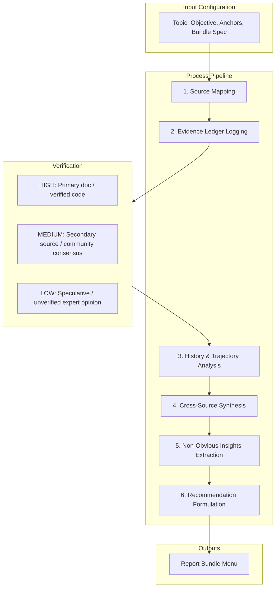

# AGY Research Metabolizer

The **AGY Research Metabolizer** is the canonical skill designed for high-agency, multi-source technical and strategic discovery. It establishes a rigorous pipeline for ingesting raw topics, mapping anchors, compiling evidence, and generating targeted output bundles, while explicitly preserving agent autonomy to explore beyond provided anchors.

---

## 1. Process & Component Architecture

The metabolizer translates unstructured inquiries into structured knowledge assets through a 6-phase pipeline:



### The 6-Phase Pipeline

1. **Source Mapping (Source Map):**
   Catalog all initial inputs and anchors. Identify data gaps, compile search queries, and define external directories or web endpoints to expand search parameters.
2. **Evidence Ledger Logging:**
   Maintain a chronological ledger of discoveries. Every fact, quote, code snippet, or historical milestone must be recorded with its origin URL/filepath and timestamp.
3. **History, Current-State, and Trajectory:**
   Analyze how the subject evolved (legacy issues, deprecated designs), evaluate the active state (present limitations, bugs, standard implementations), and project future trends or architectural directions.
4. **Cross-Source Synthesis:**
   Triangulate data across disparate sources. Highlight conflicts (e.g., outdated documentation vs. actual source code behavior) and establish consensus.
5. **Non-Obvious Insights:**
   Isolate hidden assumptions, latent vulnerabilities, non-trivial scaling issues, or architectural friction points that are not explicitly documented.
6. **Actionable Recommendations:**
   Propose practical, tiered next steps (e.g., Quick Win, Strategic Path, Defensive Guardrails) mapped directly to downstream implementation.

---

## 2. Core Inputs

To launch the metabolizer, the following inputs must be specified:

| Input Field | Description | Example / Required Format |
|---|---|---|
| **Topic** | The core subject, problem, or technical domain. | `WebAssembly-based plugin architecture` |
| **Objective** | The business, product, or development goal. | `Select a WASM runtime for sandboxed plugins with <10ms overhead` |
| **Audience** | The primary consumers of the resulting report bundle. | `Senior Core Engineers & Architects` |
| **Downstream Use** | How the output will be utilized immediately. | `To write a WASM integration module in Rust` |
| **Known Anchors** | Specific files, folders, URLs, or repositories. | `PRISMATIC_ENGINE.yaml` |
| **Allowed Expansion**| Autonomy scope for investigating outside anchors. | `Web search allowed; local sandbox limits: none; git cloning allowed` |
| **Desired Bundle** | The specific format from the Report Bundle Menu. | `architecture` |
| **Depth** | The level of verification and iterations. | `Quick` \| `Standard` \| `Deep` |

---

## 3. Supported Sources

The metabolizer natively supports and normalizes the following source types:

- **GitHub / Remote Repositories:** Code structure, commit history, issue threads, pull request reviews, and action workflows.
- **Experts & Developer Logs:** Transcribed engineer interviews, internal chat channels (Slack, Discord), developer journals, post-mortem writeups.
- **Articles & Technical Documentation:** API reference guides, specifications, RFCs, release notes, whitepapers, benchmarks.
- **Multimedia (Video/Audio):** YouTube tutorials, developer podcasts, and conference talks (via audio transcripts).
- **Forums & Discussions:** StackOverflow, Reddit, GitHub Discussions, Hacker News.
- **Academic Papers:** arXiv preprints, academic journals, conference papers.
- **Local Project Files:** Existing codebases, configuration files, environment variables, test suites.

---

## 4. Report Bundle Menu

Depending on the downstream objective, the metabolizer compiles output in one of seven canonical configurations:

```
┌─────────────────────────────────────────────────────────────────────────┐
│                           REPORT BUNDLE MENU                            │
├─────────────────┬───────────────────────────────────────────────────────┤
│ Bundle Type     │ Primary Contents & Output Focus                       │
├─────────────────┼───────────────────────────────────────────────────────┤
│ brief           │ 1-page summary, TL;DR, high-impact recommendations    │
│ standard        │ Full research synthesis, evidence ledger, source map  │
│ deep            │ Complete evidence ledger, matrices, history/trajectory│
│ architecture    │ Technical spec, Mermaid diagrams, API schemas         │
│ content-engine  │ Code snippets, copywriting drafts, visual prompts     │
│ competitive     │ SWOT, feature comparisons, pricing/technical gap maps │
│ golden-path     │ Step-by-step developer tutorial and validation script │
└─────────────────┴───────────────────────────────────────────────────────┘
```

### Bundle Specifications

*   **`brief`**
    *   *Purpose:* Rapid decision-making for executives or leads.
    *   *Contents:* Executive Summary, Critical Recommendations (Must / Should / Could), and High-Confidence Summary Table.
*   **`standard`**
    *   *Purpose:* Standard technical onboarding or investigation.
    *   *Contents:* Source Map, Evidence Ledger (truncated to relevant entries), Synthesis Report, Trend Analysis, Recommendations.
*   **`deep`**
    *   *Purpose:* Full-scale research audits, security analyses, or major technology migrations.
    *   *Contents:* Unabridged Source Map, Complete Evidence Ledger, Exhaustive Timeline/Trajectory, Multi-Dimension Comparative Matrix, Risk Audit.
*   **`architecture`**
    *   *Purpose:* Direct hand-off to software engineers.
    *   *Contents:* Data Flow Diagrams (Mermaid), API Endpoint Definitions (OpenAPI/gRPC), Database Schema/State definitions, Security Threat Models, Performance Budgets.
*   **`content-engine`**
    *   *Purpose:* Producing high-quality marketing, educational, or developer relations materials.
    *   *Contents:* Explainer code snippets, technical copy outlines, visual asset generation prompts (for Omni Flash/Veo), social distribution copy.
*   **`competitive`**
    *   *Purpose:* Product management and competitive positioning.
    *   *Contents:* Competitor Feature-for-Feature Matrix, Pricing Model Analysis, Architectural Gaps, SWOT Analysis, Strategic Recommendations.
*   **`golden-path`**
    *   *Purpose:* Fast developer onboarding or SDK evaluations.
    *   *Contents:* Step-by-step setup script, sample "Hello World" application code, self-validation unit tests, common troubleshooting steps.

---

## 5. Traceability & Confidence Labeling

Every claim made in the report must refer directly to the **Evidence Ledger** via bracketed notation (e.g., `[Ledger #12]`). Every ledger entry must carry one of three confidence tags:

### Confidence Spectrum
*   `[HIGH (Verified)]`: Fact verified by reviewing primary source code, running live tests, or checking official vendor documentation.
*   `[MEDIUM (Likely)]`: Fact corroborated by reputable secondary sources (engineering blogs, community forums) or strong inferential patterns.
*   `[LOW (Speculative)]`: Hypothesized behavior, expert opinions without consensus, or old documentation. Requires active engineering validation.

#### Sample Evidence Ledger Table
| ID | Claim / Finding | Source | Confidence | Rationale |
|---|---|---|---|---|
| L01 | Wasmtime does not support hot-swapping instances without memory re-allocation. | [Wasmtime Github Issue #872](https://github.com/bytecodealliance/wasmtime/issues/872) | **[HIGH (Verified)]** | Confirmed by lead maintainer in response to PR. |
| L02 | WASMER runtime exhibits 12% faster start times than Wasmtime. | [Wasmer vs Wasmtime Benchmark Blog](https://medium.com/wasmer/benchmark) | **[MEDIUM (Likely)]** | Published benchmark is 6 months old; needs local replication. |
| L03 | Prismatic plugins will run in separate sandboxed threads. | `plugins/manifest.go:L45` | **[HIGH (Verified)]** | Inspected code implementation directly. |

---

## 6. AGY Launch Guidance

Run the metabolizer in one of three launch profiles based on the required stage:

### 1. Pure Research Mode
*   **Command:**
    ```bash
    agy --print "RESEARCH <topic> matching objective: <objective>. Output to reports/."
    ```
*   **Behavior:** Read-only command mode. Prevents code changes. Focuses entirely on searching, gathering, synthesizing, and writing reports.

### 2. Repo-Anchored Research Mode
*   **Command:**
    ```bash
    agy --print --add-dir <repo_path> "AUDIT code at <anchor> for <topic>. Output spec to docs/."
    ```
*   **Behavior:** Local repository access is granted. The agent analyzes existing files and code directories to build a local context map, then crosses it with external sources. No code edits allowed.

### 3. Code Implementation Mode
*   **Command:**
    ```bash
    agy --prompt-interactive --add-dir <repo_path> "Implement architectural spec defined in <spec_file>."
    ```
*   **Behavior:** Multi-turn interactive mode. The agent translates the approved research bundle into real codebase edits, executing tests, debugging compilation errors, and submitting PR branches.
