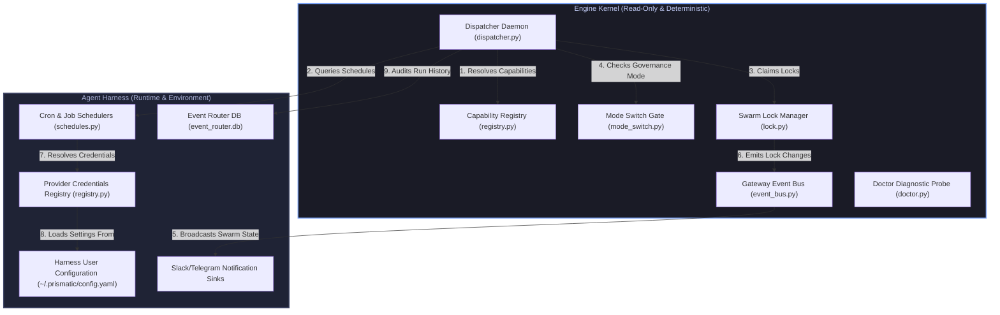

# Prismatic Engine — Core Architecture Reference

**Status:** Approved & Released  
**Target:** Engine-first architecture document  
**Last verified against commit SHA:** `b6efcfdd11181652bbe8990a36d1eeca71d8c834`  

---

## 1. Executive Overview

The Prismatic Engine is a multi-agent orchestration kernel designed to coordinate autonomous AI developers (such as Fred, Kai, Ned, and Jules) collaborating on a shared git codebase. 

To prevent run-time state-drift, process pollution, or conflicts while agents actively edit code, the system relies on a clean, physical separation between the **Engine Kernel** (the core execution loop, event routing, lock management, and capabilities system) and the **Agent Harness** (surrounding runtime environment, scheduling mechanisms, credentials, and notification channels).

---

## 2. System Topology: Engine Kernel vs. Harness Boundary

The following diagram defines the structural boundary between the read-only, deterministic **Engine Kernel** and the local execution **Harness**.

---

## 3. Core Engine Components

### 3.1 Capabilities Registry
* **Module Path:** [prismatic/capabilities/registry.py](file:///home/ubuntu/work/prismatic-engine/prismatic/capabilities/registry.py)
* **Purpose:** The capabilities registry validates that all external and internal API requirements, credential scopes, and configurations are satisfied before invoking any capability check.
* **Registered Capabilities:**
  - `linear`: Verifies `LINEAR_API_KEY` is present.
  - `vcs.github`: Verifies `GITHUB_TOKEN`, `GH_TOKEN`, or `PRISMATIC_GITHUB_TOKEN` is loaded.
  - `agy`: Verifies standard `AGY_TOKEN` availability.
  - `jules`: reviews and reviews handoff capabilities (defaulting to ok).
  - `telegram`: Verifies Telegram notification tokens.
  - `schedule`: Ensures local engine-schedule storage is validated.
  - `chat.agy`: Dynamically checks for local AGY OAuth tokens or `AGY_PATH` context.
  - `artifact`: Validates artifact generation configuration.

### 3.2 Providers
* **Module Path:** [prismatic/providers/registry.py](file:///home/ubuntu/work/prismatic-engine/prismatic/providers/registry.py)
* **Purpose:** The providers layer abstracts authentication and communication channels for external services (e.g., GitHub, Linear, Ollama). 
* **Key Mechanisms:**
  - **Probes:** Each provider maps to a validation probe function (e.g. `_github_probe` querying `GET /user`).
  - **Credentials Configuration:** The `CredentialRegistry` handles the `prismatic providers attach` CLI commands, validating tokens live and persisting metadata to `$PRISMATIC_HOME/.prismatic/config.yaml`.

### 3.3 Event Bus
* **Module Path:** [prismatic/gateway/event_bus.py](file:///home/ubuntu/work/prismatic-engine/prismatic/gateway/event_bus.py)
* **Purpose:** Provides a lightweight, thread-safe asynchronous pub/sub architecture (`EventBus`) running within the gateway process.
* **Key Mechanisms:**
  - **Fanout Distribution:** Broadcasts `SwarmEvent` packages (consisting of `type`, `source`, `timestamp`, and `payload`) concurrently to registered subscribers.
  - **History Buffer:** Maintains an in-memory ring-buffer history of up to 200 events for quick telemetry retrieval.

### 3.4 Gateway
* **Module Path:** [prismatic/gateway/server.py](file:///home/ubuntu/work/prismatic-engine/prismatic/gateway/server.py)
* **Purpose:** Runs the FastAPI web host and exposes WebSocket connections for live swarm updates.
* **Key Sub-systems:**
  - **IPC Bridge:** A Unix socket receiver (`ipc_bridge.py`) that captures raw local logs/lock events from running subprocesses and publishes them directly to the `EventBus`.
  - **WebSocket Broadcaster:** Handles connection pooling (`ws_broadcaster.py`) and pipes events from the event bus directly to front-end clients or monitoring channels.

### 3.5 Dispatcher
* **Module Path:** [prismatic/dispatcher.py](file:///home/ubuntu/work/prismatic-engine/prismatic/dispatcher.py)
* **Purpose:** Operates as the central background daemon (or CLI runner), pulling tasks from the Linear GraphQL API or a local task queue.
* **Key Responsibilities:**
  - Decomposes target requests into workspace-bounded tasks.
  - Generates sandboxed execution contracts enforcing directory constraints via `ContractManager`.
  - Manages handoffs between agents and handles file lock claims dynamically via `lock.py`.

### 3.6 Schedules
* **Module Path:** [prismatic/schedules.py](file:///home/ubuntu/work/prismatic-engine/prismatic/schedules.py)
* **Purpose:** Aggregates and inventories cron-like schedule registrations across remote and local paths.
* **Adapters:**
  - [RealAGYScheduleAdapter](file:///home/ubuntu/work/prismatic-engine/prismatic/schedules.py): Invokes `agy schedule list --json` via an isolated headless subprocess.
  - [RealJulesScheduleAdapter](file:///home/ubuntu/work/prismatic-engine/prismatic/schedules.py): Queries the remote Jules REST API endpoint under `Authorization` headers.
  - **Graceful Fallback:** If any remote adapter fails, the system logs a warning and yields cached mock lists to maintain execution continuity.

### 3.7 Doctor
* **Module Path:** [prismatic/doctor.py](file:///home/ubuntu/work/prismatic-engine/prismatic/doctor.py)
* **Purpose:** Acts as a side-effect-free diagnostic runner assessing system health.
* **Probes:** Evaluates Python environments, Git installations, path statuses for `config.yaml` and SQLite event DBs, provider scopes, and capability statuses. Returns a structured, typed `DoctorReport` to the CLI layer.

### 3.8 Mode Switch
* **Module Path:** [prismatic/mode_switch.py](file:///home/ubuntu/work/prismatic-engine/prismatic/mode_switch.py)
* **Purpose:** Gates state transitions across the 7 canonical loop states: `decompose`, `dispatch`, `execute`, `review`, `feedback`, `refine`, and `integrate`.
* **Modes:**
  - `interactive`: Every single state change prompts for human approval.
  - `collaborative`: Auto-fires minor transitions but prompts on major boundaries (e.g., entering `execute` or `integrate`).
  - `autonomous`: Auto-runs all transitions, pausing only on explicit escalation alerts.

---

## 4. Cross-References & Swarm Safety Rules

### 4.1 The Inventory System (Schedule Observability)
To render honest system status badges, the schedules module discovers jobs across:
* Local AGY configs: `~/.gemini/schedules/*.json`
* Local Jules configs: `~/.config/jules/schedules.json`
* Systemd timers and cron jobs.

### 4.2 The Additive Workflow & Lane Isolation
As defined in [PRISMATIC_ENGINE.yaml](file:///home/ubuntu/work/prismatic-engine/PRISMATIC_ENGINE.yaml), agents are restricted by strict directory paths:
* **Fred (Infra):** Owns `src/`, `infra/`, `deploy/`, `.github/`
* **Kai (Content):** Owns `content/`, `active-oahu/`
* **AGY (Design):** Owns `assets/`, `designs/`, `research/`
Any code modification must remain inside these specific directory bounds. The engine pre-push git hook validates file changes to guarantee lane separation.

### 4.3 The Rate-Limit & Credit Tracker Pattern
To avoid API disruptions or running out of tokens during deep loops:
* A central `BudgetManager` (defined in [prismatic/telemetry.py](file:///home/ubuntu/work/prismatic-engine/prismatic/telemetry.py)) tracks execution tokens and rate-limiting response states.
* Multimodal credits are monitored via the credit engine in [prismatic/credit_tracker.py](file:///home/ubuntu/work/prismatic-engine/prismatic/credit_tracker.py), triggering automated warnings when credit burn velocities exceed safe thresholds.
