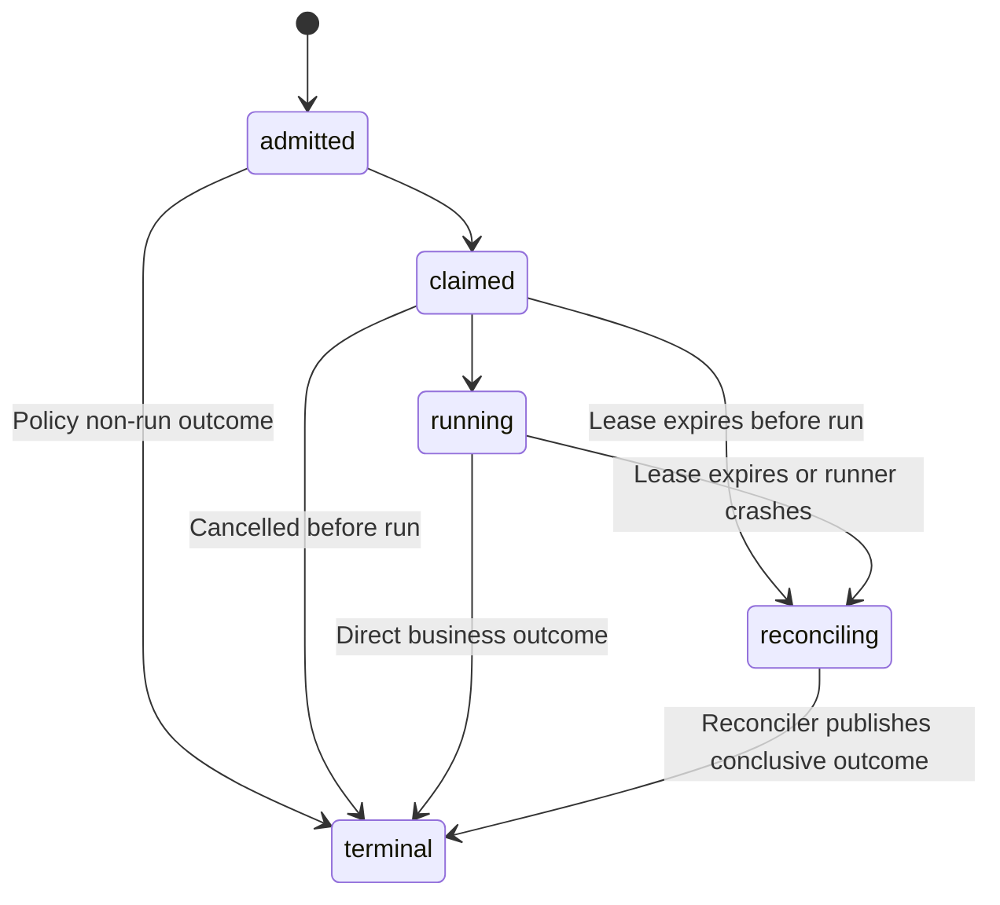

# Cron Trigger Identity and Durable Outcome Contract v1

```text
CONTRACT_VERSION=1.0.0
SPEC_ID=cron-trigger-outcome-v1
STATUS=NORMATIVE_DESIGN_CONTRACT
BASE_SCHEMA=CronRunReceipt-v1 (GRO-4270)
ALLOW_WRITES=docs/contracts/cron-trigger-outcome-v1.md
```

---

## 1. Scope and non-goals

### 1.1 Scope
This document specifies the normative architectural design contract for cron trigger envelopes, execution uniqueness keys, fenced claim state transitions, canonical durable authority, catch-up/replay policies, and recovery mechanics within the Prismatic Engine framework (`mbgulden/prismatic-engine`).

This specification is a **design contract only** and MUST NOT be construed as an authorization for code, schema, runner, or transport implementation. All operational, database, and code changes MUST be authorized under separate implementation slices.

### 1.2 Non-goals
- **Code Implementation**: Modifying Python modules (`prismatic/*.py`), tests, schemas, or databases.
- **Base Receipt Schema Mutation**: Mutating the existing GRO-4270 `CronRunReceipt` v1 schema definition (`prismatic/cron_receipts/cron-run-receipt-v1.schema.json` and `prismatic/cron_receipts/schema.py`). GRO-4270 remains the accepted base receipt schema.
- **Transport and Runner Deployment**: Deploying background runners, systemd timers, crontabs, or transport listeners.
- **External Claim Proofs**: Writing state to Linear, GitHub, staging systems, or production platforms.

---

## 2. Terminology and versioning

### 2.1 Contract Versioning
This contract is versioned as `cron-trigger-outcome-v1`. Backward-compatible additive fields or clarifications MUST increment the minor version. Changes to uniqueness inputs, field meaning, state-machine semantics, or fencing guarantees are breaking and MUST increment the major version (for example, `cron-trigger-outcome-v2`) and provide explicit v1 translation or rejection rules.

### 2.2 Domain Primitives
- **Trigger Event**: An incoming signal or notification produced by a scheduler (crontab, systemd timer, HTTP webhook, CLI) indicating that a cron schedule has fired or requires execution.
- **Execution Claim**: A fenced reservation of an execution bucket acquired in the canonical durable authority prior to dispatching business work.
- **Attempt**: A 1-indexed execution try by a runner process under an active, valid claim lease.
- **Receipt**: An immutable record of execution outcome adhering strictly to the GRO-4270 `CronRunReceipt` v1 specification.
- **Projection**: A read-only secondary view, index, or summary (such as `EventRouterDedup` in `prismatic/dedup.py` or dashboard tabs) derived from authority events.
- **Authority**: The single canonical transactional state engine that owns claim state, lease fences, and receipt persistence.

---

## 3. Trigger envelope

### 3.1 Specification Requirements
Every incoming trigger event MUST be normalized into a standard Trigger Envelope before admission. The fields, types, and constraints of the envelope are specified below:

| Field Name | Type / Format | Bounds / Constraints | Description |
| :--- | :--- | :--- | :--- |
| `trigger_event_id` | String | 1 to 128 chars | Unique identifier of the trigger notification instance. |
| `cron_id` | String | 1 to 128 chars | Target cron job identifier (e.g., `seo.aot-weekly-rankings`). |
| `registry_generation` | Integer | >= 1 | Monotonically increasing generation of the target cron definition. |
| `schedule_bucket` | String (RFC 3339 UTC) | ISO format ending with `Z` | Scheduled instant calculated using the registered cron timezone and explicit DST gap/fold policy, then normalized to UTC. |
| `trigger_kind` | Enum String | `scheduled`, `catch_up`, `manual`, `external_event` | Semantic intent of the trigger firing. |
| `transport_kind` | Enum String | `crontab`, `systemd`, `http_webhook`, `cli` | Transport channel that delivered the trigger event (recorded separately from `trigger_kind`). |
| `command_digest` | String (SHA-256) | 64 lowercase hex chars | SHA-256 over the canonical non-secret executable specification defined below. |
| `release_digest` | String (SHA-256) | 64 lowercase hex chars | SHA-256 digest of runner release artifact. |
| `requested_at` | String (RFC 3339 UTC) | ISO format ending with `Z` | Time when scheduler emitted the trigger. |
| `accepted_at` | String (RFC 3339 UTC) | ISO format ending with `Z` | Time when authority admitted the trigger envelope. |

### 3.2 Timestamp normalization and field redaction
- All timestamps MUST be normalized to UTC RFC 3339 strings with explicit `Z` suffixes (e.g., `2026-07-28T02:00:00Z`).
- Secret materials (API keys, bearer tokens, OAuth tokens, private credentials) MUST NOT enter the canonical command specification. `command_digest` MUST cover a canonical, length-prefixed encoding of non-secret executable argv, working directory, and approved configuration references; redaction is a logging defense, not an identity transform.

### 3.3 Timezone and DST policy
Every cron registry entry MUST carry an IANA timezone, `dst_gap_policy` (`skip` or `next_valid`), and `dst_fold_policy` (`first`, `second`, or `both`). The authority, not the transport, MUST calculate `schedule_bucket` from the registered schedule and these policies.

- For a nonexistent local time, `skip` emits a non-run receipt whose `schedule_bucket` is the UTC transition instant and whose bounded evidence records the intended local wall time; `next_valid` maps execution to the first valid instant after the gap.
- For an ambiguous local time, `first` selects the earlier UTC instant, `second` selects the later instant, and `both` creates two distinct UTC buckets in chronological order.
- The selected or mapped instant MUST be serialized as UTC `Z`. Registry validation MUST reject any policy/schedule combination that can map two intended firings to the same uniqueness key.
- A timezone or DST-policy change MUST increment `registry_generation`. The runner release and registry generation together bind the timezone database and policy used for calculation.

---

## 4. Execution identity

### 4.1 Canonical Uniqueness Key
The exact execution uniqueness key tuple MUST be defined as:

$$\text{UniquenessKey} = (\mathtt{cron\_id}, \mathtt{registry\_generation}, \mathtt{schedule\_bucket}, \mathtt{command\_digest})$$

- **Aggregate Uniqueness**: The authority MUST store exactly one execution aggregate for each `(cron_id, registry_generation, schedule_bucket, command_digest)` tuple. Duplicate deliveries resolve to that aggregate.
- **Attempt and Receipt Uniqueness**: An aggregate MAY contain multiple explicitly authorized attempts. `attempt` MUST increase monotonically from 1, and the authority MUST enforce one immutable receipt per `(execution_id, attempt)` plus global uniqueness of `receipt_id`. Receipts share the aggregate key by design; they do not violate aggregate uniqueness.
- **Execution ID Mapping**: On first admission the authority MUST allocate one opaque `execution_id` and bind it permanently to the aggregate uniqueness key. Every attempt and receipt for that aggregate MUST reuse that `execution_id`; a different uniqueness key MUST NOT reuse it.
- **Evidence Fields**: `trigger_kind`, `transport_kind`, `trigger_event_id`, and `attempt` count are evidence attributes and MUST NOT be used as inputs to the execution uniqueness key.

### 4.2 Convergence and Identity Changes
- **Delivery Convergence**: Duplicate, reordered, or delayed deliveries matching an existing uniqueness key MUST converge on the existing claim/outcome record without creating redundant work.
- **Identity Shifts**: Any change to `command_digest` or `registry_generation` produces a distinct uniqueness key, ensuring configuration updates create isolated execution tracks.

---

## 5. State machine

### 5.1 Per-attempt claim states
The canonical authority owns one execution aggregate per uniqueness key. Each explicitly admitted attempt has its own mutable claim state, distinct from prior attempts and immutable `CronRunReceipt` records:



Legal per-attempt states are `admitted`, `claimed`, `running`, `reconciling`, and `terminal`. An authority transaction MAY move a non-terminal attempt forward or move `reconciling` to `terminal`; a terminal attempt has no outgoing transition. It MUST NOT regress an attempt, replace the aggregate uniqueness key, or mutate an existing receipt.

### 5.2 Immutable receipt outcomes
The nine receipt outcomes MUST match GRO-4270 exactly:
1. `succeeded`: Business work completed and its required evidence was validated.
2. `failed`: Business work produced a bounded failure result.
3. `timed_out`: The attempt exceeded its authorized runtime.
4. `cancelled`: The attempt was explicitly cancelled.
5. `blocked`: Admission was denied by policy or dependency state.
6. `missed_during_offline`: A catch-up policy intentionally did not execute the bucket.
7. `awaiting_operator_approval`: This admission attempt stopped without running because approval is required.
8. `orphaned`: Reconciliation could not establish a safe business outcome after lease loss.
9. `reconciled`: Reconciliation established a conclusive outcome after an attempt failed to publish its own receipt.

A receipt is terminal and immutable for its `(execution_id, attempt, receipt_id)`. The execution aggregate MAY contain more than one immutable attempt receipt only for an explicitly admitted retry, replay, approval continuation, or reconciliation. The authority MUST create a new attempt record in `admitted`, preserve the aggregate uniqueness key, allocate the next `attempt`, and validate authorization in one transaction. Duplicate delivery alone MUST NOT create an attempt.

### 5.3 `reconciled` and illegal-transition rules
`reconciled` is an appended terminal receipt for a reconciliation attempt; it is not a mutation of a prior receipt. Its `error_classification` and bounded evidence MUST identify the underlying conclusive class (`succeeded`, `failed`, `cancelled`, or `timed_out`). If a prior attempt already published an authoritative business outcome, reconciliation MUST return that receipt and MUST NOT append `reconciled`.

An expired attempt enters `reconciling` before any terminal receipt is chosen. The reconciler MUST publish either `reconciled` when conclusive evidence exists or `orphaned` when it does not. A separately authorized retry, replay, approval continuation, or reconciliation creates a new attempt under the same aggregate; it MUST NOT reopen or transition the prior terminal attempt. No policy may overwrite or delete an earlier attempt or receipt.

---

## 6. Fenced claim and lease semantics

### 6.1 Lease properties
To prevent split-brain execution, claim acquisition MUST establish a fenced lease with:
- `runner_id`: Opaque identity of the runner process.
- `fence_token`: Monotonically increasing integer allocated on ownership acquisition or reacquisition. A heartbeat renewal by the same owner MUST retain its token.
- `lease_expires_at`: UTC RFC 3339 timestamp after which the owner may no longer start work or publish an outcome.

The authority MUST compare owner, fence token, and unexpired lease inside every state-changing transaction. Renewal MUST be conditional on the same owner and token; reacquisition after expiry MUST allocate a strictly greater token.

### 6.2 Crash windows
1. **Crash-Before-Run**: The expired claim moves to `reconciling`; the reconciler appends `orphaned` only if no conclusive work evidence exists, then policy may authorize a new fenced attempt.
2. **Crash-During-Run**: Lease loss moves the claim to `reconciling`; the stale owner is fenced out and the reconciler chooses `reconciled` or `orphaned` from bounded evidence.
3. **Crash-After-Business-Work**: The stale runner MUST NOT publish. The reconciler uses independently durable business evidence and may append `reconciled`; absent conclusive evidence it MUST append `orphaned`, never unproven success.

### 6.3 Absolute fencing invariant
**No stale owner MAY start business work, renew a claim, or publish any terminal receipt.** Any state-changing request presenting an expired lease, wrong owner, or superseded `fence_token` MUST fail closed without mutating authority state.

---

## 7. Canonical durable authority

### 7.1 Repository evidence and current gap
The current repository provides:
- Cron configuration and lifecycle fields in `prismatic/native_crons.py` (`NativeCron`, `NativeCronStore`) plus schedules in `prismatic/core_crons.py` and `prismatic/schedules.py`.
- The configured durable bus path `PRISMATIC_BUS_DB`, defaulting to `.prismatic/bus/event_log.sqlite`, referenced by `prismatic/timeline.py` and gateway readers.
- SQLite WAL, foreign-key, idempotent admission, and outbox transactions in `prismatic/task_admission.py` (`TaskAdmissionStore`).
- `BEGIN IMMEDIATE`, lease expiry, attempt count, claim lifecycle, and cap enforcement in `prismatic/task_admission_consumer.py`.
- The accepted base receipt in `prismatic/cron_receipts/schema.py`.
- Backup primitives in `prismatic/backup.py`.

No current table or store atomically joins cron execution claims to `CronRunReceipt` persistence. Therefore no current cron-execution authority satisfies this contract yet.

### 7.2 Selected authority boundary
A future implementation slice MUST extend the existing configured `PRISMATIC_BUS_DB` authority with versioned cron-execution aggregate, per-attempt, append-only receipt, and content-addressed evidence tables. It MUST reuse the repository's SQLite WAL and explicit transaction pattern rather than create `cron_execution_authority.db`, `cron_receipts.db`, or another mutable database. The configured bus database becomes cron authority only after migrations, backup/restore proof, and exact transactional canaries are accepted; until then, cron execution admission MUST remain disabled.

`EventRouterDedup`, dead-letter storage, journal records, Linear issues, transport acknowledgements, and dashboard projections are evidence or views and MUST NOT become authority.

### 7.3 Transactional consistency boundary
Each state mutation MUST execute in one `BEGIN IMMEDIATE` authority transaction that:

1. resolves the uniqueness key and current aggregate;
2. validates owner, fence token, lease, attempt, and legal transition;
3. updates attempt state, stores any content-addressed evidence object, and appends the immutable `CronRunReceipt` when an outcome is published;
4. advances any reconciliation or completed-sweep cursor; and
5. commits all changes together or rolls all of them back.

A receipt MUST NOT be visible without its matching attempt transition, and an attempt MUST NOT become terminal without its matching receipt. Projection delivery occurs only after commit and cannot change the transaction result.

---

## 8. Admission and policy rejection

### 8.1 Rejection Conditions
Admissions MUST be evaluated against policy rules. Firing requests MUST be rejected under the following conditions:
- `paused`: Target cron state is `paused`.
- `deactivated` / `deleted`: Target cron state is `deactivated` or `deleted`.
- `dependency_blocked`: Required upstream prerequisite tasks have not completed successfully.
- `release_mismatched`: Runner `release_digest` does not match active deployment policy.
- `awaiting_operator_approval`: Manual confirmation is pending.

### 8.2 Durable Non-Success Evidence
Every accepted non-run path MUST append a bounded durable `CronRunReceipt` with the policy-defined outcome (`blocked`, `cancelled`, `missed_during_offline`, or `awaiting_operator_approval`). `evidence_digest` MUST identify a separately stored bounded, redacted evidence object; the digest itself MUST NOT be treated as descriptive text.

---

## 9. Catch-up, replay, and idempotency

### 9.1 Catch-Up Policies
Every cron job MUST declare one catch-up policy plus finite `lookback_limit` and `max_buckets_per_sweep` bounds:
- `skip`: Do not execute missed buckets; append `missed_during_offline` for each in-bound bucket.
- `run_latest`: Execute only the latest in-bound bucket; append `missed_during_offline` for older in-bound buckets.
- `run_all`: Execute in-bound buckets chronologically, never exceeding `max_buckets_per_sweep`; remaining buckets stay pending for a later bounded sweep.

Buckets outside the registered lookback are expired and MUST receive bounded `missed_during_offline` evidence through a finite range-summary receipt policy. Catch-up MUST NOT create an unbounded loop or one receipt per bucket across an unbounded outage.

### 9.2 Replay and Idempotency Rules
- **Identity Preservation**: An explicitly authorized replay MUST preserve the original `(cron_id, registry_generation, schedule_bucket, command_digest)` uniqueness tuple, create a new per-attempt record in `admitted`, and later append at most one receipt for that strictly incremented `attempt`; it MUST NOT create a new aggregate or schedule bucket. Ordinary duplicate delivery returns existing state and does not create an attempt.
- **Projection Isolation**: Outages or schema changes in secondary projections (dashboards, dedup caches) MUST NOT alter or block canonical authority state transactions.

---

## 10. Migration, compatibility, backup, and restore

### 10.1 Schema Compatibility & Watermarks
- **Version Upgrades**: Minor-version migrations MUST be additive. Breaking semantics require a new major contract and explicit translation or fail-closed rejection. The authority MUST preserve readable v1 records.
- **Completed Sweep Cursor**: The authority MUST persist a monotonic cursor scoped by `(cron_id, registry_generation, command_digest)` plus catch-up policy version. The cursor is scan progress, not execution authority; uniqueness constraints remain the duplicate-work guard.

### 10.2 Orphan Sweeper & Restore Rules
- **Orphan Reconciliation**: A bounded sweeper MUST claim expired leases using a new fence, move them to `reconciling`, and append exactly one authorized reconciliation-attempt receipt (`reconciled` with conclusive evidence or `orphaned` without it).
- **Restore Invariants**: Restoring the authority database from state backups (e.g., generated via `prismatic/backup.py`) MUST preserve all existing uniqueness keys. A restored database MUST NOT permit a previously finalized terminal bucket to rerun as new work.

---

## 11. Security and evidence

### 11.1 Evidence bounding, redaction, and digest canonicalization
- Evidence MUST be a JSON object with string keys. After redaction it MUST encode to at most 4000 UTF-8 bytes; raw logs, complete environments, binary data, and unbounded stack traces are forbidden.
- Secret values MUST be removed before canonicalization and replaced only with the stable literal `[REDACTED]`. If redaction cannot be proven, evidence storage and receipt publication MUST fail closed.
- The redacted object MUST be canonicalized using RFC 8785 JSON Canonicalization Scheme. `evidence_digest` MUST equal lowercase hexadecimal `SHA-256(canonical_utf8_bytes)` and therefore contain exactly 64 hexadecimal characters.
- The canonical bytes MUST be stored once in an append-only, content-addressed evidence table in `PRISMATIC_BUS_DB`, keyed by `evidence_digest`, in the same authority transaction as the receipt. A hash collision with different bytes MUST fail closed.
- `evidence_digest` MAY be null only when the outcome contract does not require evidence. It MUST be non-null for `failed`, `timed_out`, `blocked`, `missed_during_offline`, `awaiting_operator_approval`, `orphaned`, and `reconciled`; policy MAY also require it for `succeeded` or `cancelled`.

### 11.2 Signing Mechanics
- `signing_key_id` and `signature` fields in `CronRunReceipt` remain data-only placeholders in v1 until a cryptographic signing implementation is authorized in a separate slice.

---

## 12. Canary acceptance matrix

| Case # | Scenario | Expected Uniqueness Behavior | State Transition | Durable Receipt Outcome | Forbidden Result |
| :--- | :--- | :--- | :--- | :--- | :--- |
| 1 | Normal Run | Unique key created | `admitted` -> `claimed` -> `running` -> `terminal` | `succeeded` | Duplicate run or missing receipt |
| 2 | Duplicate Delivery | Matches existing key | Converges on existing claim record | Existing receipt returned | Second execution attempt |
| 3 | Reordered Delivery | Matches existing key | Reordered event ignored | Existing receipt returned | State regression to non-terminal |
| 4 | Delayed Delivery | Matches existing key | Delayed event ignored | Existing receipt returned | Rerunning finalized work |
| 5 | Command Change | New `command_digest` generated | Forms new distinct uniqueness key | `succeeded` (new key) | Overwriting previous command receipt |
| 6 | Registry Change | New `registry_generation` generated | Forms new distinct uniqueness key | `succeeded` (new key) | Merging distinct registry histories |
| 7 | Crash-Before-Run | Matches original key | `claimed` -> `reconciling` -> `terminal` | `orphaned` absent conclusive work evidence | Unfenced retry or silent disappearance |
| 8 | Crash-During-Run | Matches original key | `running` -> `reconciling` -> `terminal` | `reconciled` or `orphaned` from bounded evidence | Stale owner publishing success |
| 9 | Crash-After-Work | Matches original key | `running` -> `reconciling` -> `terminal` | `reconciled` only with conclusive independent evidence | Unproven success or lost evidence |
| 10 | Timeout | Matches original key | `running` -> `terminal` | `timed_out` | Silent process leak |
| 11 | Cancellation | Matches original key | `running` -> `terminal` | `cancelled` | Overriding cancellation with success |
| 12 | Dependency Block | Matches original key | `admitted` -> `terminal` | `blocked` | Running without prerequisites |
| 13 | Paused / Deactivated / Deleted | Matches original key | `admitted` -> `terminal` | `blocked` | Running inactive cron |
| 14 | Missed Catch-Up | Matches original key | `admitted` -> `terminal` | `missed_during_offline` | Silent drop without receipt |
| 15 | Replay Fired | Matches original key | Authorized attempt N+1 begins at `admitted`; prior attempt remains terminal | `succeeded` or `failed` | Reopening prior attempt or creating a second aggregate |
| 16 | Restore from Backup | Restores existing keys | Key status preserved in authority | Original terminal outcome | Rerunning terminal restored buckets |
| 17 | Stale Fence Race | Superseded fence token | Stale request rejected without state change | Existing authoritative receipt, or later reconciler receipt | Stale owner mutation |
| 18 | Release Mismatch | Release digest mismatch | `admitted` -> `terminal` | `blocked` | Running on unapproved release |
| 19 | Projection Outage | Matches original key | Unaffected authority commit | `succeeded` | Authority failure due to projection |
| 20 | Approval Continuation | Matches original key | Authorized attempt N+1 begins at `admitted`; approval attempt remains terminal | `awaiting_operator_approval`, then later attempt outcome | Reopening prior attempt, new aggregate, or bypassed approval |

---

## 13. Implementation slices and unresolved decisions

### 13.1 Future Implementation Slices
1. **Schema & Dataclass Slice**: Expand receipt validation tooling if additive fields are introduced.
2. **Authority Migration Slice**: Add versioned cron aggregate and append-only receipt tables to the configured `PRISMATIC_BUS_DB`, with fenced claim transactions and rollback tests.
3. **Runner & Claim Engine Slice**: Build background runner process loop with heartbeat renewals.
4. **Transport Adapter Slice**: Connect crontab, systemd, and HTTP webhook listeners to envelope normalizer.
5. **Telemetry & Projection Slice**: Update secondary dashboard tabs and dedup projections.

### 13.2 Unresolved Decisions
- **Cryptographic Key Management**: Selection of KMS vs local asymmetric key pairs for `CronRunReceipt` signature verification will be decided in the signing implementation slice.
- **Multi-Region Replication**: Authority WAL streaming across geographic nodes is deferred until multi-region runner deployment is scoped.
