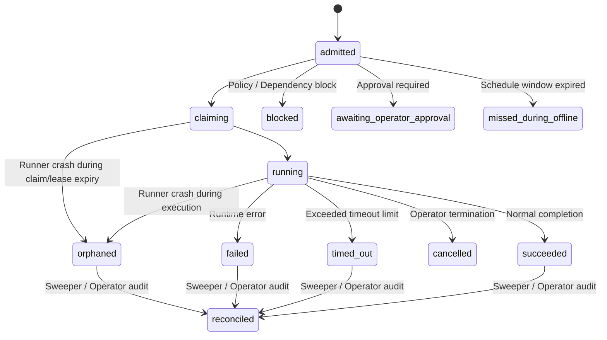

# Cron Trigger Identity and Durable Outcome Contract v1

```text
CONTRACT_VERSION=1.0.0
SPEC_ID=cron-trigger-outcome-v1
STATUS=NORMATIVE_DESIGN_CONTRACT
BASE_SCHEMA=CronRunReceipt-v1 (GRO-4270)
ALLOW_WRITES=docs/contracts/cron-trigger-outcome-v1.md
```

---

## 1. Scope and non-goals

### 1.1 Scope
This document specifies the normative architectural design contract for cron trigger envelopes, execution uniqueness keys, fenced claim state transitions, canonical durable authority, catch-up/replay policies, and recovery mechanics within the Prismatic Engine framework (`mbgulden/prismatic-engine`).

This specification is a **design contract only** and MUST NOT be construed as an authorization for code, schema, runner, or transport implementation. All operational, database, and code changes MUST be authorized under separate implementation slices.

### 1.2 Non-goals
- **Code Implementation**: Modifying Python modules (`prismatic/*.py`), tests, schemas, or databases.
- **Base Receipt Schema Mutation**: Mutating the existing GRO-4270 `CronRunReceipt` v1 schema definition (`prismatic/cron_receipts/cron-run-receipt-v1.schema.json` and `prismatic/cron_receipts/schema.py`). GRO-4270 remains the accepted base receipt schema.
- **Transport and Runner Deployment**: Deploying background runners, systemd timers, crontabs, or transport listeners.
- **External Claim Proofs**: Writing state to Linear, GitHub, staging systems, or production platforms.

---

## 2. Terminology and versioning

### 2.1 Contract Versioning
This contract is versioned as `cron-trigger-outcome-v1`. Any future modifications to fields, uniqueness rules, state machine transitions, or fencing requirements MUST increment the major version (e.g., `cron-trigger-outcome-v2`) and provide backward-compatible translation adapters for v1 receipts.

### 2.2 Domain Primitives
- **Trigger Event**: An incoming signal or notification produced by a scheduler (crontab, systemd timer, HTTP webhook, CLI) indicating that a cron schedule has fired or requires execution.
- **Execution Claim**: A fenced reservation of an execution bucket acquired in the canonical durable authority prior to dispatching business work.
- **Attempt**: A 1-indexed execution try by a runner process under an active, valid claim lease.
- **Receipt**: An immutable record of execution outcome adhering strictly to the GRO-4270 `CronRunReceipt` v1 specification.
- **Projection**: A read-only secondary view, index, or summary (such as `EventRouterDedup` in `prismatic/dedup.py` or dashboard tabs) derived from authority events.
- **Authority**: The single canonical transactional state engine that owns claim state, lease fences, and receipt persistence.

---

## 3. Trigger envelope

### 3.1 Specification Requirements
Every incoming trigger event MUST be normalized into a standard Trigger Envelope before admission. The fields, types, and constraints of the envelope are specified below:

| Field Name | Type / Format | Bounds / Constraints | Description |
| :--- | :--- | :--- | :--- |
| `trigger_event_id` | String | 1 to 128 chars | Unique identifier of the trigger notification instance. |
| `cron_id` | String | 1 to 128 chars | Target cron job identifier (e.g., `seo.aot-weekly-rankings`). |
| `registry_generation` | Integer | >= 1 | Monotonically increasing generation of the target cron definition. |
| `schedule_bucket` | String (RFC 3339 UTC) | ISO format ending with `Z` | Normalized schedule timestamp truncated to schedule interval. |
| `trigger_kind` | Enum String | `scheduled`, `catch_up`, `manual`, `external_event` | Semantic intent of the trigger firing. |
| `transport_kind` | Enum String | `crontab`, `systemd`, `http_webhook`, `cli` | Transport channel that delivered the trigger event (recorded separately from `trigger_kind`). |
| `command_digest` | String (SHA-256) | 64 lowercase hex chars | SHA-256 digest of command parts and working directory. |
| `release_digest` | String (SHA-256) | 64 lowercase hex chars | SHA-256 digest of runner release artifact. |
| `requested_at` | String (RFC 3339 UTC) | ISO format ending with `Z` | Time when scheduler emitted the trigger. |
| `accepted_at` | String (RFC 3339 UTC) | ISO format ending with `Z` | Time when authority admitted the trigger envelope. |

### 3.2 Timestamp Normalization and Field Redaction
- All timestamps MUST be normalized to UTC RFC 3339 strings with explicit `Z` suffixes (e.g., `2026-07-28T02:00:00Z`).
- Secret materials (API keys, bearer tokens, OAuth tokens, private credentials) MUST be redacted using pattern rules matching `prismatic/journal.py` before `command_digest` computation or logging.

---

## 4. Execution identity

### 4.1 Canonical Uniqueness Key
The exact execution uniqueness key tuple MUST be defined as:

$$\text{UniquenessKey} = (\mathtt{cron\_id}, \mathtt{registry\_generation}, \mathtt{schedule\_bucket}, \mathtt{command\_digest})$$

- **Unique Scope**: Within a single canonical authority, no two execution claims or terminal receipts MAY share the same `(cron_id, registry_generation, schedule_bucket, command_digest)` tuple.
- **Evidence Fields**: `trigger_kind`, `transport_kind`, `trigger_event_id`, and `attempt` count are evidence attributes and MUST NOT be used as inputs to the execution uniqueness key.

### 4.2 Convergence and Identity Changes
- **Delivery Convergence**: Duplicate, reordered, or delayed deliveries matching an existing uniqueness key MUST converge on the existing claim/outcome record without creating redundant work.
- **Identity Shifts**: Any change to `command_digest` or `registry_generation` produces a distinct uniqueness key, ensuring configuration updates create isolated execution tracks.

---

## 5. State machine

### 5.1 Legal States and Transitions
The execution state machine governs the lifecycle of an execution bucket across non-terminal and terminal states.



### 5.2 Terminal Outcomes
The 9 terminal outcomes MUST match the GRO-4270 `CronRunReceipt` schema exactly:
1. `succeeded`: Execution finished with clean zero exit code and validated outputs.
2. `failed`: Execution terminated due to non-zero exit code or unhandled exception.
3. `timed_out`: Execution exceeded maximum allowed runtime duration.
4. `cancelled`: Execution was explicitly cancelled by operator or system signal.
5. `blocked`: Execution was rejected prior to run due to missing dependency or active block.
6. `missed_during_offline`: Schedule bucket expired while system was offline or paused under `skip` policy.
7. `awaiting_operator_approval`: Execution requires manual operator authorization before run.
8. `orphaned`: Runner process crashed or lost lease heartbeat without publishing a terminal receipt.
9. `reconciled`: Execution state was conclusively determined and settled by an automated sweeper or operator audit.

### 5.3 Fail-Closed Rules and `reconciled` Disambiguation
- **Illegal Transitions**: Transitioning out of any terminal outcome to another terminal outcome is strictly FORBIDDEN. Any such attempt MUST fail closed and trigger an immediate system alert.
- **`reconciled` Disambiguation**: In GRO-4270 `CronRunReceipt` v1, `outcome` set to `"reconciled"` is a valid terminal outcome value. It signifies that the final status was established post-facto by reconciliation logic. Audit details regarding the underlying physical outcome (e.g., business success vs failure) MUST be attached via `evidence_digest` or `error_classification`.

---

## 6. Fenced claim and lease semantics

### 6.1 Lease Properties
To prevent split-brain execution, claim acquisition MUST establish a fenced lease with the following attributes:
- `runner_id`: Opaque string identifier of the executing runner node/process.
- `fence_token`: Monotonically increasing integer incremented on every claim or renewal.
- `lease_expires_at`: UTC RFC 3339 timestamp after which an un-renewed claim is subject to fencing.

### 6.2 Crash Windows
1. **Crash-Before-Run**: Runner dies after acquiring claim but before starting work. The lease expires; background sweeper marks claim `orphaned` or permits fence increment for retry.
2. **Crash-During-Run**: Runner dies mid-execution. Heartbeat fails; lease expires; stale owner is fenced out.
3. **Crash-After-Business-Work**: Runner completes work but crashes before persisting receipt. Sweeper detects valid work evidence, increments fence token, and issues terminal receipt with `reconciled` outcome.

### 6.3 Absolute Fencing Invariant
**No stale owner MAY publish terminal success.** Any commit request presenting an expired or superseded `fence_token` MUST be rejected by the canonical authority.

---

## 7. Canonical durable authority

### 7.1 Repository Evidence and Primitives Audit
An audit of current repository primitives reveals:
- **Cron Configuration**: Defined in `prismatic/native_crons.py` (`SEO_NATIVE_CRONS`, `NativeCronStore`), `prismatic/core_crons.py`, and `prismatic/schedules.py`.
- **Deduplication**: Handled via `EventRouterDedup` (`prismatic/dedup.py`), backed by SQLite (`processed_events` and `dispatch_counts`).
- **Dead-Letter Storage**: Managed via `DeadLetterStore` (`prismatic/dead_letter.py`), backed by SQLite (`dead_letter_events`).
- **Base Receipt Schema**: Defined in `prismatic/cron_receipts/schema.py` (`CronRunReceipt`).

### 7.2 Authority Selection and Gaps
- **Selected Pattern**: An ACID-compliant SQLite store in WAL mode (`cron_execution_authority.db`) is selected as the canonical durable authority engine pattern.
- **Identified Gap**: Existing SQLite stores in `dedup.py` and `dead_letter.py` handle event filtering and dead-letter queues, but lack an atomic, fenced transactional boundary linking claim leases directly to immutable `CronRunReceipt` persistence.
- **Future Authority Requirements**: A unified transactional authority engine MUST be implemented in a dedicated slice to enforce claim-and-receipt atomic commits.

### 7.3 Transactional Consistency Boundary
The claim state reservation, fence token generation, lease check, and receipt publication MUST execute inside a single ACID database transaction:

$$\text{Transaction} = \{ \text{Validate Fence Token} \land \text{Update Claim State} \land \text{Persist CronRunReceipt} \}$$

No separate `cron_receipts.db`, journal endpoint, Linear issue, transport delivery, or dashboard projection IS authority.

---

## 8. Admission and policy rejection

### 8.1 Rejection Conditions
Admissions MUST be evaluated against policy rules. Firing requests MUST be rejected under the following conditions:
- `paused`: Target cron state is `paused`.
- `deactivated` / `deleted`: Target cron state is `deactivated` or `deleted`.
- `dependency_blocked`: Required upstream prerequisite tasks have not completed successfully.
- `release_mismatched`: Runner `release_digest` does not match active deployment policy.
- `awaiting_operator_approval`: Manual confirmation is pending.

### 8.2 Durable Non-Success Evidence
Every accepted non-run path MUST produce a bounded durable `CronRunReceipt` with an appropriate terminal outcome (`blocked`, `cancelled`, or `awaiting_operator_approval`) and include an `evidence_digest` detailing the rejection policy rule.

---

## 9. Catch-up, replay, and idempotency

### 9.1 Catch-Up Policies
Every cron job MUST declare one of three catch-up policies for missed schedule buckets:
- `skip`: Omit missed buckets and create terminal receipt `missed_during_offline` for each skipped interval.
- `run_latest`: Execute only the most recent missed schedule bucket; emit `missed_during_offline` receipts for older buckets.
- `run_all`: Sequentially execute all missed schedule buckets in chronological order.

### 9.2 Replay and Idempotency Rules
- **Identity Preservation**: Manual or automated replays MUST preserve the original `(cron_id, registry_generation, schedule_bucket, command_digest)` uniqueness tuple. Replays increment `attempt` count within evidence, but do NOT create new schedule buckets.
- **Projection Isolation**: Outages or schema changes in secondary projections (dashboards, dedup caches) MUST NOT alter or block canonical authority state transactions.

---

## 10. Migration, compatibility, backup, and restore

### 10.1 Schema Compatibility & Watermarks
- **Version Upgrades**: Schema version migrations MUST be additive. The authority MUST support reading v1 receipt records indefinitely.
- **Completed Sweep Watermark**: The authority MUST track a persistent `last_completed_bucket` per `cron_id` to prevent duplicate scanning during catch-up evaluation.

### 10.2 Orphan Sweeper & Restore Rules
- **Orphan Reconciliation**: A periodic background sweeper MUST query for expired leases (`lease_expires_at < NOW()`) and transition un-heartbeated claims to `orphaned` or `reconciled`.
- **Restore Invariants**: Restoring the authority database from state backups (e.g., generated via `prismatic/backup.py`) MUST preserve all existing uniqueness keys. A restored database MUST NOT permit a previously finalized terminal bucket to rerun as new work.

---

## 11. Security and evidence

### 11.1 Evidence Bounding and Redaction
- Evidence payloads MUST be bounded (maximum 4000 characters for text outputs, 64-hex char SHA-256 for `evidence_digest`).
- All log lines, stack traces, and environment variables MUST be filtered through secret redaction regexes before storage.

### 11.2 Signing Mechanics
- `signing_key_id` and `signature` fields in `CronRunReceipt` remain data-only placeholders in v1 until a cryptographic signing implementation is authorized in a separate slice.

---

## 12. Canary acceptance matrix

| Case # | Scenario | Expected Uniqueness Behavior | State Transition | Durable Receipt Outcome | Forbidden Result |
| :--- | :--- | :--- | :--- | :--- | :--- |
| 1 | Normal Run | Unique key created | `admitted` -> `claiming` -> `running` -> `succeeded` | `succeeded` | Duplicate run or missing receipt |
| 2 | Duplicate Delivery | Matches existing key | Converges on existing claim record | Existing receipt returned | Second execution attempt |
| 3 | Reordered Delivery | Matches existing key | Reordered event ignored | Existing receipt returned | State regression to non-terminal |
| 4 | Delayed Delivery | Matches existing key | Delayed event ignored | Existing receipt returned | Rerunning finalized work |
| 5 | Command Change | New `command_digest` generated | Forms new distinct uniqueness key | `succeeded` (new key) | Overwriting previous command receipt |
| 6 | Registry Change | New `registry_generation` generated | Forms new distinct uniqueness key | `succeeded` (new key) | Merging distinct registry histories |
| 7 | Crash-Before-Run | Matches original key | `admitted` -> `claiming` -> `orphaned` | `orphaned` | Unfenced orphan hanging in `running` |
| 8 | Crash-During-Run | Matches original key | `claiming` -> `running` -> `orphaned` | `orphaned` | Stale owner publishing success |
| 9 | Crash-After-Work | Matches original key | `running` -> `reconciled` (via sweeper) | `reconciled` | Losing execution evidence |
| 10 | Timeout | Matches original key | `running` -> `timed_out` | `timed_out` | Silent process leak |
| 11 | Cancellation | Matches original key | `running` -> `cancelled` | `cancelled` | Overriding cancellation with success |
| 12 | Dependency Block | Matches original key | `admitted` -> `blocked` | `blocked` | Running without prerequisites |
| 13 | Paused / Deactivated | Matches original key | `admitted` -> `blocked` | `blocked` | Running paused cron |
| 14 | Missed Catch-Up | Matches original key | `admitted` -> `missed_during_offline` | `missed_during_offline` | Silent drop without receipt |
| 15 | Replay Fired | Matches original key | Replays under original key with incremented attempt | `succeeded` or `failed` | Creating duplicate schedule bucket |
| 16 | Restore from Backup | Restores existing keys | Key status preserved in authority | Original terminal outcome | Rerunning terminal restored buckets |
| 17 | Stale Fence Race | Superseded fence token | Stale owner rejected by authority | `orphaned` or `reconciled` | Stale owner overwrite |
| 18 | Release Mismatch | Release digest mismatch | `admitted` -> `blocked` | `blocked` | Running on unapproved release |
| 19 | Projection Outage | Matches original key | Unaffected authority commit | `succeeded` | Authority failure due to projection |

---

## 13. Implementation slices and unresolved decisions

### 13.1 Future Implementation Slices
1. **Schema & Dataclass Slice**: Expand receipt validation tooling if additive fields are introduced.
2. **Authority Database Slice**: Implement `CronExecutionAuthority` SQLite engine with fenced claim transactional logic.
3. **Runner & Claim Engine Slice**: Build background runner process loop with heartbeat renewals.
4. **Transport Adapter Slice**: Connect crontab, systemd, and HTTP webhook listeners to envelope normalizer.
5. **Telemetry & Projection Slice**: Update secondary dashboard tabs and dedup projections.

### 13.2 Unresolved Decisions
- **Cryptographic Key Management**: Selection of KMS vs local asymmetric key pairs for `CronRunReceipt` signature verification will be decided in the signing implementation slice.
- **Multi-Region Replication**: Authority WAL streaming across geographic nodes is deferred until multi-region runner deployment is scoped.
