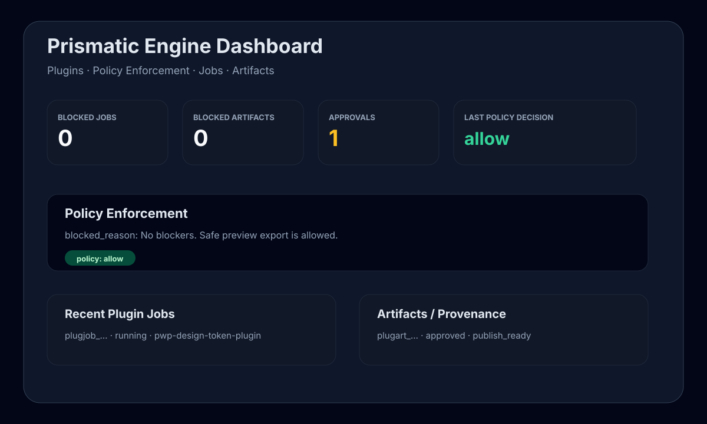
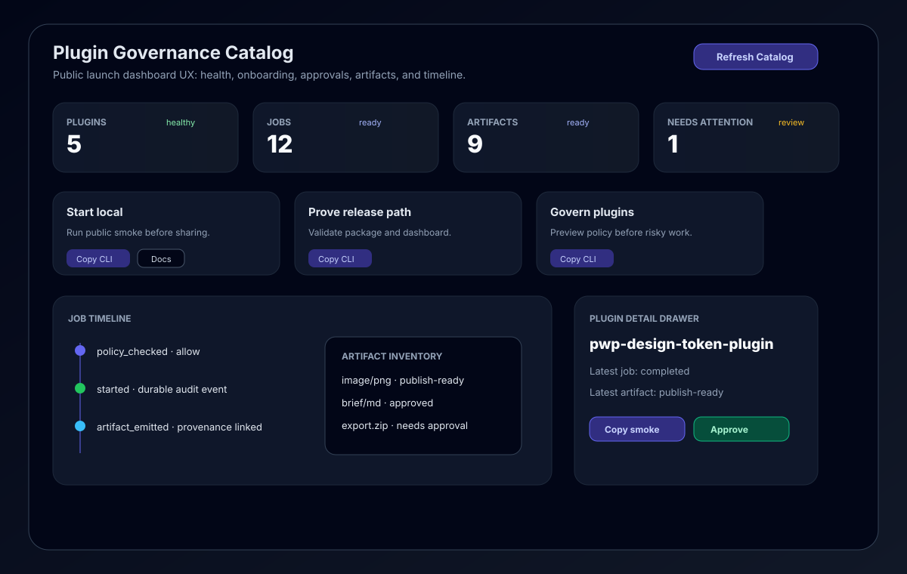

# Dashboard screenshots

The current public dashboard is available at:

```text
http://127.0.0.1:9000/dashboard
```

Start it locally:

```bash
prismatic-gateway --host 127.0.0.1 --port 9000
```

## Plugin policy dashboard

The Plugins tab shows governance, durable jobs, artifacts, and policy enforcement state.



Smoke-test markers in the dashboard template:

```text
plugin-policy-summary
plugin-policy-decision
renderPluginPolicy
Policy Enforcement
blocked_reason
```

## Plugin dashboard UX hardening

The public-polished Plugins tab now includes first-run empty states, onboarding hints, error explanations, copyable CLI commands, docs links, health cards, a plugin detail drawer, job timeline, artifact inventory, cross-plugin audit events, and approval controls.



Smoke-test markers in the dashboard template:

```text
plugin-first-run-empty-state
plugin-onboarding-hints
plugin-error-explanation
copyDashboardCommand
plugin-detail-drawer
plugin-job-timeline
plugin-artifact-inventory
plugin-audit-events
/api/plugins/audit-events
plugin-approval-controls
plugin-dashboard-health-cards
DASHBOARD_VISUAL_QA_OK
```

Run the static visual QA check:

```bash
python scripts/dashboard_visual_qa.py
```

The check verifies public UX markers and mobile/responsive layout markers such as `grid-cols-1`, `sm:grid-cols-2`, the two-column detail drawer breakpoint, and `overflow-x-auto` table containers.

## Capturing a real screenshot

For release notes or website publishing, run the Gateway locally and capture the browser view after both smoke checks pass:

```bash
python scripts/public_launch_smoke.py
python scripts/dashboard_visual_qa.py
```

Keep screenshots free of credentials and private workspace data.
