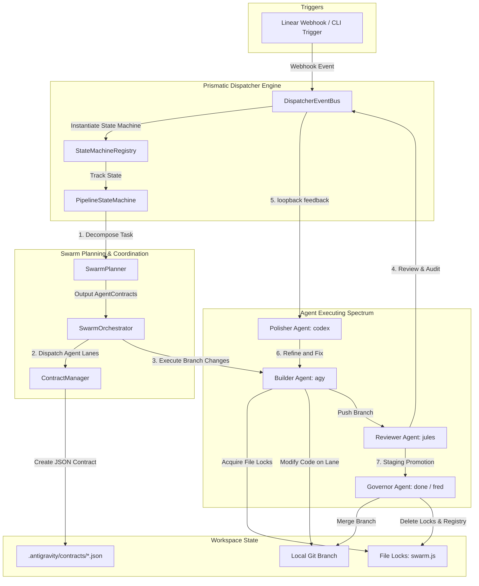
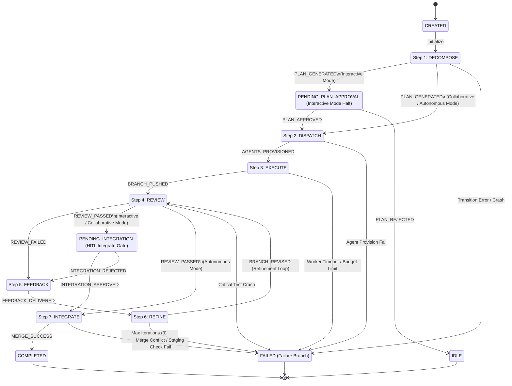

# Prismatic Engine — 7-Step Iterative Loop Developer Guide

This developer guide describes the formal execution loop that powers the **Prismatic Engine**. By structuring all software tasks into a deterministic state-machine-driven sequence, the engine guarantees predictability, enforces strict repository boundaries, incorporates human review gates, and manages automated feedback loops.

---

## 1. Component Architecture Overview

The 7-Step Loop execution lifecycle is managed by the Prismatic Dispatcher. The diagram below illustrates how core system components coordinate task parsing, worker scheduling, lock handling, and validation:



### Core Architecture Components

1. **`DispatcherEventBus`**: The central pub-sub backbone that receives triggers from webhooks (such as Linear status updates or branch pushes) and invokes the relevant subscribers.
2. **`PipelineStateMachine`**: A thread-safe state machine that maintains and persists the state of each active pipeline task. It enforces transition validation, records historical step execution times, and checks configuration modes from `PRISMATIC_ENGINE.yaml`.
3. **`StateMachineRegistry`**: An in-memory registry that maintains the active state of all running pipelines.
4. **`SwarmPlanner`**: An LLM-powered planning engine that parses the user's high-level task descriptions (Megaprompt) and breaks them down into a discrete set of subtasks represented as `AgentContract` configurations.
5. **`SwarmOrchestrator`**: The workflow engine that manages the active agent pool, routes subtasks to specific agents, launches runner environments, and coordinates execution logs.
6. **`ContractManager`**: Coordinates local filesystem storage of agent task JSON schemas under `.antigravity/contracts/<threadId>.json` and manages locks.
7. **`SwarmLockManager` (`swarm.js`)**: A command-line mutex lock system. Prior to modifying any file, worker agents must assert a file-level lock. Stale locks are cleared via a 5-minute heartbeat monitor.

---

## 2. The 7-Step Lifecycle

Each task progresses through seven distinct lifecycle steps:

| Step | State Name | Primary Agent | Action / Description | Exit Criteria |
| :--- | :--- | :--- | :--- | :--- |
| **1** | **DECOMPOSE** | `agent:fred` | Parses user Megaprompts into individual subtasks/contracts. | Valid `AgentContract` plan list. |
| **2** | **DISPATCH** | `agent:kai` | Creates local lanes, git branches, and registers contract files. | Provisioned agent environment & workspace JSON files. |
| **3** | **EXECUTE** | `agent:agy` | The builder agent acquires locks and modifies files to satisfy the contract. | Pushed branch and executed lock releases. |
| **4** | **REVIEW** | `agent:jules` | Runs automated compiler checks, linters, tests, and formatting checks. | `ReviewReport` generated with `approved`/`rejected` status. |
| **5** | **FEEDBACK** | `agent:fred` | Compiles failure logs into feedback payloads. Wakes up refiners. | Feedback file written and worker thread notified. |
| **6** | **REFINE** | `agent:codex` | The polisher agent reads feedback, acquires locks, and applies revisions. | Revised branch pushed to remote (transitions back to REVIEW). |
| **7** | **INTEGRATE** | `agent:done` | Governor merges staging branch into `deploy-fresh` and purges locks. | Clean git merge, deleted contract files, and released locks. |

---

## 3. Finite State Machine (FSM) Specification

The state machine transitions between canonical steps and pseudo-states. FSM transitions are strictly validated inside the `PipelineStateMachine` class.

### FSM State Transition Diagram

The state diagram below illustrates the legal state transitions, including human approval halts, refinement loopbacks, and failure branches:



### Transition Validation Rules

* **Forward Progression Only**: The FSM permits advancing step-by-step (`DECOMPOSE` $\rightarrow$ `DISPATCH` $\rightarrow$ `EXECUTE` $\rightarrow$ `REVIEW` $\rightarrow$ `INTEGRATE` $\rightarrow$ `COMPLETED`). Any attempt to skip states (e.g. going from `DISPATCH` directly to `REVIEW` without `EXECUTE`) raises a `ValueError`.
* **Refinement Loop Gate**: The only valid backward transition is `REFINE` $\rightarrow$ `REVIEW`. This transition increments the in-memory `_review_cycles` counter.
* **Terminal Failure States**: Transition to `FAILED` is allowed from any active execution state when unexpected errors, timeouts, lock heartbeats, or loop limit breakers are tripped. Once in `FAILED` or `COMPLETED`, no further transitions are allowed.

---

## 4. Sequence Event Flow

The sequence diagram below displays the event exchange pattern between the system components during a happy path loopback execution:

```mermaid
sequenceDiagram
    autonumber
    actor Developer
    participant Gateway as API Gateway (Port 9000)
    participant FSM as PipelineStateMachine
    participant Planner as SwarmPlanner (fred)
    participant Orch as SwarmOrchestrator (kai)
    participant Worker as Agent Worker (agy)
    participant Reviewer as Jules Reviewer (jules)
    participant Governor as Staging Governor (done)

    Developer->>Gateway: Trigger Megaprompt (Web/CLI)
    Gateway->>FSM: Create Pipeline (issue_id="GRO-1234")
    FSM->>FSM: Transition: CREATED -> DECOMPOSE
    FSM->>Planner: Request Decomposition
    Planner-->>FSM: Return AgentContracts (JSON)
    Note over FSM: Gate 1: Check Orchestration Mode (e.g., Autonomous)
    FSM->>FSM: Transition: DECOMPOSE -> DISPATCH
    FSM->>Orch: Dispatch Contracts
    Orch->>FSM: Transition: DISPATCH -> EXECUTING
    Orch->>Worker: Spawn Agent Execution
    activate Worker
    Note over Worker: Worker claims file locks and commits code changes
    Worker-->>Orch: Branch Pushed (git push feature/GRO-1234)
    deactivate Worker
    Orch->>FSM: Transition: EXECUTING -> REVIEWING
    FSM->>Reviewer: Request Validation
    activate Reviewer
    Note over Reviewer: Jules compiles code and runs unit tests
    Reviewer-->>FSM: Return ReviewReport (approved)
    deactivate Reviewer
    Note over FSM: Gate 3: Check Mode Integrate Gating
    FSM->>FSM: Transition: REVIEWING -> INTEGRATING
    FSM->>Governor: Request Code Integration
    activate Governor
    Note over Governor: Merge branch to deploy-fresh, release locks
    Governor-->>FSM: Return Success
    deactivate Governor
    FSM->>FSM: Transition: INTEGRATING -> COMPLETED
    FSM->>Developer: Notify linear/console (Mark issue DONE)
