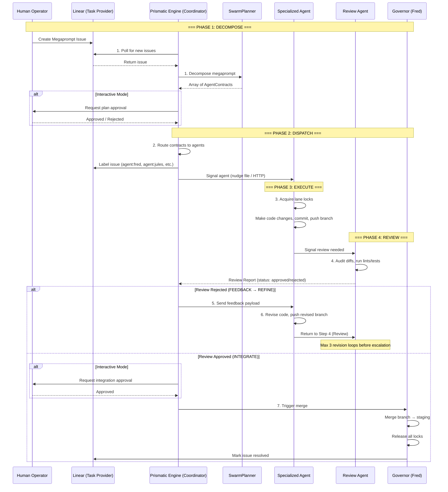

# Prismatic Engine — 7-Step Iterative Loop Design

**Author:** AGY (Antigravity Senior Systems Architect) / Ned (autonomous executor)
**Date:** 2026-06-09
**Linear Issue:** [GRO-819](https://linear.app/growthwebdev/issue/GRO-819)
**Status:** Complete
**Source Spec:** [7-step-loop-specification.md](file:///home/ubuntu/work/prismatic-engine/specs/7-step-loop-specification.md) (GRO-816)
**Claude Code Research:** [agy-claude-code-build-pattern.md](file:///home/ubuntu/work/prismatic-engine/reports/agy-claude-code-build-pattern.md) (GRO-817)

---

## 1. Overview & Core Philosophy

The **Prismatic 7-Step Iterative Loop** is the operational backbone of the Prismatic Engine. It defines the formal lifecycle of a task as it progresses from a high-level user request (Megaprompt) down to individual code/content edits, reviews, and git-integrated merges.

By structuring agent workflows into a strict, state-machine-driven loop, the Prismatic Engine achieves:
- **Deterministic Transitions:** Eliminates "agent drift" where worker agents lose context or perform unauthorized tasks.
- **Human-in-the-Loop (HITL) Adaptability:** Integrates review gates whose behavior changes dynamically based on the active **Orchestration Mode**.
- **Conflict Prevention:** Orchestrates branch creation, mutex locking, and pre-push validations in sync with the task state.

```
                  ┌──────────────────────────────┐
                  │      User Megaprompt         │
                  └──────────────┬───────────────┘
                                 │
                                 ▼
                     ┌──────────────────────┐
                     │  1. DECOMPOSE        │
                     └──────────┬───────────┘
                                │
                                ▼
                     ┌──────────────────────┐
                     │  2. DISPATCH         │
                     └──────────┬───────────┘
                                │
                                ▼
                     ┌──────────────────────┐
                     │  3. EXECUTE          │◄────────────────┐
                     └──────────┬───────────┘                 │
                                │                             │
                                ▼                             │
                     ┌──────────────────────┐                 │
                     │  4. REVIEW           │                 │
                     └──────────┬───────────┘                 │
                                │                             │
                  ┌─────────────┴─────────────┐               │
                  │                           │               │
            (Issues Found)              (Approved)            │ (Refinement Loop)
                  │                           │               │
                  ▼                           ▼               │
       ┌────────────────────┐      ┌────────────────────┐     │
       │  5. FEEDBACK       │      │  7. INTEGRATE      │     │
       └──────────┬─────────┘      └────────────────────┘     │
                  │                                           │
                  ▼                                           │
       ┌────────────────────┐                                 │
       │  6. REFINE         ├─────────────────────────────────┘
       └────────────────────┘
```

---

## 2. The 7-Step Loop — Detailed Specification

### Step 1: DECOMPOSE
- **What it does:** Parse a high-level task/Megaprompt and decompose it into a set of specialized, non-overlapping worker contracts.
- **Who does it:** SwarmPlanner (LLM-driven decomposer)
- **What already exists:** `SwarmPlanner.ts` in the Antigravity Orchestration Hub — invokes Gemini with a strict JSON system prompt.
- **Input:** User Megaprompt (natural language)
- **Output:** Array of `AgentContract` objects (threadId, role, taskDescription, allowedDirectories, readOnlyDirectories, targetHead, budgetLimit, localContextMax)
- **Gate condition:** Valid array of contracts with no overlapping directory permissions

### Step 2: DISPATCH
- **What it does:** Instantiate worker agents, assign execution branches, configure lanes, register threads.
- **Who does it:** SwarmOrchestrator + ContractManager
- **What already exists:** `dispatcher.py` (Fred's dispatcher) + `SwarmOrchestrator.ts` + `ContractManager.ts`
- **Input:** Array of AgentContract objects from Step 1
- **Output:** `.antigravity/contracts/<threadId>.json` files, spawned agent processes/threads
- **Gate condition:** All agents provisioned, contracts written to disk

### Step 3: EXECUTE
- **What it does:** Worker agent edits the codebase within its assigned lane boundaries while respecting locks.
- **Who does it:** Specialized agent (Fred, AGY, Jules, Codex, Kai)
- **What already exists:** `HandoffProtocol.ts`, `SwarmLockManager.ts`, lane-scoped execution
- **Input:** Contract file, workspace context, lane permissions
- **Output:** Pushed git branch containing task commits, lock release calls
- **Gate condition:** Branch pushed to remote, locks released

### Step 4: REVIEW
- **What it does:** Audit the worker's changes for correctness, styling, compilation, and security.
- **Who does it:** Specialist reviewer agent (Jules for code, AGY for design) or human operator
- **What already exists:** Jules PR review pipeline, AGY design review capability
- **Input:** Pushed git branch, diffs
- **Output:** Review report with `status: "approved"` or `status: "rejected"` and detailed comments
- **Gate condition:** Review report produced with explicit status

### Step 5: FEEDBACK
- **What it does:** Formulate a structured payload of issues and transmit it back to the active worker thread.
- **Who does it:** Prismatic Engine Coordinator
- **What already exists:** Feedback payload format (JSON), thread wake-up mechanism
- **Input:** Review report with rejection status
- **Output:** Feedback payload listing failing files, compilation errors, reviewer suggestions. Thread state updated to `REFINE`.
- **Gate condition:** Feedback payload written, worker thread notified

### Step 6: REFINE
- **What it does:** Worker adjusts its changes in response to review issues.
- **Who does it:** Original worker agent (same as Step 3)
- **What already exists:** Loopback mechanism, lock re-acquisition
- **Input:** Feedback payload from Step 5
- **Output:** Revised branch pushed to remote
- **Gate condition:** Branch revised, transitions back to REVIEW (Step 4)

### Step 7: INTEGRATE
- **What it does:** Merge the approved worker branch into staging/deploy-fresh base branch and resolve the contract.
- **Who does it:** Governor Agent (Fred) — sole branch merger
- **What already exists:** `HandoffProtocol.ts`, `ContractManager.ts`
- **Input:** Approved review report, worker branch
- **Output:** Successful git merge to staging, locks deleted, contract marked resolved
- **Gate condition:** Merge complete, all locks cleared, contract file deleted

---

## 3. The Review Gate Interface

### Approval States

| Status | Meaning | Action |
|--------|---------|--------|
| `approved` | Work meets all acceptance criteria | Proceed to Step 7 (INTEGRATE) |
| `revise` | Minor issues found, fixable by original agent | Route to Step 5 (FEEDBACK) → Step 6 (REFINE) |
| `reject` | Fundamental problems, requires human intervention | Pause loop, escalate to human operator |

### Revision Loop Rules

- **Max revisions before escalation:** 3 consecutive rejection loops
- **Escalation action:** Mode Escalation — pauses execution, prompts human operator
- **Lock behavior during refinement:** Original locks maintained; new locks can be acquired but are subject to 5-minute heartbeat stale cleanup
- **Pre-integration staging snapshot:** Created before any merge. If integration tests fail, merge is rolled back and work returns to refinement loop.

### Linear Label Mapping

| Loop State | Linear Label | Description |
|------------|-------------|-------------|
| REVIEWING | `pipeline:review` | Under review by specialist agent |
| FEEDBACK | `pipeline:feedback` | Issues found, sent back to worker |
| REFINING | `pipeline:refine` | Worker revising based on feedback |
| INTEGRATING | `pipeline:integrate` | Approved, merging into staging |

---

## 4. Orchestration Mode Switch

The **Orchestration Mode Switch** controls how many loop steps require human intervention or approval:

| Mode | Gate 1: Decompose (1→2) | Gate 2: Review (4→5/7) | Gate 3: Integrate (7) | Use Case |
|------|------------------------|------------------------|----------------------|----------|
| **Interactive** | **Required** (Human reviews contracts) | **Required** (Human approves review) | **Required** (Human triggers merge) | High-risk migrations, sensitive UI/UX |
| **Collaborative** | *Auto-continue* | **Required** (Human reviews PR diffs) | *Auto-continue* (Governor merges on approval) | Core software development (default) |
| **Autonomous** | *Auto-continue* | *Auto-continue* (AI review only) | *Auto-continue* (Governor merges automatically) | Overnight batch runs, deep research |

### State Machine Transitions Per Mode

| Current State | Event | Interactive Target | Collaborative Target | Autonomous Target |
|--------------|-------|-------------------|---------------------|-------------------|
| `DECOMPOSING` | `PLAN_GENERATED` | `PENDING_PLAN_APPROVAL` | `DISPATCHING` | `DISPATCHING` |
| `REVIEWING` | `REVIEW_PASSED` | `PENDING_INTEGRATION` | `INTEGRATING` | `INTEGRATING` |
| `PENDING_INTEGRATION` | `INTEGRATION_APPROVED` | `INTEGRATING` | n/a (skipped) | n/a (skipped) |
| `PENDING_INTEGRATION` | `INTEGRATION_REJECTED` | `FEEDBACK` | n/a (skipped) | n/a (skipped) |

---

## 5. Mapping to Claude Code's Iterative Build Loop

### Claude Code's Inner Agent Loop (from GRO-817 research)

Claude Code operates a **7-step inner agent loop** at the file-editing level:

1. **Analyze** — Parse user input, inspect local directory files
2. **Plan** — Formulate sequential file changes and build tasks
3. **Edit** — Modify code files based on requirements
4. **Execute** — Run compile/test commands locally in the shell
5. **Inspect** — Read stdout/stderr feedback
6. **Correct** — Self-heal errors or proceed to next step
7. **Report** — Output final work summary and diff logs

### Side-by-Side Mapping

| Prismatic 7-Step (Orchestration) | Claude Code 7-Step (Execution) | Relationship |
|----------------------------------|-------------------------------|--------------|
| 1. DECOMPOSE | 1. Analyze + 2. Plan | Prismatic decomposes at the *pipeline* level across agents. Claude decomposes at the *file* level within one agent. |
| 2. DISPATCH | (N/A — single agent) | Prismatic routes to specialized agents. Claude executes everything itself. |
| 3. EXECUTE | 3. Edit + 4. Execute | Prismatic delegates to agent lanes. Claude directly edits and runs commands. |
| 4. REVIEW | 5. Inspect | Prismatic has a dedicated reviewer agent. Claude self-reviews via compiler/test output. |
| 5. FEEDBACK | (Implicit in error output) | Prismatic formalizes feedback as a JSON payload. Claude treats stderr as implicit feedback. |
| 6. REFINE | 6. Correct | Prismatic loops back to the same agent. Claude self-heals inline. |
| 7. INTEGRATE | 7. Report | Prismatic merges to staging via Governor. Claude outputs a summary. |

### Key Architectural Insight

Claude Code is an **agent executor** (engine doing file edits and shell calls). Prismatic Engine is a **coordinator/orchestrator** (routing tasks between separate, specialized agents). They are complementary, not competing:
- **Claude Code's loop** handles the *inner* loop: read→write→build→fix→retry within a single agent's execution
- **Prismatic's loop** handles the *outer* loop: decompose→dispatch→execute→review→integrate across multiple agents

### Feature Comparison

| Feature | Claude Code | Prismatic Engine |
|---------|------------|-----------------|
| **Primary Role** | Direct file editing, tool execution | Task routing, state management, handoff logic |
| **Workspace Scope** | Single codebase directory | Cross-project, multi-workspace via Linear |
| **Execution Order** | Sequential sub-tasks | Sequential pipeline agent transitions |
| **Self-Healing Level** | Code-level (fixes source files) | System-level (recovers stalled agents, restarts) |
| **State Tracking** | Local files, prompt caches | Linear labels, SQLite DB, comments |
| **Handoff** | Internal self-calls | Transport-agnostic signals (files, HTTP, Redis) |

---

## 6. Mermaid Sequence Diagram — Full 7-Step Loop



---

## 7. State Machine Definition

### State Transition Table

| Current State | Event | Target State | Action / Side Effect |
|--------------|-------|-------------|---------------------|
| `IDLE` | `MEGAPROMPT_RECEIVED` | `DECOMPOSING` | Launch SwarmPlanner LLM parser |
| `DECOMPOSING` | `PLAN_GENERATED` (Interactive) | `PENDING_PLAN_APPROVAL` | Write contracts to draft, notify human |
| `DECOMPOSING` | `PLAN_GENERATED` (Collab/Auto) | `DISPATCHING` | Commit contracts, proceed |
| `PENDING_PLAN_APPROVAL` | `PLAN_APPROVED` | `DISPATCHING` | Transition to dispatcher |
| `PENDING_PLAN_APPROVAL` | `PLAN_REJECTED` | `IDLE` | Cancel task, clear state |
| `DISPATCHING` | `AGENTS_PROVISIONED` | `EXECUTING` | Create contract files, boot processes |
| `EXECUTING` | `BRANCH_PUSHED` | `REVIEWING` | Trigger code review agent |
| `REVIEWING` | `REVIEW_FAILED` | `FEEDBACK` | Generate feedback payload |
| `REVIEWING` | `REVIEW_PASSED` (Interactive) | `PENDING_INTEGRATION` | Notify human for merge confirmation |
| `REVIEWING` | `REVIEW_PASSED` (Collab/Auto) | `INTEGRATING` | Hand off to Governor |
| `FEEDBACK` | `FEEDBACK_DELIVERED` | `REFINING` | Wake up worker agent |
| `REFINING` | `BRANCH_REVISED` | `REVIEWING` | Re-trigger code review |
| `PENDING_INTEGRATION` | `INTEGRATION_APPROVED` | `INTEGRATING` | Trigger Governor merge |
| `PENDING_INTEGRATION` | `INTEGRATION_REJECTED` | `FEEDBACK` | Send human remarks to feedback |
| `INTEGRATING` | `MERGE_SUCCESS` | `IDLE` | Resolve contract, delete locks |

---

## 8. Robust Handoff & Loopbacks

To prevent infinite loops during Steps 5-6:

1. **Loop Limit Safeguard:** The orchestrator tracks the iteration counter. If a thread undergoes more than 3 consecutive rejection loops, the orchestrator triggers a **Mode Escalation**, pausing execution and prompting the human operator.
2. **Dynamic Lock Re-assertion:** During refinement, the agent is allowed to request new locks or maintain existing ones, but these are subject to automatic stale cleanup via the 5-minute heartbeat mechanism.
3. **Pre-Integration Staging Snapshot:** Before merging any code, a staging snapshot is created. If integration tests fail, the merge is rolled back, the staging branch is restored to its original state, and work returns to the Refinement loop.

---

## DONE SIGNAL

1. ✅ Path: `/home/ubuntu/work/prismatic-engine/reports/agy-7-step-loop-design.md`
2. ✅ Mermaid diagram renders (full sequence diagram covering all 7 steps + mode switch + review gate branching)
3. ✅ Key design decision: The Prismatic 7-step loop operates at the **orchestration layer** (multi-agent routing), while Claude Code's 7-step loop operates at the **execution layer** (single-agent file editing). They are complementary — Prismatic's outer loop wraps Claude-like inner agent loops, enabling cross-agent pipelines while each individual agent benefits from the read→write→build→fix→retry pattern.

— Ned (autonomous executor, GRO-819)
