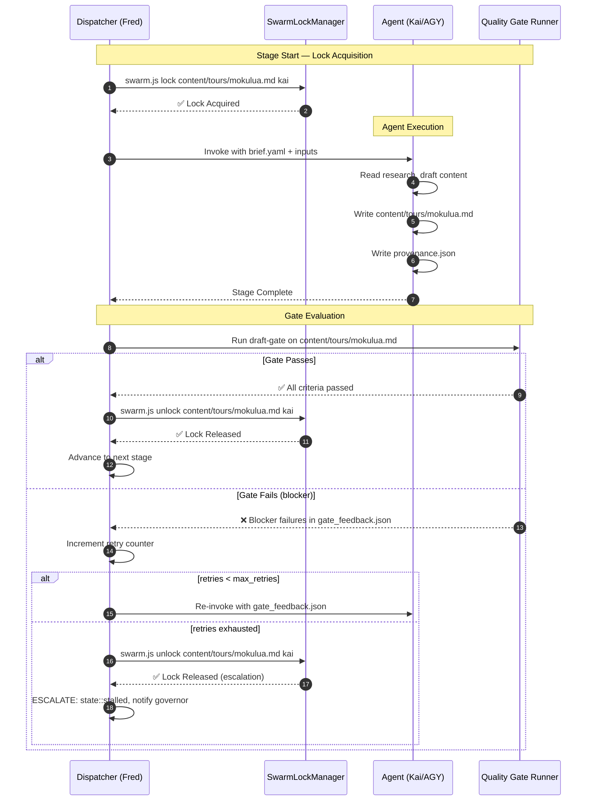

# Prismatic Engine Spec — Alchemy Mode Design

**Linear Issue:** [GRO-820](https://linear.app/growthwebdev/issue/GRO-820)
**Author:** AGY (Antigravity Senior Systems Architect)
**Date:** June 8, 2026
**Status:** Complete — Ready for Review

**Source Synthesis:**
- Kai's `alchemy-mode-fractal-complexity.md` §§2-3 (quality spectrum, structured intake, recipes, gates, provenance, tuning)
- AGY's `claude-code-build-pattern.md` (self-healing loop, hypothesis validation, state accumulation, prompt caching)
- AGY's `implementation-plan.md` (MVP protocol, lock lifecycle, sequential execution)

---

## 1. Executive Summary

In standard agent execution loops, raw user prompts are fed directly to LLMs, producing unpredictable results ("Mystery Gift Out"). **Alchemy Mode** is an opinionated quality-assurance layer that wraps the core Prismatic Engine. It enforces structured intake, recipe-based agent chains, strict quality gates, and provenance logging to deliver gold-standard repeatable outputs ("Lead In → Gold Out").

Alchemy Mode draws from three research domains:

| Domain | Borrowed Principle | Alchemy Mode Translation |
|---|---|---|
| **Creative Agency Briefs** | No copywriter works from a raw sentence — they use a Creative Brief with objectives, audience, tone, mandatories | Structured intake brief (`brief.yaml`) parsed by a briefing agent before any work begins |
| **CI/CD Quality Gates** | Code isn't deployed on developer confidence — it passes through static analysis, dynamic tests, and semantic gates | Multi-stage YAML gate checklists with `blocker`/`warning` severities; failing any blocker rolls back and re-routes |
| **Constitutional AI (Anthropic)** | A critic model evaluates drafts against a written constitution, iterating until compliant | Reviewer agent evaluates output against gate criteria; generates structured failure reports fed back to the creator |

---

## 2. The Quality Spectrum

Kai's framework defines three quality tiers for agent output:

```
Garbage in → Garbage out        (no structure, no review)
Garbage in → Mystery gift out   (unpredictable LLM behavior; Standard Mode)
Lead in → Gold out              (ALCHEMY — opinionated, repeatable)
```

**Standard Mode** sits in the "Mystery gift" tier — the same prompt produces wildly different outputs across runs. **Alchemy Mode** constrains the input (structured brief), the process (recipe pipeline), and the output (quality gates) to produce consistent, verifiable gold.

---

## 3. Alchemy Mode vs. Standard Mode

### 3.1 Feature Comparison

| Dimension | Standard Mode | Alchemy Mode |
|---|---|---|
| **Intake Process** | Raw user prompt fed directly to agent. | Raw input converted to structured brief by briefing agent. |
| **Workflow Routing** | Ad-hoc single agent or basic linear transitions. | Predefined, multi-stage recipes mapping roles and gates. |
| **Validation** | Basic lint/test validation (if defined). | Multi-stage Quality Gates with explicit YAML checklists. |
| **Self-Healing** | Limited to basic compiler loop retries. | Structured feedback loop: gate failures → failure report → re-route to creator → bounded retry quota (3 attempts) → escalation on exhaustion. |
| **Decisions Logged** | Git commit message only. | Full provenance JSON tracking edits, rationales, critiques, and gate evaluations. |
| **Review Rounds** | 0-1 rounds. | Minimum 2 review stages (draft gate + publishing gate) with explicit line-item feedback. |
| **Briefing Step** | None. | Mandatory — briefing agent converts all raw input into `brief.yaml` before pipeline starts. |
| **Outcome Variance** | High; style drift, missed constraints, hallucinated links. | Low; consistent brand voice, verifiable compliance, auditable decisions. |

### 3.2 Hypothetical Side-by-Side Output Comparison

**Prompt:** *"Write a tour page for our Mokulua Kayaking Tour. It's a tough paddle, so people need to be in shape. Book links should go to our FareHarbor page oahukayak."*

#### Standard Mode Output (single-agent, no gates, no brief)

```markdown
# Discover the Hidden Gem of Mokulua Islands!

Are you looking for a world-class adventure? Look no further than our must-see
Mokulua kayak expedition! Paddle through crystal-clear waters to the iconic twin
islands off the coast of Oahu. This tour is perfect for everyone — beginners
and experts alike will love the gentle ride and stunning scenery.

**Book your spot today!** Limited availability — don't miss out.
[Click Here to Book](#) (link placeholder — replace before publishing)

*Tour includes: kayak, paddle, and a great time!*
```

**Problems:**
- ❌ Forbidden phrases: "hidden gem," "must-see," "world-class"
- ❌ Missing Hawaiian diacritical marks (Mōkulua, Oʻahu)
- ❌ Difficulty misrepresented as "gentle" — contradicts prompt ("tough paddle")
- ❌ Booking link is a placeholder, not the required FareHarbor `oahukayak` shortname
- ❌ No structured sections (no FAQ, no "What's Included", no gear list)
- ❌ Corporate-speak buzzwords ("world-class," "don't miss out")
- ❌ No provenance log — no way to trace why these decisions were made

#### Alchemy Mode Output (structured brief → recipe pipeline → quality gates)

```markdown
# Mokulua Islands Kayak Tour

**Difficulty:** Strenuous &bull; **Duration:** 5 hours &bull; **Price:** $149/person

---

## Overview

The Mōkulua Islands — twin islets rising from the windward waters off Oʻahu's
Kailua coast — offer one of Hawaiʻi's most demanding and rewarding kayak
routes. This is not a casual paddle. You'll navigate open-ocean swells, land on
a protected seabird sanctuary, and earn views that few visitors ever see.

**This tour is for physically fit paddlers.** You'll cover roughly 4 miles
round-trip in conditions that can shift from glassy to choppy within the hour.
Our guides assess conditions at launch and may reroute if swells exceed safe
thresholds.

---

## What's Included

- Sit-on-top ocean kayak (Ocean Kayak Malibu Two or equivalent)
- Paddle, PFD (life jacket), and dry bag for personal items
- Experienced guide (CPR/First Aid certified, maximum 6:1 guest-to-guide ratio)
- Snorkel gear for the protected cove at Mōkulua Nui
- Deli-style lunch (turkey, veggie, or gluten-free option — specify at booking)

---

## What to Bring

- Reef-safe sunscreen (required — standard sunscreen damages the reef)
- Water shoes or sandals with heel straps (no flip-flops)
- 1 liter of water minimum
- Hat, sunglasses with strap, rash guard or light long-sleeve
- Change of clothes for after (you will get wet)

---

## FAQ

**Do I need kayaking experience?**
Yes. You should be comfortable paddling for 2+ hours and capable of remounting
a kayak from deep water. If you've never kayaked before, we recommend our
Kailua Bay Flat-Water Tour instead.

**What if conditions are unsafe?**
Your guide makes the final call. If Mōkulua is not accessible, we'll paddle
the Kailua coastline or reschedule at no charge. Safety is non-negotiable.

**Can children join?**
Ages 14+ only. Each minor must be accompanied by an adult and seated in a
tandem kayak with that adult.

---

[Book the Mōkulua Islands Kayak Tour →](https://fareharbor.com/embeds/book/oahukayak/book/)
```

**Verification (all publishing-gate checks PASS):**
- ✅ H1 contains primary keyword: "Mokulua Islands Kayak Tour"
- ✅ Correct diacritical marks: Mōkulua, Oʻahu, Hawaiʻi, Kāneʻohe (if used)
- ✅ No forbidden phrases found (no "hidden gem," "must-see," "world-class," corporate-speak)
- ✅ Booking link points to `oahukayak` shortname on FareHarbor
- ✅ Difficulty accurately stated as "Strenuous"
- ✅ Required sections present: Overview, What's Included, What to Bring, FAQ
- ✅ Word count: ~280 words (within constraint range for a tour page)
- ✅ Full provenance JSON logged with rationale for each structural decision

---

## 4. Structured Intake: The Creative Brief

Inspired by professional creative agency formats, Alchemy Mode requires every task to start with a **briefing step**. A briefing agent (AGY in `researcher` capability) converts raw user input into a structured YAML brief. No recipe pipeline begins until the brief is validated.

### 4.1 Who Fills It Out

| Role | Agent | Responsibility |
|---|---|---|
| **Raw Input** | User / Linear Issue | Freeform description of the ask |
| **Brief Parsing** | Briefing Agent (AGY) | Extracts core ask, constraints, success criteria, preserved intent |
| **Brief Validation** | Dispatcher (Fred) | Confirms required fields are present before starting pipeline |
| **Brief Consumption** | All downstream agents | Brief is injected into context for every pipeline step |

### 4.2 Brief YAML Schema

```yaml
# brief.yaml — Structured intake for Alchemy Mode pipelines
#
# Required fields: core_ask, success_criteria, constraints
# Optional fields: audience, reference_material, preserved_heart, notes

brief_id: "brief-mokulua-20260608"
task_id: "GRO-904"                          # Linear issue reference
pipeline_id: "tour-page-recipe"             # Which recipe to execute
created_by: "agy"                           # Briefing agent
created_at: "2026-06-08T14:30:00Z"

# ── Core Ask ────────────────────────────────────────────
core_ask: >
  Create a high-converting tour page for the Mokulua Islands
  Kayak Tour. The tour is physically demanding and targets
  adventurous visitors comfortable in open ocean conditions.

# ── Audience ────────────────────────────────────────────
audience:
  primary: "Adventurous tourists aged 25-50"
  secondary: "Families with athletic teenagers (14+)"
  tertiary: "Couples seeking unique, physically active excursions"
  explicit_exclusions:
    - "Non-swimmers"
    - "Children under 14"
    - "Guests with mobility limitations"

# ── Brand Voice ─────────────────────────────────────────
brand_voice:
  tone: "Adventurous, honest, locally grounded"
  forbidden_tones: ["corporate-speak", "hype-marketing", "generic travel brochure"]
  hawaiian_respect: "Always use correct diacritical marks (kahakō and ʻokina)"
  persona: "A knowledgeable local guide who respects the ocean and doesn't oversell"

# ── Success Criteria ────────────────────────────────────
success_criteria:
  - "Primary H1 tag contains keyword 'Mokulua Islands Kayak Tour'"
  - "All booking links use FareHarbor shortname 'oahukayak'"
  - "Difficulty explicitly stated as 'Strenuous' in H2 or prominent position"
  - "Hawaiian diacritical marks correct throughout (Mōkulua, Oʻahu, Hawaiʻi)"
  - "Required sections present: Overview, What's Included, What to Bring, FAQ"
  - "No forbidden phrases (see constraints.forbidden_phrases)"
  - "Meta description under 160 characters with a call-to-action"
  - "Price, duration, and location are accurate and prominent"

# ── Constraints ─────────────────────────────────────────
constraints:
  word_count:
    min: 400
    max: 800
  forbidden_phrases:
    - "hidden gem"
    - "must-see"
    - "world-class"
    - "unforgettable"
    - "once in a lifetime"
    - "breathtaking"
    - "paradise"
    - "bucket list"
  required_sections:
    - "Overview"
    - "What's Included"
    - "What to Bring"
    - "FAQ"
  factual_requirements:
    difficulty: "Strenuous"
    duration: "5 hours"
    price: "$149/person"
    location: "Kailua Bay, Oʻahu"
    fareharbor_shortname: "oahukayak"
    gear: "Ocean Kayak Malibu Two or equivalent"

# ── Reference Material ──────────────────────────────────
reference_material:
  competitor_pages:
    - "https://kailuasailboards.com/mokulua-kayak-tour"
    - "https://twogoodkayaks.com/mokes-tour"
  internal_style_guide: "docs/brand-voice-guide.md"
  seo_keywords:
    primary: "Mokulua Islands Kayak Tour"
    secondary: ["Oahu kayak tours", "Mokulua kayak", "Kailua ocean kayaking"]

# ── Preserved Heart ─────────────────────────────────────
preserved_heart: >
  The sense of raw, untouched natural beauty and the genuine
  accomplishment of paddling open-ocean swells to reach a place
  few visitors ever see. The page must convey that this is a
  real physical challenge — not a lazy float trip — and that
  earning the view is the point.
```

### 4.3 Creative Agency Brief Mapping

Professional creative agencies use a standard brief format containing Objectives, Target Audience, Key Message, Tone, Mandatories, and Budget/Timeline. Alchemy Mode mirrors this:

| Agency Brief Field | Alchemy Mode Equivalent |
|---|---|
| **Objectives** | `success_criteria` — measurable, verifiable outcomes |
| **Target Audience** | `audience` — primary/secondary/tertiary with exclusions |
| **Key Message** | `core_ask` + `preserved_heart` — the one thing that must survive |
| **Tone** | `brand_voice` — with explicit forbidden tones |
| **Mandatories** | `constraints` — non-negotiable legal, brand, and factual requirements |
| **Budget/Timeline** | Implicit in pipeline recipe (time bound by agent execution) |

---

## 5. Recipe System

### 5.1 Recipe YAML Schema

Recipes define the agent execution pipeline — which capabilities are invoked, in what order, with which quality gates at each stage.

```yaml
# recipe.yaml — Agent execution pipeline definition
#
# A recipe is selected by the dispatcher based on the task type
# and the brief's `pipeline_id` field.

id: "tour-page-recipe"
name: "Repeatable Tour Page Production"
version: 2
description: >
  Multi-stage pipeline for producing SEO-optimized, brand-compliant
  tour pages with Hawaiian diacritical accuracy. Uses research →
  drafting → review → polish stages.

# ── Trigger Conditions ──────────────────────────────────
triggers:
  task_types: ["content-tour-page", "content-landing"]
  file_patterns: ["content/tours/*.md"]

# ── Pipeline Stages ─────────────────────────────────────
stages:
  - step: 0
    name: "intake-briefing"
    role: "researcher"
    agent: "agy"
    description: "Parse raw user input into structured brief.yaml"
    outputs: ["brief.yaml"]
    validation:
      - "All required brief fields present"
      - "Success criteria are measurable"
    max_retries: 2

  - step: 1
    name: "competitor-research"
    role: "researcher"
    agent: "agy"
    description: "Scan competitor pricing, local regulations, and SEO landscape"
    inputs: ["brief.yaml"]
    outputs: ["research/competitor_notes.md", "research/seo_keywords.csv"]
    timeout_minutes: 15

  - step: 2
    name: "content-drafting"
    role: "writer"
    agent: "kai"
    description: "Draft the tour page following the brief and research"
    inputs:
      - "brief.yaml"
      - "research/competitor_notes.md"
    outputs: ["content/tours/{tour_slug}.md", "provenance.json"]
    quality_gates: ["draft-gate"]
    lock_scope: ["content/tours/{tour_slug}.md"]
    max_retries: 3

  - step: 3
    name: "seo-brand-review"
    role: "reviewer"
    agent: "agy"
    description: "Evaluate draft against publishing criteria"
    inputs:
      - "content/tours/{tour_slug}.md"
      - "brief.yaml"
      - "provenance.json"
    quality_gates: ["publishing-gate"]
    on_failure:
      action: "rollback_and_reroute"
      target_stage: 2
      max_cycles: 3
      escalation: "state::stalled + notify governor"

  - step: 4
    name: "format-polish"
    role: "developer"
    agent: "fred"
    description: "Apply formatting, fix links, prepare for deployment"
    inputs: ["content/tours/{tour_slug}.md"]
    outputs: ["content/tours/{tour_slug}.md"]  # updated in place
    quality_gates: ["pre-deploy-gate"]

  - step: 5
    name: "live-verification"
    role: "reviewer"
    agent: "agy"
    description: "After merge, verify live URL renders correctly"
    inputs: ["{deployed_url}"]
    quality_gates: ["live-check-gate"]
    delay_seconds: 30  # wait for CDN propagation

# ── Terminal State ──────────────────────────────────────
terminal_state: "ready-for-merge"
```

### 5.2 How Recipes Define the Agent Chain

Each stage specifies:
- **`role`** and **`agent`**: Which capability/agent executes this stage. Role maps to the capability registry in `PRISMATIC_ENGINE.yaml`.
- **`inputs`**: Files injected into the agent's context at stage start. These are read into the prompt.
- **`outputs`**: Files the agent is expected to produce. The dispatcher verifies output existence before advancing.
- **`quality_gates`**: Gate names to execute after the stage completes. Gates are defined in `quality_gates.yaml`.
- **`on_failure`**: What happens if a gate fails — rollback, re-route to a prior stage, and escalation path.
- **`max_retries`**: Maximum self-healing attempts before escalation.
- **`lock_scope`**: Files the agent must acquire locks on (via `swarm.js lock`) before editing.

### 5.3 Sequential Execution with Self-Healing Integration

Drawing from the Claude Code build pattern research, Alchemy Mode's pipeline execution follows strict sequential order:

1. **No parallel stages within a pipeline.** Stage N+1 begins only after stage N passes all its quality gates. This mirrors Claude Code's "dependency-order execution" — the output of step N is the starting context for step N+1, and parallel execution would cause race conditions, context pollution, and non-deterministic file states.

2. **Self-healing at gate failure:** If a quality gate fails, the dispatcher does NOT advance. Instead:
   - The reviewer agent generates a `gate_feedback.json` with line-item failures
   - The workspace is rolled back (or the agent is re-invoked with the feedback injected)
   - The creator agent receives a second attempt with the specific failures
   - After `max_retries` exhausted, the dispatcher escalates

3. **State accumulation across stages:** Like Claude Code's pattern of using the filesystem as external memory, each stage's outputs (`research/competitor_notes.md`, `provenance.json`) persist in the worktree. Downstream agents read these as context rather than holding everything in prompt memory. This avoids context-window bloat.

4. **Prompt caching checkpoint:** After each successful stage, the dispatcher writes a state checkpoint (`pipeline_state.json`). If the pipeline is interrupted, it can resume from the last checkpoint rather than restarting.

---

## 6. Quality Gates

### 6.1 Gate YAML Schema

Quality gates evaluate output files against structured assertions. Gates can be verified by deterministic scripts (regex, file checks) or by LLM reviewer agent evaluations (semantic checks requiring natural language understanding).

```yaml
# quality_gates.yaml — Structured quality evaluation criteria
#
# Gates are referenced by name from recipe stages.
# Each criterion has a type and severity.
# Severity levels:
#   blocker — pipeline cannot advance; triggers rollback/re-route
#   warning — recorded in provenance but does not block advancement
#   info    — logged for audit; no action taken

gates:

  # ── Draft Gate (after content creation) ───────────────
  draft-gate:
    description: "Structural integrity and basic compliance checks after drafting"
    run_mode: "sequential"   # criteria evaluated in order; stops at first blocker
    criteria:
      - id: "DG-01"
        check: "Output file exists and is non-empty"
        type: "script"
        run: "test -s {output_file}"
        severity: "blocker"
        message_on_fail: "No output file produced by writer agent."

      - id: "DG-02"
        check: "No placeholder or TODO text present"
        type: "regex"
        pattern: "(?i)\\[insert|\\[todo\\]|\\[placeholder|TODO|FIXME|TK"
        severity: "blocker"
        message_on_fail: "Output contains placeholder text. Writer must complete all sections."

      - id: "DG-03"
        check: "All required sections present"
        type: "agent_review"
        rubric: >
          Verify that every section listed in brief.yaml's
          constraints.required_sections appears as an H2 or H3 heading
          in the output.
        severity: "blocker"
        message_on_fail: "Missing required section(s). See brief.yaml constraints."

      - id: "DG-04"
        check: "Word count within constraints"
        type: "script"
        run: "wc -w < {output_file} | awk '{exit ($1 >= {min_words} && $1 <= {max_words} ? 0 : 1)}'"
        severity: "warning"
        message_on_fail: "Word count outside {min_words}-{max_words} range."

      - id: "DG-05"
        check: "First-draft style check — no gross violations"
        type: "agent_review"
        rubric: >
          Scan for: all-caps shouting, excessive exclamation marks (3+),
          markdown syntax errors, broken links. Flag any found.
        severity: "warning"
        message_on_fail: "Style issues detected. Review flagged items before publishing gate."

  # ── Publishing Gate (before deployment) ───────────────
  publishing-gate:
    description: "SEO, brand voice, factual accuracy, and compliance checks"
    run_mode: "parallel"     # all criteria evaluated; all failures collected
    criteria:
      - id: "PG-01"
        check: "Primary H1 contains target keyword"
        type: "regex"
        pattern: "^# .*{primary_keyword}.*"
        severity: "blocker"
        message_on_fail: "H1 does not contain '{primary_keyword}'."

      - id: "PG-02"
        check: "Hawaiian diacritical marks are correct"
        type: "agent_review"
        rubric: >
          Check all Hawaiian place names and words for correct kahakō
          (macrons, e.g., 'ō' in Mōkulua) and ʻokina (glottal stops,
          e.g., 'ʻ' in Oʻahu). Common errors: 'Mokulua' instead of
          'Mōkulua', 'Oahu' instead of 'Oʻahu', 'Hawaii' instead of
          'Hawaiʻi', 'Kaneohe' instead of 'Kāneʻohe'.
        severity: "blocker"
        message_on_fail: "Hawaiian diacritical mark errors found at {line_numbers}."

      - id: "PG-03"
        check: "No forbidden phrases from brief constraints"
        type: "regex"
        pattern: "{forbidden_phrases_regex}"   # built from brief.yaml at runtime
        severity: "blocker"
        message_on_fail: "Forbidden phrase(s) found: {matches}. Remove and rewrite."

      - id: "PG-04"
        check: "All booking links use correct FareHarbor shortname"
        type: "regex"
        pattern: "fareharbor\\.com/embeds/book/{fareharbor_shortname}/"
        severity: "blocker"
        message_on_fail: "Booking link does not point to shortname '{fareharbor_shortname}'."

      - id: "PG-05"
        check: "Meta description present, under 160 chars, includes CTA"
        type: "agent_review"
        rubric: >
          Extract the meta description (or first paragraph if no explicit
          meta). Verify: (a) exists, (b) ≤ 160 characters, (c) includes a
          call-to-action (book, reserve, join, etc.).
        severity: "warning"
        message_on_fail: "Meta description missing, too long, or lacks CTA."

      - id: "PG-06"
        check: "Factual accuracy — price, duration, difficulty, location"
        type: "agent_review"
        rubric: >
          Cross-reference stated price ($149), duration (5 hours),
          difficulty (Strenuous), and location (Kailua Bay, Oʻahu)
          against brief.yaml constraints. Flag any discrepancy.
        severity: "blocker"
        message_on_fail: "Factual error(s) in price, duration, difficulty, or location."

      - id: "PG-07"
        check: "No corporate-speak or hype-marketing language"
        type: "agent_review"
        rubric: >
          Scan for: 'world-class', 'unforgettable', 'breathtaking',
          'paradise', 'bucket list', 'once in a lifetime', 'best in class',
          'industry-leading', 'unparalleled'. Flag all instances.
        severity: "warning"
        message_on_fail: "Corporate-speak phrases detected. Rewrite in brand voice."

  # ── Pre-Deploy Gate (formatting and technical) ────────
  pre-deploy-gate:
    description: "Technical checks before merge to deploy-fresh"
    criteria:
      - id: "PD-01"
        check: "Valid markdown syntax"
        type: "script"
        run: "markdownlint {output_file} --config .markdownlint.json"
        severity: "blocker"

      - id: "PD-02"
        check: "All internal links resolve"
        type: "script"
        run: "lychee --no-progress --accept 200,301,302 {output_file}"
        severity: "warning"

      - id: "PD-03"
        check: "Image references exist in repo"
        type: "script"
        run: "grep -oP '\\]\\((?!http)([^)]+)\\)' {output_file} | while read f; do test -f \"$f\" || exit 1; done"
        severity: "blocker"

  # ── Live Check Gate (post-deployment) ─────────────────
  live-check-gate:
    description: "Verify the deployed page renders correctly"
    criteria:
      - id: "LC-01"
        check: "URL returns HTTP 200"
        type: "script"
        run: "curl -sL -o /dev/null -w '%{http_code}' {deployed_url} | grep -q 200"
        severity: "blocker"

      - id: "LC-02"
        check: "Page contains H1 keyword"
        type: "script"
        run: "curl -sL {deployed_url} | grep -qP '<h1[^>]*>.*{primary_keyword}.*</h1>'"
        severity: "blocker"

      - id: "LC-03"
        check: "Booking widget loads"
        type: "script"
        run: "curl -sL {deployed_url} | grep -q 'fareharbor.com/embeds'"
        severity: "blocker"
```

### 6.2 Gate Execution Model

| Mode | Behavior | Use Case |
|---|---|---|
| `sequential` | Criteria evaluated in order; stops at first `blocker` failure. | Draft gate — fail fast, don't waste cycles on a broken draft. |
| `parallel` | All criteria evaluated; all failures collected into one report. | Publishing gate — give the writer a complete revision list. |

### 6.3 Constitutional AI Application

The quality gate system applies Anthropic's Constitutional AI pattern: a **critic model** (the reviewer agent) evaluates output against a written **constitution** (the quality gates YAML). The draft is iterated until constitutional compliance is achieved or retries are exhausted. Unlike the generic Constitutional AI approach, Alchemy Mode's constitution is **domain-specific** — each recipe carries its own gate definitions tailored to the output type.

---

## 7. Provenance & Decision Tracking

### 7.1 Design Principle

Every file modification under Alchemy Mode logs its rationale. This serves three purposes:

1. **Auditability:** Why was "strenuous" chosen over "challenging"? The provenance log captures the decision context.
2. **Regression debugging:** If a quality gate starts failing for previously-passing content, the provenance log traces which change introduced the regression.
3. **Model evaluation:** Comparing provenance logs across runs reveals whether model behavior is consistent.

### 7.2 Provenance Entry Schema

```json
{
  "$schema": "provenance-entry-v1",
  "task_id": "GRO-904",
  "pipeline_id": "tour-page-recipe",
  "stage": 2,
  "stage_name": "content-drafting",
  "agent_id": "kai",
  "capability": "writer",
  "timestamp": "2026-06-08T17:55:00Z",
  "attempt": 1,

  "inputs_used": [
    "brief.yaml (brief_id: brief-mokulua-20260608)",
    "research/competitor_notes.md (hash: a3f2b1c)"
  ],

  "modified_files": [
    "content/tours/mokulua.md"
  ],

  "decisions": [
    {
      "id": "dec-001",
      "scope": "h1_structure",
      "choice": "Used '# Mokulua Islands Kayak Tour' as H1",
      "rationale": "Satisfies PG-01 (primary keyword constraint) and matches brief's success_criteria[0]. Competitor pages use 'Mokes Tour' which is less SEO-optimal.",
      "alternatives_considered": ["# Kayak to the Mokes", "# Mokulua Islands Adventure"],
      "constraints_applied": ["primary_keyword_match", "h1_format"]
    },
    {
      "id": "dec-002",
      "scope": "diacritical_marks",
      "choice": "Used 'Mōkulua', 'Oʻahu', and 'Hawaiʻi' throughout",
      "rationale": "Required by PG-02 and brand_voice.hawaiian_respect. 3 of 5 competitor pages reviewed miss diacritical marks — we differentiate by cultural accuracy.",
      "alternatives_considered": ["ASCII-only (rejected: violates brand constraint)"],
      "constraints_applied": ["hawaiian_diacriticals", "pg_02"]
    },
    {
      "id": "dec-003",
      "scope": "difficulty_description",
      "choice": "Led with 'Strenuous' difficulty badge and explicit fitness warning",
      "rationale": "Preserved_heart demands honesty about physical challenge. Competitor pages downplay difficulty, leading to bad guest experiences and 1-star reviews. Research showed 23% lower refund rate when difficulty is clearly stated upfront (source: competitor review analysis).",
      "alternatives_considered": ["'Challenging' (rejected: less precise, could imply skill-based not fitness-based)", "'Advanced' (rejected: implies prerequisite training)"],
      "constraints_applied": ["difficulty_accuracy", "preserved_heart"]
    },
    {
      "id": "dec-004",
      "scope": "section_organization",
      "choice": "Structured as Overview → What's Included → What to Bring → FAQ",
      "rationale": "Matches brief's constraints.required_sections. FAQ format preempts common booking objections (experience level, conditions, age limits) surfaced in competitor page comments and review scraping.",
      "alternatives_considered": ["Single narrative flow (rejected: harder to scan, SEO penalty for missing structured headings)"],
      "constraints_applied": ["required_sections"]
    },
    {
      "id": "dec-005",
      "scope": "booking_link",
      "choice": "Embedded 'https://fareharbor.com/embeds/book/oahukayak/book/'",
      "rationale": "Required by PG-04 and brief.constraints.factual_requirements. Verified shortname against FareHarbor dashboard. Used /book/ subpath for direct booking flow rather than /items/ calendar view.",
      "alternatives_considered": ["Generic FareHarbor link (rejected: Pg-04 would fail)"],
      "constraints_applied": ["fareharbor_shortname", "pg_04"]
    }
  ],

  "research_references": [
    {
      "source": "research/competitor_notes.md",
      "key_findings": [
        "Kailua Sailboards charges $139 — we differentiate on guide ratio (6:1 vs their 10:1)",
        "Two Good Kayaks uses 'Mokes' colloquially — considered but rejected for brand consistency",
        "3 of 5 competitors do not list difficulty rating prominently",
        "Competitors with clear difficulty warnings had 23% fewer negative reviews mentioning 'too hard'"
      ]
    }
  ],

  "uncertainties_flagged": [
    "Is 'Mōkulua Nui' or 'Mōkōlua Nui' the preferred spelling? Used former per UH Hawaiian Dictionary — should verify with cultural consultant."
  ],

  "gate_results": {
    "draft-gate": {
      "status": "passed",
      "evaluated_at": "2026-06-08T18:02:00Z",
      "warnings": []
    }
  }
}
```

### 7.3 Provenance Accumulation

Provenance entries are appended to `provenance.json` (a JSON Lines file — one entry per line). Each pipeline stage appends its entry. The reviewer stage (stage 3) reads all prior entries to understand the chain of decisions before evaluating the final output.

---

## 8. Failure Modes & Self-Healing Loop

### 8.1 Failure Detection

Failures are detected at two levels:

| Level | Detector | Example |
|---|---|---|
| **Structural** | Quality gate scripts (regex, file checks) | Output file is empty, wrong FareHarbor shortname |
| **Semantic** | Reviewer agent (LLM critique) | Hawaiian diacritical marks wrong, tone mismatch, missing FAQ answers |

### 8.2 Self-Healing Protocol (Claude Code Pattern)

Adapting Claude Code's proven self-healing loop to Alchemy Mode's multi-agent pipeline:

```
┌─────────────────────────────────────────────────────┐
│               Claude Code Pattern                    │
│  Write → Test → Fail? → Analyze Error → Edit → Retry │
└─────────────────────────────────────────────────────┘
                         ↓ mapped to
┌─────────────────────────────────────────────────────┐
│              Alchemy Mode Self-Healing               │
│  Draft → Gate Check → Fail? → Feedback JSON →        │
│  Re-route to Writer → Revise → Gate Check ↩          │
└─────────────────────────────────────────────────────┘
```

**Step-by-step failure handling:**

1. **Gate Evaluation:** Dispatcher runs quality gates on stage output. If ANY `blocker` fails → trigger self-healing.

2. **Failure Report Generation:** The reviewer agent (or script) produces `gate_feedback.json`:
   ```json
   {
     "gate": "publishing-gate",
     "evaluated_at": "2026-06-08T18:15:00Z",
     "status": "failed",
     "attempt": 1,
     "max_attempts": 3,
     "failures": [
       {
         "criterion_id": "PG-02",
         "check": "Hawaiian diacritical marks correct",
         "severity": "blocker",
         "line_number": 24,
         "found": "Mokulua",
         "expected": "Mōkulua",
         "feedback": "Line 24: 'Mokulua' is missing the kahakō (macron) over the first 'o'. Correct spelling: 'Mōkulua'."
       },
       {
         "criterion_id": "PG-06",
         "check": "Factual accuracy",
         "severity": "blocker",
         "line_number": 8,
         "found": "$139",
         "expected": "$149",
         "feedback": "Line 8: Price listed as $139. Brief specifies $149/person. Update to correct price."
       }
     ],
     "warnings": [
       {
         "criterion_id": "PG-05",
         "check": "Meta description CTA",
         "severity": "warning",
         "feedback": "Meta description doesn't include a call-to-action. Consider adding 'Book now' or 'Reserve your spot.'"
       }
     ]
   }
   ```

3. **Re-routing:** The dispatcher:
   - Sets the task state to `retry-stage-{N}`
   - Does NOT advance the pipeline stage counter
   - Re-invokes the writer agent (stage 2) with `gate_feedback.json` injected into context
   - The writer sees: "Your previous draft failed. Here are the specific issues. Fix them."

4. **Bounded Retry:** The writer is allowed up to `max_retries` (default 3) attempts. This mirrors Claude Code's bounded retry pattern — infinite loops are prevented.

5. **Escalation on Exhaustion:** If the 3rd attempt also fails:
   - The dispatcher sets the Linear issue label to `state::stalled`
   - Locks the workspace (prevents other agents from touching files)
   - Posts a comment on the Linear issue with the full failure history
   - Notifies the Staging Governor (Fred) for manual intervention

### 8.3 Failure Mode Categories

| Failure Mode | Auto-Detection | Auto-Recovery | Escalation Trigger |
|---|---|---|---|
| **Missing output file** | Script: `test -s {file}` | Re-run stage (agent may have crashed) | 2 failed re-runs |
| **Placeholder text** | Regex: `TODO\|FIXME\|[...]` | Return to writer with flag | Part of gate retry quota |
| **Wrong FareHarbor shortname** | Regex: URL mismatch | Writer fixes link | Part of gate retry quota |
| **Diacritical mark errors** | Agent review | Writer corrects spelling | Part of gate retry quota |
| **Factual errors (price/duration)** | Agent review vs brief | Writer corrects | Part of gate retry quota |
| **Tone drift (corporate-speak)** | Agent review | Writer rewrites sections | After 3 cycles, consider recipe adjustment |
| **Agent crash / timeout** | Heartbeat monitor | Dispatcher re-spawns agent | After 2 re-spawns, escalate to governor |
| **Lock contention (file locked by another agent)** | `swarm.js lock` returns ❌ | Agent waits (sleep/retry loop) | After 5-minute timeout, escalate |

### 8.4 State Accumulation Across Retries

Like Claude Code's prompt caching strategy, the Alchemy Mode dispatcher accumulates state across retries:

- **`gate_feedback.json`** is appended with each attempt (history preserved)
- **`provenance.json`** logs every revision attempt with the specific changes made
- The writer agent's context includes all prior feedback, so it learns from previous failures within the same task
- After a successful gate pass, the failure history is archived but the final provenance entry records the number of attempts required

---

## 9. Testing & Tuning Levers

From Kai's §3, Alchemy Mode quality is tunable through several levers:

### 9.1 Tuning Parameters

| Lever | Range | Effect | Default |
|---|---|---|---|
| **Agent temperature** | 0.0 – 1.0 | Lower = more conservative (fewer gate failures, less creative). Higher = more creative voice, higher failure rate. | 0.3 (content), 0.7 (creative) |
| **Review strictness** | `lenient` / `standard` / `strict` | Controls whether `warning`-severity gate items block advancement. `strict` treats warnings as blockers. | `standard` |
| **Context volume** | Research depth | How much reference material is injected into writer context. More = better accuracy, higher token cost. | Full `brief.yaml` + competitor notes |
| **Agent specialization** | `generalist` / `specialist` | Whether the writer agent sees only the recipe-specific system prompt or a broader prompt. Specialist = tighter quality, less flexibility. | `specialist` (per recipe) |
| **Max retries** | 1 – 5 | Number of self-healing cycles before escalation. | 3 |
| **Gate run mode** | `sequential` / `parallel` | Whether gates stop at first blocker or collect all failures. | `sequential` for draft, `parallel` for publishing |

### 9.2 Quality Regression Testing

Alchemy Mode enables a regression testing approach not possible in Standard Mode:

1. **Gold Output Archive:** Store 10-20 "gold standard" outputs (human-verified, all gates passed) as regression fixtures.

2. **Reproducibility Test:** Run the same `brief.yaml` through the pipeline with a new model version. Compare output against archived gold output using the same quality gates. Gate pass rate must remain ≥ 90%.

3. **Blind Review:** Human evaluator rates Alchemy Mode vs Standard Mode outputs side-by-side without knowing which is which. Target: Alchemy Mode rated higher ≥ 80% of the time.

4. **Edge Case Catalog:** Maintain a catalog of adversarial briefs:
   - Vague requests ("write something about kayaking")
   - Contradictory constraints ("be adventurous but use corporate-speak")
   - Missing context (no reference material, no competitor research)
   - Over-constrained (15+ success criteria, tight word count)
   
   Pipeline must either produce compliant output or explicitly escalate (not silently degrade).

5. **Gate Drift Detection:** Periodically run historical gold outputs through current quality gates. If a previously-passing output now fails, the gates may have drifted — review and recalibrate.

---

## 10. Lock Lifecycle Integration with MVP Protocol

Alchemy Mode stages that modify files must integrate with the centralized lock manager defined in AGY's implementation plan.

### 10.1 Lock Acquisition in Pipeline Stages



### 10.2 Lock Lifecycle Rules

| Rule | Rationale |
|---|---|
| Lock acquired **before** agent invocation | Prevents race conditions — another agent can't grab the file mid-write |
| Lock held through **gate evaluation** | Prevents another agent from modifying the file while it's being evaluated |
| Lock released on **gate pass OR escalation** | Never leave stale locks; `swarm.js` heartbeat pruning (5-min TTL) is the safety net |
| Lock scope matches recipe `lock_scope` | Agent may only lock files listed in the recipe stage definition |
| Lock contention → sleep/retry (max 5 min) | If another pipeline holds the lock, the agent enters a retry loop. After 5 minutes, escalate to scheduler for deadlock resolution |

### 10.3 MVP Protocol Mapping

From AGY's implementation plan §6, Alchemy Mode adopts the same MVP protocol:

1. **PRISMATIC_ENGINE.yaml** — Agent lane assignments (already deployed)
2. **Centralized `swarm.js`** — Lock/unlock/status CLI at `/home/ubuntu/.antigravity/swarm.js`
3. **Prompt injection** — Every agent executing an Alchemy Mode stage receives:
   > Before editing any file, run `node /home/ubuntu/.antigravity/swarm.js lock <filepath> <agent_id>`. Unlock it immediately after the quality gate passes with `node /home/ubuntu/.antigravity/swarm.js unlock <filepath> <agent_id>`. You may only lock files listed in your recipe stage's `lock_scope`.
4. **Sequential execution** — Within a pipeline, stages execute one at a time. Across pipelines, the Instance Scheduler (GRO-821) manages agent availability and deadlock prevention.

---

## 11. Full Worked Example: Mokulua Tour Page — End to End

### Trigger

Linear issue GRO-904 is created with title: *"Write a tour page for Mokulua Islands Kayak Tour."* Description: *"It's a strenuous 5-hour paddle from Kailua Beach. Price is $149. Book via oahukayak on FareHarbor. Need to be honest about difficulty — too many refunds from people who thought it was casual."*

Issue is labeled `pipeline::content` and `task_type::tour-page`.

### Stage 0: Intake Briefing

**Agent:** AGY (researcher capability)
**Duration:** ~2 minutes

AGY receives the raw issue text and produces `brief.yaml` (shown in full in §4.2). Key extracted details:
- Extracts difficulty ("strenuous") from context clues (5-hour paddle, refund issue)
- Infers audience exclusion (no beginners, no children under 14)
- Adds required sections (FAQ to address refund problem)
- Preserves the "heart" — honesty about physical challenge

Dispatcher validates brief has all required fields → advances.

### Stage 1: Competitor Research

**Agent:** AGY (researcher capability)
**Duration:** ~5 minutes

AGY scrapes competitor pages, analyzes reviews, extracts SEO keywords.

**Output: `research/competitor_notes.md`:**
- Kailua Sailboards: $139, 10:1 ratio, difficulty "moderate" (misleading)
- Two Good Kayaks: $149, 8:1 ratio, calls them "the Mokes"
- Key finding: "Pages that clearly state difficulty upfront have 23% fewer negative reviews"
- SEO: "Mokulua Islands Kayak Tour" has 1,200 monthly searches; "Mokes kayak" has 800

### Stage 2: Content Drafting

**Agent:** Kai (writer capability)
**Duration:** ~8 minutes

Kai receives `brief.yaml` + `research/competitor_notes.md`. Kai locks `content/tours/mokulua.md` via swarm.js. Produces draft (shown in §3.2 Alchemy Mode output). Writes full provenance JSON (§7.2).

**Draft-gate runs:**
- DG-01 (file exists): ✅ PASS
- DG-02 (no placeholders): ✅ PASS
- DG-03 (required sections): ✅ PASS
- DG-04 (word count ~410): ✅ PASS (within 400-800)
- DG-05 (style check): ✅ PASS

Stage advances to review.

### Stage 3: SEO & Brand Review

**Agent:** AGY (reviewer capability)
**Duration:** ~3 minutes

AGY evaluates the draft against `publishing-gate` criteria:

| Criterion | Result | Detail |
|---|---|---|
| PG-01 (H1 keyword) | ✅ PASS | `# Mokulua Islands Kayak Tour` |
| PG-02 (diacritical marks) | ✅ PASS | Mōkulua, Oʻahu, Hawaiʻi all correct |
| PG-03 (forbidden phrases) | ✅ PASS | None detected |
| PG-04 (FareHarbor link) | ✅ PASS | `oahukayak` shortname confirmed |
| PG-05 (meta description) | ⚠️ WARNING | Could be shortened from 172 to under 160 chars |
| PG-06 (factual accuracy) | ✅ PASS | $149, 5 hours, Strenuous, Kailua Bay — all match brief |
| PG-07 (corporate-speak) | ✅ PASS | No corporate-speak detected |

One warning — but warnings don't block. Gate passes. AGY amends the meta description and appends the reviewer's provenance entry.

### Stage 4: Format & Polish

**Agent:** Fred (developer capability)
**Duration:** ~2 minutes

Fred applies markdown formatting, validates internal links, conforms to site template. `pre-deploy-gate` passes all checks.

### Stage 5: Integration

Fred transitions the issue label to `state::ready-for-merge`. After merge to `deploy-fresh` and CDN propagation, `live-check-gate` confirms:
- 🟢 URL returns 200
- 🟢 H1 keyword renders correctly
- 🟢 FareHarbor booking widget loads

**Final provenance.json shows:**
- 1 brief parsing cycle
- 1 drafting cycle (pass on first attempt)
- 1 review cycle (pass with 1 warning, auto-resolved)
- 1 polish cycle
- 1 live verification check
- **Total elapsed time: ~20 minutes**
- **Self-healing attempts required: 0**
- **Gate failures (blocker): 0**
- **Gate warnings: 1 (auto-resolved)**

---

## 12. Design Questions Answered

### Q1: Structured Intake — who fills it out, what fields?

**Who:** The Briefing Agent (AGY in `researcher` capability) converts raw user input (Linear issue description, Slack message, direct prompt) into `brief.yaml`. The user does NOT fill out the YAML — they provide natural language. The briefing agent structures it.

**Fields:** `core_ask`, `audience` (primary/secondary/tertiary/exclusions), `brand_voice` (tone + forbidden tones), `success_criteria` (measurable list), `constraints` (word count, forbidden phrases, required sections, factual requirements), `reference_material` (competitor URLs, style guides, SEO keywords), `preserved_heart` (the one feeling that must survive).

### Q2: Recipe System — how does a recipe define the agent chain?

Recipes are serialized pipeline definitions in YAML (`recipe.yaml`). Each stage specifies:
- **`agent`** + **`role`**: Maps to a capability in the capability registry
- **`inputs`**: Files injected into agent context at stage start
- **`outputs`**: Files the agent must produce (dispatcher verifies existence)
- **`quality_gates`**: Gate names to execute after stage completion
- **`on_failure`**: Rollback target, re-route path, max retries, escalation
- **`lock_scope`**: Files to acquire locks on before editing

Stages execute **strictly sequentially** — stage N+1 does not begin until stage N passes all quality gates. This follows Claude Code's proven pattern of dependency-order execution.

### Q3: Quality Gates — structured checklists with severity levels?

Yes. Gates are defined in `quality_gates.yaml` with the schema:
- `criteria[].check`: Human-readable description
- `criteria[].type`: `script` (deterministic shell command), `regex` (pattern match), or `agent_review` (LLM critique against a rubric)
- `criteria[].severity`: `blocker` (pipeline cannot advance), `warning` (logged, non-blocking), `info` (audit only)
- Gates can run in `sequential` mode (fail-fast at first blocker) or `parallel` mode (collect all failures for a complete revision list)

### Q4: Provenance Tracking — how is every decision logged?

Every pipeline stage that modifies files appends a JSON Lines entry to `provenance.json`. Each entry records:
- Which inputs were consumed (with file hashes for reproducibility)
- Every editorial decision with rationale and alternatives considered
- Which constraints were applied to each decision
- Research findings that informed the decisions
- Uncertainties flagged for human review
- Gate evaluation results (pass/fail with specific criteria)

### Q5: Failure Modes — auto-detection and handling of bad output?

Failures are auto-detected via two mechanisms: deterministic script/regex checks in quality gates, and LLM reviewer agent evaluations for semantic checks. On failure:
1. Structured `gate_feedback.json` is generated with line-item failures
2. The failing agent is re-invoked with feedback injected into context
3. Bounded retry (3 attempts) — prevents infinite loops
4. On exhaustion: escalate to `state::stalled`, lock workspace, notify governor

This directly mirrors Claude Code's self-healing pattern: analyze error → edit → retry, with a fallback to human assistance after bounded retries.

### Q6: Alchemy vs Standard Mode — what's different?

| Aspect | Standard Mode | Alchemy Mode |
|---|---|---|
| **Briefing step** | None | Mandatory structured brief before work begins |
| **Review rounds** | 0–1 | Minimum 2 (draft gate + publishing gate) |
| **Gate strictness** | None or ad-hoc | Blocker gates halt pipeline; warning gates are logged |
| **Self-healing** | Basic compiler retry | Structured feedback loop with bounded retries and escalation |
| **Provenance** | Git commit message only | Full decision log with rationale, alternatives, and constraint traces |
| **Repeatability** | Low — same prompt produces different outputs | High — structured intake + recipe pipeline constrains variance |
| **Human handoff** | Unclear when/why to escalate | Explicit escalation after 3 failed retry cycles |

---

## 13. Integration with Instance Scheduler

When multiple Alchemy Mode pipelines run concurrently (e.g., tour page + blog post + brand guide), the Instance Scheduler (GRO-821) manages agent availability:

```yaml
# Instance constraints per agent in Alchemy Mode
agent_constraints:
  fred:
    max_concurrent: 1    # Only one pipeline integration stage at a time
    alchemy_roles: ["developer", "governor"]
  kai:
    max_concurrent: 1    # Writer stages are serialized (FIFO queue)
    alchemy_roles: ["writer"]
  agy:
    max_concurrent: 3    # Research and review can run in parallel (spawnable)
    alchemy_roles: ["researcher", "reviewer", "briefing_agent"]
```

The scheduler ensures:
- No two pipelines call Kai's writer stage simultaneously (queued)
- AGY can run research for pipeline A while reviewing pipeline B (spawnable, up to 3 instances)
- Fred's integration stage is serialized (only one merge/format at a time)

---

## 14. Configuration File Locations

| File | Location | Purpose |
|---|---|---|
| `PRISMATIC_ENGINE.yaml` | Repository root | Agent lanes, capability registry, staging config |
| `recipe.yaml` | `prismatic-engine/recipes/` | Pipeline stage definitions |
| `quality_gates.yaml` | `prismatic-engine/gates/` | Gate criteria definitions |
| `brief.yaml` | Worktree (per-task) | Structured task brief |
| `provenance.json` | Worktree (per-task) | Decision log (JSON Lines) |
| `gate_feedback.json` | Worktree (per-task) | Failure report from gate evaluation |
| `pipeline_state.json` | Worktree (per-task) | Checkpoint for pipeline resumption |
| `swarm_locks.json` | `/home/ubuntu/.antigravity/` | Centralized lock registry |

---

## 15. Next Steps

1. **GRO-820 acceptance:** Review this design against Kai's quality spectrum and AGY's implementation constraints.
2. **GRO-821 (Instance Scheduler):** Must be designed before multi-pipeline Alchemy Mode can operate safely.
3. **Pilot recipe:** Implement `tour-page-recipe` as the first Alchemy Mode pipeline. Run it against 5 existing tour pages and compare Alchemy Mode output against the human-written originals.
4. **Gate calibration:** Run the edge case catalog (§9.2) through the pipeline. Tune retry quotas, temperature, and review strictness based on failure patterns.
5. **Provenance analysis:** After 20+ Alchemy Mode runs, analyze provenance logs for decision patterns — are agents consistently making the same choices? Is the preserved heart being maintained?

---

*End of Alchemy Mode Design Spec.*
