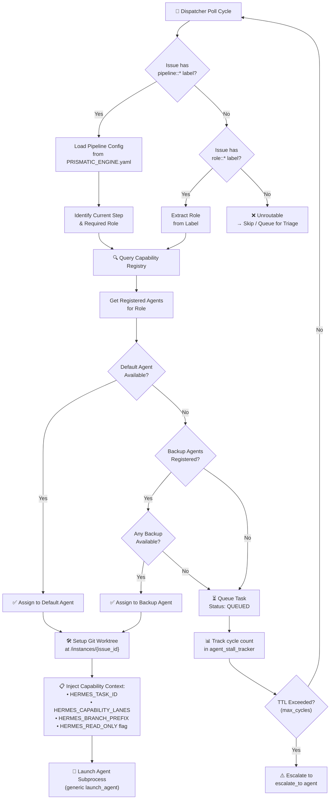

# Prismatic Engine — Capability Registry Design

**Deliverable:** GRO-820  
**Author:** AGY (Antigravity Senior Systems Architect)  
**Date:** June 8, 2026  
**Status:** Complete — Synthesized from Kai's Fractal Complexity Report, AGY's Core-Boundary Validation, `dispatcher.py` Audit, and AGY's Implementation Plan

---

## 1. Executive Summary

The Prismatic Engine currently routes work by matching **agent labels** (`agent::fred`, `agent::agy`, etc.) on Linear issues. Multi-modal agents like AGY break this model: AGY can design, research, review, and synthesize — four distinct roles requiring different lane scopes, branch prefixes, and concurrency rules. Binding a single set of static permissions to an agent identity is insufficient.

**This document designs the Capability Registry**, a role-based routing layer that sits between the dispatcher and agent runtimes. Capabilities define *what work can be done* (lanes, branch prefix, read/write scope) independently from *who does it* (agent executable). The dispatcher routes to capabilities, not agents.

### Source Synthesis

| Source | Key Contribution |
|--------|-----------------|
| **Kai's §1 — alchemy-mode-fractal-complexity.md** | Proposes per-task lane assignment and a YAML capability schema with roles: `designer`, `researcher`, `reviewer`, `synthesizer`, each with `lanes`, `branch_prefix`, and `read_only` flags. |
| **AGY's §2.3 — core-boundary-validation.md** | Recommends a generic Agent Registry in `PRISMATIC_ENGINE.yaml` with `executable`, `launch_arguments`, `labels`, `heartbeat_ttl_ms`, and `stall_recovery` per agent — decoupling the core from hardcoded agent identities. |
| **`prismatic/dispatcher.py`** (lines 383–419, 481–591) | Contains the hardcoded `AGENT_CONFIG` dict and agent-specific `launch_agy`/`launch_jules` functions. Current lane assignment is per-agent via label matching. The dispatcher iterates `AGENT_CONFIG` keys, constructs `agent::<name>` labels, and launches the mapped function. |
| **AGY's implementation-plan.md §5–6** | Defines `PRISMATIC_ENGINE.yaml` with agents having `lanes` and `branch_prefix`, and introduces pipeline steps with `role` fields — foreshadowing capability-based routing. |

---

## 2. Design Questions & Solutions

### 2.1 Configuration Location: `PRISMATIC_ENGINE.yaml` vs. Separate `capabilities.yaml`

**Recommendation: Unified in `PRISMATIC_ENGINE.yaml`.**

**Rationale:** 
- Kai's capability schema (alchemy-mode-fractal-complexity.md §1) embeds capabilities directly in the YAML — the lanes and branch prefix from capabilities must reference the same workspace settings, staging branch, and lock configuration as the agent definitions.
- AGY's core-boundary-validation §2.3 places the Agent Registry in `PRISMATIC_ENGINE.yaml` alongside pipeline definitions, creating a single source of truth.
- The implementation plan §5 already uses `PRISMATIC_ENGINE.yaml` for agents, lanes, branch prefixes, and staging — capabilities are a natural extension.
- **Single-file governance:** One Git commit captures all routing, lane, and concurrency rules. Configuration drift between files is eliminated.

### 2.2 How Does the Dispatcher Know Which Capability to Route To?

**Answer: Two-tier resolution via Linear labels → pipeline config → capability registry.**

```
Issue arrives
    │
    ├─ Has pipeline::* label? ──▶ Read pipeline def → get step's role → look up capability
    │
    ├─ Has role::* label? ──────▶ Look up capability directly (ad-hoc dispatch)
    │
    └─ No routing label ────────▶ Reject / queue for manual triage
```

The dispatcher (`dispatch_once`, dispatcher.py lines 1101–1214) currently iterates `AGENT_CONFIG` keys and queries Linear for `agent::<name>` labels. Under capabilities, the loop changes to:

1. **Pipeline mode (primary):** When an issue carries a `pipeline::*` label, the router loads the pipeline from `PRISMATIC_ENGINE.yaml`. Each step specifies a `role` (e.g., `role: designer`). The dispatcher looks up `capabilities.<role>` to find eligible agents, checks their `max_concurrent` availability, and launches the task.

2. **Direct label mode (fallback):** A `role::researcher` label on an issue triggers a direct capability lookup — no pipeline required. This matches the current `agent::*` label pattern but maps to a capability role instead of an agent name.

3. **Agent specificity:** The `capabilities.<role>.agents` map lists which agents can fulfill each role, with a `default_agent` for auto-selection. The dispatcher attempts the default first, then falls back to alternates.

### 2.3 Can AGY Run Multiple Capabilities Simultaneously?

**Answer: Yes — through independent Git Worktree instances.**

When AGY has `max_concurrent > 1` for a given capability (or globally), the scheduler can spawn multiple AGY process instances, each isolated in its own **Git Worktree**.

- **AGY's implementation-plan §4.1** validates worktree isolation as the primary concurrency primitive: "Agents run builds, compile, and run tests in complete isolation without locking out peers."
- **Dispatcher integration:** The current `launch_agy` function (dispatcher.py lines 481–517) spawns a single subprocess with `--issue` and `--task` flags. The capability-aware launcher extends this to also inject `--worktree <path>` and `--capability <role>` so each instance receives scoped lane and branch rules.
- **Concurrency tracking:** A SQLite slot table (extending `event_router.db`'s existing `dedup_log` schema) tracks active capability assignments per agent. If AGY has 3 active capability slots (one each for designer, reviewer, researcher), the scheduler knows to queue a 4th task.
- **AGY is `spawnable: true`:** Unlike Fred, Kai, or Autobot (which are fixed at `max_concurrent: 1`), AGY and Jules are spawnable — they can run many parallel instances.

### 2.4 What Happens When a Capability Isn't Available?

**Answer: Queue → heartbeat → escalate after TTL.**

```
Task needs capability "designer"
    │
    ▼
All registered agents at max_concurrent?
    │
    ├─ Yes ──▶ Write QUEUED record to event_router.db
    │            │
    │            ▼
    │         Every poll cycle: re-check slot availability
    │            │
    │            ├─ Slot freed ──▶ DEQUEUE → launch
    │            │
    │            └─ TTL exceeded (MAX_CYCLES_BEFORE_RECOVER) ──▶ ESCALATE
    │                 │
    │                 ▼
    │            Post Linear comment: "⚠️ Task queued for 6 cycles.
    │            No designer capacity. Escalating to fred."
    │            Transition label to agent::fred
    │
    └─ No ──▶ Launch immediately
```

This mirrors the existing stall recovery pattern in dispatcher.py (`recover_stalled_agy`, lines 824–937):
- The `agy_stall_tracker` SQLite table (soon to become `agent_stall_tracker` per AGY §2.3 recommendation 3) tracks cycle counts.
- After `MAX_CYCLES_BEFORE_RECOVER` (default 6), the task escalates to the configured `escalate_to` agent.
- **Preemption:** A high-priority task (priority 4-5) can preempt a lower-priority running task by signaling the agent process to pause, releasing its capability slot, and queuing the low-priority task.

### 2.5 How Does This Interact with the Existing Lane Assignment System?

**Answer: Capabilities extend lanes — a capability maps to specific lane scopes, which are injected at runtime.**

| Component | Current (Agent-based) | Proposed (Capability-based) |
|-----------|----------------------|---------------------------|
| **Lane source** | Static per-agent in `AGENT_CONFIG` / `PRISMATIC_ENGINE.yaml` | Dynamic per-capability in `PRISMATIC_ENGINE.yaml` |
| **Lane enforcement** | Agent-wide — AGY can write to `assets/`, `designs/`, `research/` always | Scoped per task — AGY as designer can only write to `assets/`, `designs/`; AGY as reviewer is read-only across `*` |
| **Branch prefix** | `design/` for all AGY work | `design/` for designer tasks, `research/` for researcher tasks, `review/` for reviewer tasks |
| **Prompt injection** | Static `SOUL.md` overlay | Dynamic overlay injected before agent launch with capability-specific lane rules |

**Integration with existing governance (implementation-plan §5, Phase 3):**
- The `pre-push` hook already validates files against `PRISMATIC_ENGINE.yaml` lanes. Under capabilities, the hook queries the capability registry by `HERMES_TASK_ID` (stored as an env var in the spawned process) to determine which lanes are authorized for that specific task.
- The centralized lock manager (`/home/ubuntu/.antigravity/swarm_locks.json`, implementation-plan §5 Phase 2) continues to verify lock ownership — now cross-referenced against the task's capability scope.

### 2.6 Worked Example: AGY Gets Three Tasks

**Scenario:** Three issues arrive simultaneously:

| Task | Issue ID | Required Capability | Description |
|------|----------|-------------------|-------------|
| T1 | GRO-901 | `designer` | Design new tour logo |
| T2 | GRO-902 | `reviewer` | Review Hawaiian diacritical marks in content |
| T3 | GRO-903 | `researcher` | Research competitor tour pricing |

**Scheduler execution trace:**

```
┌─────────────────────────────────────────────────────────────────┐
│ CYCLE 1: Dispatcher polls Linear                                │
├─────────────────────────────────────────────────────────────────┤
│                                                                  │
│  T1 (GRO-901): role=designer                                     │
│    → Capability registry: designer.default_agent = agy          │
│    → AGY availability: slot 1/∞ (spawnable)                     │
│    → LAUNCH: /home/ubuntu/.local/bin/agy                        │
│        --worktree /home/ubuntu/work/instances/gro-901           │
│        --capability designer                                     │
│        --issue GRO-901                                           │
│        --task "Design new tour logo"                             │
│    → Env: HERMES_TASK_ID=gro-901                                │
│           HERMES_CAPABILITY_LANES=["assets/","designs/"]         │
│           HERMES_BRANCH_PREFIX="design/"                         │
│    → Branch: design/gro-901-logo                                │
│                                                                  │
│  T2 (GRO-902): role=reviewer                                     │
│    → Capability registry: reviewer.default_agent = jules        │
│    → Jules availability: SLOT AVAILABLE (max_concurrent: 50)    │
│    → LAUNCH: /home/ubuntu/.local/bin/jules                      │
│        --worktree /home/ubuntu/work/instances/gro-902           │
│        --capability reviewer                                     │
│        --issue GRO-902                                           │
│    → Env: HERMES_TASK_ID=gro-902                                │
│           HERMES_CAPABILITY_LANES=["*"]                          │
│           HERMES_READ_ONLY=true                                  │
│    → Branch: review/gro-902-marks                               │
│                                                                  │
│  T3 (GRO-903): role=researcher                                   │
│    → Capability registry: researcher.default_agent = agy        │
│    → AGY availability: slot 2/∞ (spawnable)                     │
│    → LAUNCH: /home/ubuntu/.local/bin/agy                        │
│        --worktree /home/ubuntu/work/instances/gro-903           │
│        --capability researcher                                   │
│        --issue GRO-903                                           │
│    → Env: HERMES_TASK_ID=gro-903                                │
│           HERMES_CAPABILITY_LANES=["research/"]                  │
│           HERMES_BRANCH_PREFIX="research/"                       │
│    → Branch: research/gro-903-pricing                           │
│                                                                  │
│  RESULT: All three tasks launched concurrently in isolated       │
│          worktrees. AGY runs T1 and T3 simultaneously.          │
│          Jules runs T2. Each task is lane-scoped.               │
└─────────────────────────────────────────────────────────────────┘
```

**Pre-push validation example:** If AGY (running as designer for T1) attempts to push a commit that modifies `src/main.ts`, the pre-push hook:
1. Reads `HERMES_TASK_ID=gro-901` from environment.
2. Queries `PRISMATIC_ENGINE.yaml` → `capabilities.designer.agents.agy.lanes` = `["assets/", "designs/"]`.
3. `src/main.ts` is **not** in allowed lanes → **REJECT** with comment: "Lane violation: `src/main.ts` is outside designer capability scope for task gro-901."

---

## 3. Proposed YAML Schema

This schema extends the existing `PRISMATIC_ENGINE.yaml` (v1, 94 lines) to v2 with capabilities, merging proposals from all four sources.

```yaml
version: 2

# ── Centralized Workspace Settings ──────────────────────────
# Source: AGY core-boundary-validation §2.3 + existing PRISMATIC_ENGINE.yaml
settings:
  locks_dir: "/home/ubuntu/.antigravity"
  heartbeat_ttl_ms: 300000
  staging_branch: "deploy-fresh"
  staging_governor: "fred"

# ── Dynamic Agent Registry ──────────────────────────────────
# Source: AGY core-boundary-validation §2.3 (executable, launch_args, labels,
#         heartbeat_ttl_ms, stall_recovery)
#         + AGY implementation-plan §6 (lanes, branch_prefix)
#         + dispatcher.py lines 383-419 (AGENT_CONFIG mapping)
agents:
  fred:
    executable: "/home/ubuntu/.local/bin/fred"
    launch_arguments: ["--issue", "{issue_id}"]
    labels: ["agent::fred"]
    lanes: ["src/", "infra/", "deploy/", "agentic-swarm-ops/"]
    branch_prefix: "feature/"
    max_concurrent: 1
    heartbeat_ttl_ms: 300000
    mode: "signal"           # signal-based, not subprocess launch

  kai:
    executable: "/home/ubuntu/.local/bin/kai"
    launch_arguments: ["--issue", "{issue_id}"]
    labels: ["agent::kai"]
    lanes: ["content/", "active-oahu/"]
    branch_prefix: "content/"
    max_concurrent: 1
    heartbeat_ttl_ms: 300000
    mode: "signal"

  agy:
    executable: "/home/ubuntu/.local/bin/agy"
    launch_arguments: ["--headless", "--issue", "{issue_id}", "--task", "{task}"]
    labels: ["agent::agy"]
    lanes: []                # Base lanes — overridden per-capability
    branch_prefix: ""        # Base prefix — overridden per-capability
    spawnable: true          # Can run multiple parallel instances
    limit: "hardware"        # Concurrency bound by hardware, not config
    heartbeat_ttl_ms: 300000
    mode: "launch"
    stall_recovery:
      max_cycles: 6
      escalate_to: "fred"

  jules:
    executable: "/home/ubuntu/.local/bin/jules"
    launch_arguments: ["--issue", "{issue_id}", "--task", "{task}"]
    labels: ["agent::jules"]
    lanes: []
    branch_prefix: "fix/"
    max_concurrent: 50
    heartbeat_ttl_ms: 300000
    mode: "launch"

  codex:
    executable: "/home/ubuntu/.local/bin/codex"
    launch_arguments: ["--issue", "{issue_id}", "--task", "{task}"]
    labels: ["agent::codex"]
    lanes: []
    branch_prefix: "polish/"
    max_concurrent: 1
    heartbeat_ttl_ms: 300000
    mode: "launch"

  autobot:
    executable: "/home/ubuntu/.local/bin/autobot"
    labels: ["agent::autobot"]
    max_concurrent: 1
    mode: "signal"

# ── Capability Registry ─────────────────────────────────────
# Source: Kai's alchemy-mode-fractal-complexity §1 (per-task lane assignment,
#         YAML capability schema with roles, lanes, branch_prefix, read_only)
#         Extended with multi-agent fallback from AGY core-boundary §2.3
capabilities:
  designer:
    description: "Visual and UI design — logos, layouts, assets"
    agents:
      agy:
        branch_prefix: "design/"
        lanes: ["assets/", "designs/"]
        write_allowed: true
    default_agent: "agy"

  researcher:
    description: "Market research, competitor analysis, data gathering"
    agents:
      agy:
        branch_prefix: "research/"
        lanes: ["research/"]
        write_allowed: true
      kai:
        branch_prefix: "research-content/"
        lanes: ["research/", "content/"]
        write_allowed: true
    default_agent: "agy"

  reviewer:
    description: "Accuracy review, brand voice, SEO, diacritical marks"
    agents:
      agy:
        branch_prefix: "review/"
        lanes: ["*"]           # Read access everywhere
        write_allowed: false   # Read-only — no commits
      jules:
        branch_prefix: "review-code/"
        lanes: ["src/", "infra/"]
        write_allowed: false
    default_agent: "jules"

  synthesizer:
    description: "Combine research into reports, docs, recommendations"
    agents:
      agy:
        branch_prefix: "synthesis/"
        lanes: ["reports/", "docs/"]
        write_allowed: true
    default_agent: "agy"

  implementer:
    description: "Code implementation — features, fixes, infrastructure"
    agents:
      fred:
        branch_prefix: "feature/"
        lanes: ["src/", "infra/"]
        write_allowed: true
      codex:
        branch_prefix: "polish/"
        lanes: ["src/"]
        write_allowed: true
    default_agent: "fred"

  writer:
    description: "Content creation — pages, articles, copy"
    agents:
      kai:
        branch_prefix: "content/"
        lanes: ["content/", "active-oahu/"]
        write_allowed: true
    default_agent: "kai"

# ── Pipeline Templates ──────────────────────────────────────
# Source: AGY core-boundary §5.1 (design-review pipeline)
#         + Kai's alchemy-mode §2.B (recipe system: Research→Write→Review→Polish)
pipelines:
  content-pipeline:
    description: "Research → write → review → publish"
    trigger_labels: ["pipeline::content"]
    steps:
      - step: 1
        role: "researcher"
        next: 2
      - step: 2
        role: "writer"
        next: 3
      - step: 3
        role: "reviewer"
        next: "done"
    soul: "A single article should feel like a team spent a week on it."

  code-pipeline:
    description: "Design → implement → review → deploy"
    trigger_labels: ["pipeline::code"]
    steps:
      - step: 1
        role: "designer"
        next: 2
      - step: 2
        role: "implementer"
        next: 3
      - step: 3
        role: "reviewer"
        next: "done"
    soul: "Every feature ships complete, not half-baked."

  design-flow:
    description: "Design → review → integrate (AGY→Jules→Fred)"
    trigger_labels: ["pipeline::design"]
    steps:
      - step: 1
        role: "designer"
        next: 2
      - step: 2
        role: "reviewer"
        next: "integrate"

  research-synthesis:
    description: "AGY research → AGY synthesis → Kai review"
    trigger_labels: ["pipeline::research"]
    steps:
      - step: 1
        role: "researcher"
        next: 2
      - step: 2
        role: "synthesizer"
        next: 3
      - step: 3
        role: "reviewer"
        next: "done"

# ── Staging Configuration ──────────────────────────────────
# (unchanged from v1)
staging:
  governor: "fred"
  branch: "deploy-fresh"
```

---

## 4. Routing Decision Tree — Flow Diagrams

### 4.1 Mermaid Diagram (GitHub-renderable)



### 4.2 ASCII Decision Tree

```
                           ┌──────────────────────────┐
                           │   Dispatcher Poll Cycle   │
                           └────────────┬─────────────┘
                                        │
                          ┌─────────────▼─────────────┐
                          │ Issue has pipeline::*      │
                          │ label?                     │
                          └──────┬────────────┬───────┘
                                 │YES         │NO
                                 ▼            ▼
                    ┌─────────────────┐  ┌──────────────────┐
                    │ Load Pipeline    │  │ Issue has         │
                    │ Config from YAML │  │ role::* label?    │
                    └────────┬────────┘  └────┬─────────┬────┘
                             │                │YES      │NO
                             ▼                ▼         ▼
                    ┌─────────────────┐  ┌──────────┐ ┌──────────┐
                    │ Identify Step & │  │ Extract  │ │ UNROUTABLE│
                    │ Required Role   │  │ Role     │ │ → Skip    │
                    └────────┬────────┘  └────┬─────┘ └──────────┘
                             │                │
                             └───────┬────────┘
                                     ▼
                          ┌──────────────────────┐
                          │ Query Capability      │
                          │ Registry for Role     │
                          └──────────┬───────────┘
                                     ▼
                          ┌──────────────────────┐
                          │ Get Registered Agents │
                          │ + default_agent       │
                          └──────────┬───────────┘
                                     │
                          ┌──────────▼──────────┐
                          │ Default Agent        │
                          │ Available?           │
                          └──────┬──────────┬────┘
                                 │YES       │NO
                                 ▼          ▼
                          ┌───────────┐ ┌──────────────────┐
                          │ ASSIGN to │ │ Backup Agents     │
                          │ Default   │ │ Available?        │
                          └─────┬─────┘ └────┬─────────┬────┘
                                │            │YES      │NO
                                │            ▼         ▼
                                │     ┌───────────┐ ┌───────────┐
                                │     │ ASSIGN to │ │ QUEUE     │
                                │     │ Backup    │ │ Task      │
                                │     └─────┬─────┘ └─────┬─────┘
                                │           │             │
                                └─────┬─────┘             │
                                      ▼                   │
                          ┌───────────────────┐           │
                          │ Setup Git Worktree │           │
                          │ Inject Capability  │           │
                          │ Context via Env    │           │
                          └────────┬──────────┘           │
                                   ▼                      │
                          ┌───────────────────┐           │
                          │ Launch Agent      │           │
                          │ Subprocess         │           │
                          └───────────────────┘           │
                                                          │
                          ┌───────────────────────────────┘
                          ▼
                 ┌────────────────────┐
                 │ Track cycle count  │
                 │ in agent_stall_    │
                 │ tracker            │
                 └────────┬───────────┘
                          │
                 ┌────────▼──────────┐
                 │ TTL Exceeded?     │
                 └──┬───────────┬────┘
                    │YES        │NO
                    ▼           ▼
           ┌──────────────┐  ┌──────────┐
           │ ESCALATE to  │  │ Retry    │
           │ escalate_to  │  │ next     │
           │ agent        │  │ cycle    │
           └──────────────┘  └──────────┘
```

---

## 5. Integration Points with `prismatic/dispatcher.py`

This section maps the capability registry design to specific refactoring targets in the current `dispatcher.py` (1,331 lines).

### 5.1 Remove Hardcoded Agent Constants (lines 54–56)

**Current (hardcoded):**
```python
AGY_PATH: str = os.environ.get("AGY_PATH", "/home/ubuntu/.local/bin/agy")
JULES_PATH: str = os.environ.get("JULES_PATH", "/home/ubuntu/.local/bin/jules")
CODEX_PATH: str = os.environ.get("CODEX_PATH", "/home/ubuntu/.local/bin/codex")
```

**Target (dynamic from YAML):**
```python
def load_agent_registry(config_path: str = "PRISMATIC_ENGINE.yaml") -> dict:
    """Load agent executables and config from YAML."""
    import yaml
    with open(config_path) as f:
        config = yaml.safe_load(f)
    return config.get("agents", {})
```

**Rationale:** AGY core-boundary-validation §2.3 Recommendation 1: "Move all agent definitions out of python constants and into `PRISMATIC_ENGINE.yaml`."

### 5.2 Replace `AGENT_CONFIG` Dict with Capability-Aware Routing (lines 383–419)

**Current (hardcoded pipeline mapping):**
```python
AGENT_CONFIG: dict[str, dict[str, Any]] = {
    "fred": {
        "executable": AGY_PATH,
        "mode": "signal",
        "timeout": 300,
        "next_label": "agent::kai",
        ...
    },
    ...
}
```

The current dispatcher iterates `AGENT_CONFIG` keys at line 1147:
```python
for agent_name, config in AGENT_CONFIG.items():
    ...
    label = f"agent::{agent_name}"
    issues = get_issues_with_label(label)
```

**Target (capability-driven loop):**

The main dispatch loop changes from iterating agents to iterating **capabilities with queued work**:

```python
def dispatch_once_capabilities(dedup, config):
    """Capability-aware dispatch cycle."""
    capabilities = config.get("capabilities", {})
    agents_config = config.get("agents", {})

    for cap_name, cap_def in capabilities.items():
        label = f"role::{cap_name}"
        issues = get_issues_with_label(label)

        for issue in issues:
            # Resolve agent for this capability
            agent_name = resolve_agent_for_capability(
                cap_name, cap_def, agents_config
            )
            if not agent_name:
                queue_task(issue, cap_name)
                continue

            # Launch via generic launcher
            launch_agent(
                agent_name=agent_name,
                issue_id=issue["id"],
                task=issue.get("title", ""),
                capability=cap_name,
                cap_def=cap_def["agents"].get(agent_name, {}),
            )
```

### 5.3 Generic `launch_agent()` Replaces `launch_agy`/`launch_jules` (lines 481–581)

**Current (agent-specific):**
```python
def launch_agy(issue_id: str, task: str = "") -> subprocess.Popen | None:
    ...
    cmd = [AGY_PATH, "--headless", "--issue", issue_id]
    ...

def launch_jules(issue_id: str, task: str = "") -> subprocess.Popen | None:
    ...
    cmd = [JULES_PATH, "--issue", issue_id]
    ...
```

**Target (generic):**
```python
def launch_agent(
    agent_name: str,
    issue_id: str,
    task: str = "",
    capability: str = "",
    cap_lanes: list[str] | None = None,
    cap_branch_prefix: str = "",
    cap_read_only: bool = False,
    config: dict | None = None,
) -> subprocess.Popen | None:
    """Generic agent launcher — resolves executable and args from config."""
    if config is None:
        config = load_config()

    agent_cfg = config.get("agents", {}).get(agent_name)
    if not agent_cfg:
        print(f"[dispatcher] Unknown agent: {agent_name}")
        return None

    exe = agent_cfg["executable"]
    if not os.path.exists(exe):
        print(f"[dispatcher] Executable not found: {exe}")
        return None

    # Build command from launch_arguments template
    cmd = [exe]
    for arg in agent_cfg.get("launch_arguments", []):
        cmd.append(arg.format(issue_id=issue_id, task=task))

    # Inject capability context via environment
    env = os.environ.copy()
    env["HERMES_TASK_ID"] = issue_id
    env["HERMES_CAPABILITY"] = capability
    if cap_lanes:
        env["HERMES_CAPABILITY_LANES"] = json.dumps(cap_lanes)
    if cap_branch_prefix:
        env["HERMES_BRANCH_PREFIX"] = cap_branch_prefix
    if cap_read_only:
        env["HERMES_READ_ONLY"] = "true"

    proc = subprocess.Popen(
        cmd,
        stdout=subprocess.DEVNULL,
        stderr=subprocess.DEVNULL,
        stdin=subprocess.DEVNULL,
        env=env,
    )
    print(f"[dispatcher] Launched {agent_name} (pid={proc.pid}) "
          f"capability={capability} issue={issue_id}")
    return proc
```

**Rationale:** AGY core-boundary-validation §2.3 Recommendation 2: "Replace `launch_agy` and `launch_jules` with a single generic function `launch_agent(agent_name, issue_id, task)`."

### 5.4 Generalize `agy_stall_tracker` → `agent_stall_tracker` (lines 824–937)

**Current:**
```python
cursor.execute("""
    CREATE TABLE IF NOT EXISTS agy_stall_tracker (
        issue_id TEXT PRIMARY KEY,
        cycle_count INTEGER DEFAULT 0,
        last_seen TEXT,
        escalated INTEGER DEFAULT 0
    )
""")
```

**Target:**
```python
cursor.execute("""
    CREATE TABLE IF NOT EXISTS agent_stall_tracker (
        issue_id TEXT NOT NULL,
        agent_name TEXT NOT NULL,
        capability TEXT,
        cycle_count INTEGER DEFAULT 0,
        last_seen TEXT,
        escalated INTEGER DEFAULT 0,
        queued INTEGER DEFAULT 0,
        priority INTEGER DEFAULT 3,
        PRIMARY KEY (issue_id, agent_name, capability)
    )
""")
```

**Rationale:** AGY core-boundary-validation §2.3 Recommendation 3: "Rename `agy_stall_tracker` to `agent_stall_tracker`. Generalize the database table columns to index state by `agent_id`."

### 5.5 Capability Resolution Function

```python
def resolve_agent_for_capability(
    cap_name: str,
    cap_def: dict,
    agents_config: dict,
    active_slots: dict | None = None,
) -> str | None:
    """Find an available agent for a capability.

    Tries default_agent first, then falls back to alternates.
    Checks max_concurrent against active_slots tracker.
    """
    default_agent = cap_def.get("default_agent")
    registered = cap_def.get("agents", {})

    # Try default first
    if default_agent and default_agent in registered:
        if _agent_has_capacity(default_agent, agents_config, active_slots):
            return default_agent

    # Fallback to any registered agent with capacity
    for agent_name in registered:
        if agent_name == default_agent:
            continue  # Already checked
        if _agent_has_capacity(agent_name, agents_config, active_slots):
            return agent_name

    return None


def _agent_has_capacity(
    agent_name: str,
    agents_config: dict,
    active_slots: dict | None,
) -> bool:
    """Check if an agent has capacity for another task."""
    agent_cfg = agents_config.get(agent_name, {})
    max_conc = agent_cfg.get("max_concurrent", 1)
    spawnable = agent_cfg.get("spawnable", False)

    if spawnable:
        return True  # AGY/Jules scale to hardware

    if active_slots is None:
        active_slots = {}

    current = active_slots.get(agent_name, 0)
    return current < max_conc
```

### 5.6 Integration Summary Table

| `dispatcher.py` Location | Current Behavior | Capability-Aware Behavior |
|--------------------------|-----------------|--------------------------|
| Lines 54–56 | Hardcoded `AGY_PATH`, `JULES_PATH`, `CODEX_PATH` | Load from `PRISMATIC_ENGINE.yaml` → `agents.<name>.executable` |
| Lines 383–419 | `AGENT_CONFIG` dict with `next_label` hardcoded | `capabilities` registry; `next_label` derived from pipeline step sequence |
| Lines 481–581 | `launch_agy()`, `launch_jules()`, `launch_codex()` | Single `launch_agent()` with capability context injection |
| Lines 584–591 | `AGENT_LAUNCHERS` dict mapping name→function | Dynamic resolution: `agents_config[name]["mode"]` → signal or launch |
| Lines 733–791 | `cleanup_stale_agy()` | `cleanup_stale_agent(agent_name)` — generic, config-driven |
| Lines 824–937 | `recover_stalled_agy()` with `agy_stall_tracker` table | `recover_stalled_agent()` with unified `agent_stall_tracker` |
| Lines 1101–1214 | `dispatch_once()` iterates `AGENT_CONFIG` keys | Iterates `capabilities` keys, queries `role::*` labels |
| Lines 1147–1151 | Skips signal-mode agents (fred, kai) | Signal agents dispatched via same capability loop; mode determines transport |

---

## 6. Migration Path

### Phase 1: Add Capability Registry to YAML (backward-compatible)
- Add `capabilities:` section to `PRISMATIC_ENGINE.yaml` alongside existing `agents:` and `pipelines:` sections.
- Existing `agent::*` label routing continues to work unchanged.
- Add `role::*` label support in dispatcher (new code path, no breakage).

### Phase 2: Generic Launch Engine
- Implement `launch_agent()` as described in §5.3.
- Add deprecation warnings to `launch_agy`/`launch_jules`/`launch_codex`.
- Migrate `AGENT_LAUNCHERS` to dynamic dispatch based on `mode` field.

### Phase 3: Unified Stall Tracker
- Create `agent_stall_tracker` table alongside existing `agy_stall_tracker`.
- Dual-write during transition.
- Drop `agy_stall_tracker` after validation.

### Phase 4: Full Capability-Driven Dispatch
- `dispatch_once()` iterates capabilities, not agents.
- `agent::*` labels become soft-deprecated; `role::*` and `pipeline::*` are canonical.
- All agent config loaded from YAML — zero hardcoded agent references in Python.

---

## 7. References

1. **Kai — alchemy-mode-fractal-complexity.md §1** (lines 9–36): Per-task lane assignment, YAML capability schema for AGY's multi-modal roles.
2. **AGY — core-boundary-validation.md §2.3** (lines 50–72): Generic Agent Registry recommendation with `executable`, `launch_arguments`, `labels`, `heartbeat_ttl_ms`, `stall_recovery`.
3. **`prismatic/dispatcher.py`** (full 1,331 lines): Current hardcoded `AGENT_CONFIG` dict, agent-specific launchers, label-based routing loop, AGY-specific stall recovery.
4. **AGY — implementation-plan.md §5–6** (lines 161–231): `PRISMATIC_ENGINE.yaml` with `agents` having `lanes` and `branch_prefix`, MVP deployment, pipeline steps with `role` fields.
5. **Existing `PRISMATIC_ENGINE.yaml`** (94 lines, v1): Current agent definitions with lanes, branch prefixes, and pipeline templates.
6. **Existing `config/agents.yaml`** (62 lines): Signal provider configuration per agent (file, http, redis, telegram transports).
