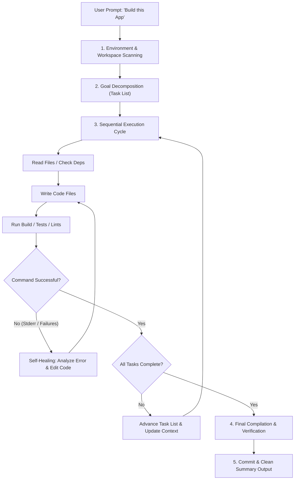
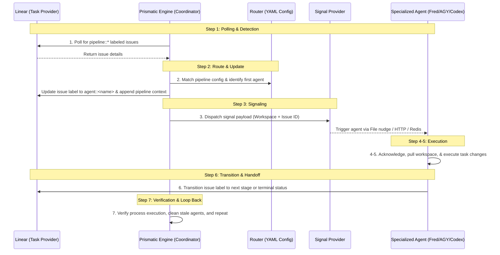

# Prismatic Engine Research Report: Claude Code Iterative Build Pattern
**Issue Reference:** [GRO-817](https://linear.app/growthwebdev/issue/GRO-817)  
**Author:** Antigravity (Pair Programming with User)  
**Date:** June 8, 2026  

---

## 📸 Architectural Visual Overview

---

## 1. Executive Summary

This report delivers a deep-dive investigation into **Claude Code's Iterative Build Pattern**, specifically addressing its signature *"build the thing, wake me when done"* autonomous capability. By analyzing developer workflows, CLI designs, prompt constraints, and comparing these concepts to the **Prismatic Engine's 7-step label-based routing loop**, we trace exactly what happens under the hood during a multi-hour autonomous build session.

---

## 2. Core Research Question
> **"When someone tells Claude Code to build an app and comes back 12 hours later, what is actually happening?"**

When a developer starts a long-running, autonomous command (e.g. using `claude` with high tool thresholds, or headless scripting hooks) and leaves it running for 12 hours, the following lifecycle is occurring on the local machine and Anthropic's APIs:

### The 12-Hour Session Breakdown:
1. **Initial Codebase Exploration & Scoping**: The CLI scans directory structures, parses dependencies (`package.json`, `requirements.txt`, etc.), and reads system rules or configurations (e.g. `CLAUDE.md`).
2. **Dynamic Plan Synthesis**: The agent translates the high-level prompt into a sequence of concrete implementation files and verification steps, typically saved in-memory or written to a tracking scratchpad file.
3. **The Sequential Read-Write-Test-Fix Loop**: The agent initiates a highly iterative loop. It writes a file, executes a compiler or test command via a local shell tool, captures stderr/stdout, modifies code to fix errors, and proceeds.
4. **Prompt Caching & State Management**: Because this loop can run for hundreds of cycles, Claude Code leverages **Prompt Caching** (caching system instructions and codebase schemas) to minimize cost and latency. The filesystem itself serves as the persistent database; the agent periodically reads the files it just wrote to maintain a single source of truth, avoiding the need to hold massive historical files in its direct context window.
5. **Interactive Fail-Safe Fallbacks**: If the agent gets stuck in a compiler loop or hits a timeout/safety gate, it suspends execution and prompts the console for manual intervention, waiting until the developer returns.
6. **Completion Summary**: The CLI outputs a clean summary showing the file diffs, test pass/fail state, and a checklist of completed items.

---

## 3. Hypotheses Validation

We have evaluated the five target hypotheses against standard agent behaviors, documentation, and compiler-loop heuristics:

### Hypothesis 1: Claude Code decomposes the request into a task DAG
> [!NOTE]  
> **Status: VALIDATED WITH NUANCE**  
> While Claude Code does not typically construct a formal, mathematically declared mathematical Graph data structure (with node and edge objects) in its code, it **functionally models task dependencies**. The agent creates a logical plan (often stored in a local markdown scratchpad or context memory) stating: *"I must build the API database models before writing endpoints, and I must build endpoints before implementing client views."* The execution order behaves strictly as a dependency tree.

### Hypothesis 2: Executes tasks in dependency order (not in parallel)
> [!IMPORTANT]  
> **Status: VALIDATED (The Key to Agentic Reliability)**  
> Parallel task execution is intentionally avoided in single-workspace agent loops for three critical reasons:
> 1. **Context Dependency**: The output of step N is the starting context for step N+1.
> 2. **Environment & File Collisions**: Compiling, linting, or editing the same files in parallel causes race conditions, lock conflicts, and merge conflicts.
> 3. **Context Window Expansion**: Spawning parallel LLM calls increases token costs exponentially and pollutes the workspace context with non-deterministic file states.
> 
> Therefore, sequential dependency-order execution is a hard constraint for reliability.

### Hypothesis 3: Self-heals failures — retries, re-plans, or asks for help
> [!TIP]  
> **Status: VALIDATED**  
> Claude Code treats error codes (exit status != 0) and compiler logs (tracebacks, lints) as natural language observations. If a build command fails:
> * **Analyze**: It reads the stderr/log output.
> * **Act**: It edits the code files causing the error.
> * **Verify**: It runs the command again.
> * **Fallback**: If the retry counter is exceeded, it stops and requests human assistance instead of looping infinitely.

### Hypothesis 4: Accumulates context across tasks
> [!NOTE]  
> **Status: VALIDATED WITH OPTIMIZATION**  
> The agent does not simply pile all historical tool calls into the context window (which would cause context collapse and extreme token costs). Instead, context is accumulated via:
> 1. **Filesystem State**: The repository files act as the external memory.
> 2. **Task State tracking**: Checklists (`task_list.md`) track progress.
> 3. **Prompt Caching**: Minimizes token overhead for repeated context.
> 4. **Pruning**: It discards raw command outputs once a task is resolved, keeping only the final structure.

### Hypothesis 5: Produces a summary at the end
> [!NOTE]  
> **Status: VALIDATED**  
> Upon reaching the end of the task queue or hitting a hard block, the CLI generates a human-readable list of modified files, completed goals, failed tests, and next-step recommendations.

---

## 4. Comparative Analysis: Claude Code vs. Prismatic Engine

The two architectures occupy different layers of the agentic stack. Claude Code is an **agent executor** (the engine doing the file edits and shell calls), whereas Prismatic Engine is a **coordinator/orchestrator** (routing tasks between separate, specialized agents).

### Feature Comparison Matrix

| Feature | Claude Code (Agent Loop) | Prismatic Engine (Orchestrator Loop) |
|---|---|---|
| **Primary Role** | Direct file editing, tool execution, local shell calls. | High-level task routing, state management, handoff logic. |
| **Workspace Scope** | Single codebase directory / session. | Cross-project, multi-workspace routing via Linear issues. |
| **Execution Order** | Sequential execution of sub-tasks. | Sequential transitions across pipeline agents (`GY` → `Codex` → `Jules`). |
| **Self-Healing Level** | **Internal/Code-level**: Modifies source files to resolve tests/compiler errors. | **Operational/System-level**: Recovers stalled agents, restarts processes, handles fallbacks. |
| **State Tracking** | Local files, prompt caches, terminal history, markdown checklists. | Linear issue labels, SQLite (`event_router.db`), issue comments. |
| **Handoff Mechanism** | Internal agent self-calls. | Transport-agnostic signals (Files, HTTP webhooks, Redis pub/sub). |

---

## 5. Mapping the Loops Side-by-Side

### Claude Code's Inner Agent Loop
1. **Analyze**: Parse user input and inspect local directory files.
2. **Plan**: Formulate a sequential list of file changes and build tasks.
3. **Edit**: Modify code files based on requirements.
4. **Execute**: Run compile/test commands locally in the shell.
5. **Inspect**: Read stdout/stderr feedback.
6. **Correct**: Self-heal any errors or proceed to the next step.
7. **Report**: Output final work summary and diff logs.

### Prismatic Engine's 7-Step Outer Orchestration Loop

---

## 6. Architectural Recommendations for Prismatic Engine

To enhance Prismatic Engine's capabilities using lessons from the Claude Code iterative build pattern:

1. **Local Self-Healing Hooks**: Allow Prismatic's agent configurations to define a validation command (e.g. `test_command: pytest`). If the command fails, instead of immediate failure, provide the agent with a local retry quota (e.g. `max_retries: 3`) to self-heal code files before signaling completion.
2. **State-Accumulating Workspace Volumes**: When shifting tasks between agents (e.g., `AGY` designing and `Codex` building), ensure the workspace state (including build logs, lint outputs, and code changes) persists in a shared worktree volume, preventing context loss between transitions.
3. **Label-Driven Caching Checkpoints**: Introduce a cache label (e.g., `pipeline::checkpoint`) that commits changes to git before transitioning to the next agent. If the next step fails, the coordinator can automatically roll back the repository state to the last successful checkpoint and retry.

---
*End of Report.*
