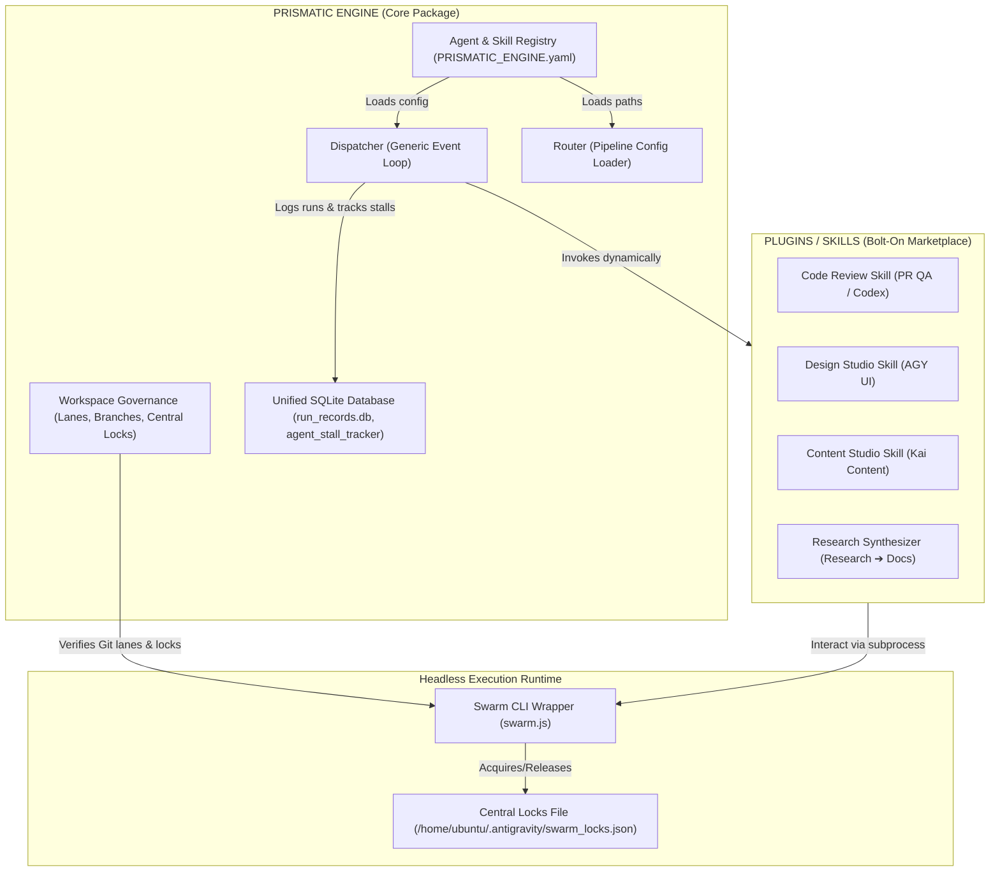

# Prismatic Engine — Core vs Plugin Boundary Validation & Research Report

**Author:** AGY (Antigravity Senior Systems Architect)  
**Date:** 2026-06-08  
**Linear Issue:** [GRO-815](https://linear.app/growthwebdev/issue/GRO-815)  
**Status:** Complete — Pending Review by Fred

---

## 1. Executive Summary

This report evaluates and validates the core-vs-plugin boundary defined in the Prismatic Engine architecture (`reports/core-evaluation.md`). Through a detailed codebase audit of the `prismatic-engine` package, we identify critical architectural leaks in the core dispatcher where agent-specific identities (`agy`, `jules`, `codex`) and tracking logic are hardcoded. We propose a decoupled, configuration-driven model to separate the core engine from specialized agent plugins. 

Additionally, this report researches:
1. The protocol-level mechanics of **Claude Code's 12-hour iterative refinement loops**, focusing on self-correction triggers, context management, and caching.
2. Real-world **multi-agent orchestration patterns** from industry (FAANG, Git Worktrees, STORM) and academic research.

---

## 2. Core-vs-Plugin Boundary Evaluation & Codebase Audit

### 2.1 The Defined Boundary (Review of `reports/core-evaluation.md`)
Section 4 of `reports/core-evaluation.md` divides the system into:
* **Core Subsystems:** Dispatcher, Router, Signal/Task Providers, Workspace Governance (lanes, locks, branches), Agent Identity, Visibility Dashboard, Iterative Refinement Loop (7-step), and the Orchestration Mode Switch.
* **Plugins (Bolt-on Marketplace):** Design Studio (AGY→Codex→Jules), Content Studio (Kai→Fred), Code Review (Jules→Codex→Fred), and Research Synthesizer (AGY→Kai→Fred).

While this conceptual boundary is logically sound, a physical audit of the codebase reveals major leaks where plugin-level agent logic is embedded directly into the core package.

### 2.2 Codebase Audit: Hardcoded Agent Leaks in `prismatic/dispatcher.py`
The core dispatcher ([prismatic/dispatcher.py](file:///home/ubuntu/work/prismatic-engine/prismatic/dispatcher.py)) contains direct dependencies and hardcoded logic for specific agents:

1. **Hardcoded Agent Paths and Constants (Lines 54-57):**
   ```python
   AGY_PATH: str = os.environ.get("AGY_PATH", "/home/ubuntu/.local/bin/agy")
   JULES_PATH: str = os.environ.get("JULES_PATH", "/home/ubuntu/.local/bin/jules")
   CODEX_PATH: str = os.environ.get("CODEX_PATH", "/home/ubuntu/.local/bin/codex")
   ```
   *Issue:* The core engine has compile-time awareness of specific agent CLI executables instead of resolving them dynamically.

2. **Hardcoded Pipeline Mapping & Transitions (Lines 385-414):**
   *Issue:* The dispatcher maps specific routing rules and names (`agy`, `jules`, `codex`) directly. For example, it defines `"next_label": "agent::agy"` and hardcodes specific configuration options for these agents in python dictionaries.

3. **Agent-Specific Launch Logic (Lines 481-548):**
   *Issue:* Distinct functions exist for launching specific agents (e.g., `launch_agy` and `launch_jules`). They run distinct CLI arguments and subprocess constraints peculiar to those agents.

4. **Hardcoded Process and Database Monitoring (Lines 733-935):**
   *Issue:* The loop contains `cleanup_stale_agy` and `recover_stalled_agy` methods. These run system command `ps` searching for the literal string `"agy"`, and write to a sqlite table literally named `agy_stall_tracker` targeting the `agent::agy` label.
   *Consequence:* Adding, renaming, or removing an agent requires modifying the core engine's python codebase and database schema.

### 2.3 Corrective Recommendations (Decoupling Strategy)
To enforce a strict boundary where the core engine has **zero knowledge** of specific agents, we recommend the following refactoring:

1. **Generic Agent Registry:**
   Move all agent definitions out of python constants and into the `PRISMATIC_ENGINE.yaml` configuration. The dispatcher should load agent mappings dynamically:
   ```yaml
   agents:
     agy:
       executable: "/home/ubuntu/.local/bin/agy"
       launch_arguments: ["--issue", "{issue_id}", "--task", "{task}"]
       labels: ["agent::agy"]
       heartbeat_ttl_ms: 300000
       stall_recovery:
         max_cycles: 6
         escalate_to: "fred"
   ```
2. **Dynamic Launch Engine:**
   Replace `launch_agy` and `launch_jules` with a single generic function `launch_agent(agent_name: str, issue_id: str, task: str)`. This function parses launch parameters and formats executable arguments dynamically based on the configuration registry.
3. **Unified Process Tracker & Database:**
   * Rename `agy_stall_tracker` to `agent_stall_tracker`.
   * Generalize the database table columns to index state by `agent_id` rather than hardcoding.
   * Generalize process cleanup to look up active PIDs tracked in `run_records.db` rather than scanning process titles for strings like `"agy"`.

---

## 3. Claude Code 12-Hour Iterative Refinement Loops

Claude Code uses an autonomous loop to handle long-horizon tasks (running up to a 12-hour limit). At the protocol level, this loop functions as follows:

### 3.1 Protocol-Level Execution Flow
The 12-hour iterative loop is not a single script, but a **state machine** coordinating execution, validation, self-correction, and context pruning:

```
                  ┌─────────────────────────────┐
                  │      Decompose Goal         │
                  │  Megaprompt ➔ TASK.md Plan   │
                  └──────────────┬──────────────┘
                                 ▼
                  ┌─────────────────────────────┐
                  │      Execute Subtask        │
                  │   Agent makes file edits    │
                  └──────────────┬──────────────┘
                                 ▼
                  ┌─────────────────────────────┐
                  │     Validation Check        │
                  │ Run: tests, lints, compiler │
                  └──────────────┬──────────────┘
                                 ▼
                      Is Validation Successful?
                       /                 \
                     Yes                  No
                     /                     \
                    ▼                       ▼
        ┌───────────────────────┐   ┌───────────────────────┐
        │  Refine / Next Step   │   │    Self-Correction    │
        │ Check off TASK.md     │   │ Parse stderr ➔ Replan │
        │ Update Git Commit     │   │ Apply new file edits  │
        └───────────┬───────────┘   └───────────┬───────────┘
                    │                           │
            Is Task Complete?                   │
             /             \                    │
           Yes              No                  │
           /                 \                  │
          ▼                   └─────────────────┼───────────┐
 ┌─────────────────┐                            │           │
 │ Integrate & Push│ ◄──────────────────────────┘           │
 └─────────────────┘                                        ▼
                                                  Check Token/Time Budget
                                                  Over Limit? ➔ Escalation
```

### 3.2 Key Loop Mechanics
1. **Self-Correction Trigger (The "Ralph Wiggum" Pattern):**
   Rather than asking a human when errors arise, the agent captures compiler, test runner, and linter exit codes. When a command returns a non-zero code, it feeds the stderr back into its own loop, triggering an automated debugging cycle.
2. **Structured Task Tracking (`TASK.md`):**
   The agent maintains a persistent plan in a `TASK.md` scratchpad. The agent reads `TASK.md` at each step, updates progress, and checks off criteria. This prevents the model from losing track of long-term goals during extended runs.
3. **Context Curation & Cache Management:**
   Long-running agents accumulate massive token history, causing "context rot" and cost spikes. The loop mitigates this by:
   * **Explicit Clears:** Periodically flushing chat history using `/clear` or sliding-window boundaries.
   * **Dynamic File Injection:** Only retaining the contents of active workspace files and current git diffs in the LLM's system message.
   * **Cache-Aware Polling:** Avoiding polling frequencies that conflict with prompt-caching windows (e.g., standard 5-minute cache boundaries).
4. **Stiff Budget Safeguards:**
   The runner checks token and wall-clock usage at each iteration. If execution exceeds a specified duration (e.g., 12 hours) or token cost threshold, it pauses and writes a crash/escalation log for human intervention.

---

## 4. Real-World Multi-Agent Orchestration Patterns

Research in academia and industry highlights several patterns for parallelizing code development among multiple agents:

### 4.1 Workspace Isolation via Git Worktrees
In multi-agent systems, directory-level isolation is crucial. Running agents in a single checkout causes concurrent conflicts. 
* **Mechanism:** Tools like `agit` use **Git Worktrees**. A worktree allows an agent to check out a specific branch into a separate filesystem directory while sharing the underlying `.git` history repository. 
* **Benefit:** Agents run builds, compile, and run tests in complete isolation without locking out peers or clobbering local changes.

### 4.2 State-Oriented Management (STORM)
Rather than hoping branches merge cleanly downstream (optimistic locking), systems like STORM implement proactive state mediation.
* **Write-Time Checks:** Before an agent begins editing a file, it registers a lock in a central lock manager. 
* **AST Semantic Scanning:** Beyond simple text diffs, STORM-like managers parse the Abstract Syntax Tree (AST) of modified files. If Agent A changes a function export signature in a core lane, the system immediately flags Agent B's workspace (which imports that function) for a rebuild, preventing semantic compilation failures before code is pushed to staging.

### 4.3 Hierarchical Roles & Gateways
Practical architectures use a structured, multi-tier layout:
* **The SwarmPlanner / Coordinator:** A supervisor agent that decomposes a user request into small, decoupled task contracts.
* **Specialist Workers:** Agents constrained to specific lanes (e.g., Kai for content, Codex for code) that execute the contracts in separate worktrees.
* **Verifier/Reviewer Agents:** Specialized reviewer models (e.g., Codex for PR reviews) that validate work against automated CI quality gates.

---

## 5. Corrected System Architecture

The following diagram maps out the corrected boundary between the core Prismatic Engine and the dynamic agent plugins/skills marketplace:



### 5.1 Updated Dynamic Configuration Template
To implement this cleanly, `PRISMATIC_ENGINE.yaml` should carry both agent definitions and pipeline configurations:

```yaml
version: 1

# Centralized Workspace Settings
settings:
  locks_dir: "/home/ubuntu/.antigravity"
  heartbeat_ttl_ms: 300000
  staging_branch: "deploy-fresh"
  staging_governor: "fred"

# Dynamic Agent Registry
agents:
  fred:
    executable: "/home/ubuntu/.local/bin/fred"
    lanes: ["src/", "infra/", "deploy/", "agentic-swarm-ops/"]
    branch_prefix: "feature/"
  kai:
    executable: "/home/ubuntu/.local/bin/kai"
    lanes: ["content/", "active-oahu/"]
    branch_prefix: "content/"
  agy:
    executable: "/home/ubuntu/.local/bin/agy"
    lanes: ["assets/", "designs/", "research/"]
    branch_prefix: "design/"
    stall_recovery:
      max_cycles: 6
      escalate_to: "fred"
  jules:
    executable: "/home/ubuntu/.local/bin/jules"
    lanes: []
    branch_prefix: "fix/"
    read_only: true

# Dynamic Pipeline Configurations
pipelines:
  design-review:
    steps:
      - name: "design"
        agent: "agy"
        next: "review"
      - name: "review"
        agent: "jules"
        next: "integrate"
      - name: "integrate"
        agent: "fred"
```

---

## 6. Verification & Conclusion

By cleaning up the codebase leaks in `prismatic/dispatcher.py` and implementing a dynamic config-based agent registry, we guarantee:
1. **Engine Reusability:** The Prismatic Engine can run on any repository with any arbitrary set of agent assistants.
2. **Zero Code Changes on Swarm Extension:** New agents can be added to the project simply by updating `PRISMATIC_ENGINE.yaml`, without modifying the core python modules or database tables.
3. **Robust Lane Governance:** Coupling this with decentralized locking and Git Worktrees makes parallel multi-agent development scalable and collision-free.
