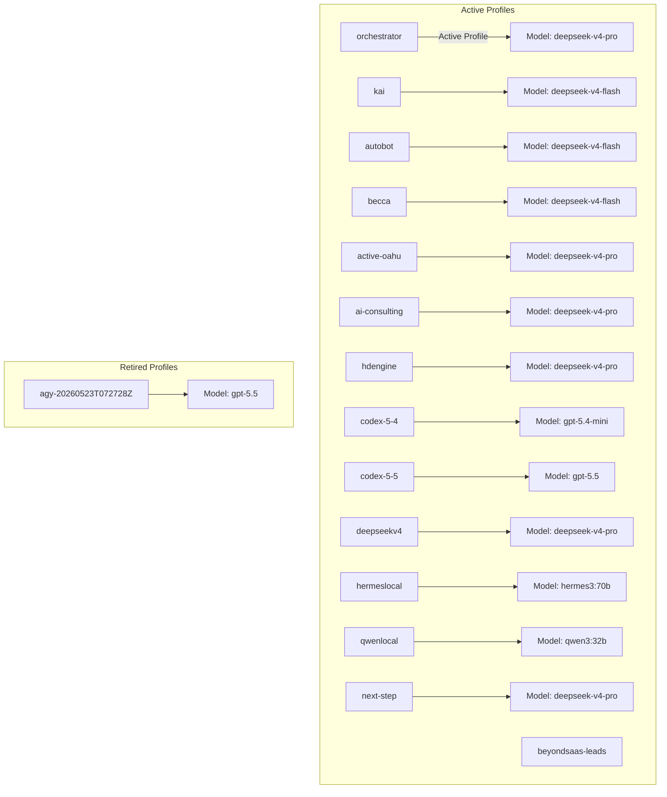

# Hermes Installation Discovery & Service Audit Report

This report presents a complete audit of the Hermes installation, including plugins, profiles, services, configurations, and the `workspace-tree` plugin capability. This discovery data feeds into the Prismatic Engine to map available tools and environment structure.

---

## 1. Plugin Inventory

All discovered plugins are located in the global directory (`/home/ubuntu/.hermes/plugins/`) and the orchestrator profile directory (`/home/ubuntu/.hermes/profiles/orchestrator/plugins/`). Every plugin has a valid `manifest.json` under its `dashboard/` directory, contains a compiled frontend bundle (`dist/index.js`), and is fully active (running) on the Hermes dashboard.

| Plugin Name | Version | Path | Status | Symlink? | Tab Path | Description |
|---|---|---|---|---|---|---|
| **hermes-inbox** | `0.1.2` | `/home/ubuntu/.hermes/plugins/hermes-inbox` | Running / Dashboard-Enabled | No | `/inbox` | Drag/drop screenshots, logs, and text; get copy-ready prompt snippets. |
| **hermes-plugin-mcp-controller** | `0.1.0-local` | `/home/ubuntu/.hermes/plugins/hermes-plugin-mcp-controller` | Running / Dashboard-Enabled | No | `/mcp-controller` | Control panel for active Model Context Protocol (MCP) servers. |
| **hermes-plugin-orchestrator-command-deck** | `0.1.0-local` | `/home/ubuntu/.hermes/plugins/hermes-plugin-orchestrator-command-deck` | Running / Dashboard-Enabled | No | `/orchestrator` | Swarm command dispatch layout, agent status indicators, and cross-tab synchronization. |
| **hermes-plugin-prismatic-hub** | `0.1.0-local` | `/home/ubuntu/.hermes/plugins/hermes-plugin-prismatic-hub` | Running / Dashboard-Enabled | Yes* | `/prismatic-hub` | Portable multi-agent coordination hub dashboard, event dispatcher activity, and skill marketplace. |
| **hermes-plugin-realtime-activity-stream** | `0.1.0-local` | `/home/ubuntu/.hermes/plugins/hermes-plugin-realtime-activity-stream` | Running / Dashboard-Enabled | No | `/activity-stream` | SSE-multiplexed live running process status. |
| **hermes-plugin-swarm-manager** | `0.1.0-local` | `/home/ubuntu/.hermes/plugins/hermes-plugin-swarm-manager` | Running / Dashboard-Enabled | Yes* | `/swarm-manager` | Unified Swarm Manager workspace explorer, session director, and terminal console. |
| **hermes-plugin-vram-observability** | `0.1.0-local` | `/home/ubuntu/.hermes/plugins/hermes-plugin-vram-observability` | Running / Dashboard-Enabled | No | `/gpu-observability` | Real-time GPU resource monitor and VRAM analyzer. |
| **hermes-plugin-workspace-tree-navigator** | `0.2.0` | `/home/ubuntu/.hermes/plugins/hermes-plugin-workspace-tree-navigator` | Running / Dashboard-Enabled | No | `/workspace-tree` | Interactive workspace directory navigator with file previews, download buttons. |
| **kanban** | `0.1.0-local` | `/home/ubuntu/.hermes/plugins/kanban` | Running / Dashboard-Enabled | No | `/kanban` | Hermes Kanban task board. |

> [!NOTE]
> \* **Symlink Details:** 
> - `hermes-plugin-prismatic-hub` is symlinked globally and in the orchestrator profile to `/home/ubuntu/work/agentic-swarm-ops/plugins/hermes-plugin-prismatic-hub`
> - `hermes-plugin-swarm-manager` is symlinked globally to `/home/ubuntu/work/agentic-swarm-ops/plugins/hermes-plugin-swarm-manager`. In the orchestrator profile, it is a physical folder with only the dashboard build assets.

---

## 2. Dashboard Layout

The Hermes dashboard runs on port **9119** and registers the following frontend tabs:
- **Inbox** (`/inbox`): Serves a drag-and-drop intake UI for screenshots, logs, and prompt fragments.
- **MCP Servers** (`/mcp-controller`): Provides a monitoring dashboard and control panel for connected Model Context Protocol servers.
- **Orchestrator Deck** (`/orchestrator`): Displays swarm command dispatch logs, agent status indicators, and cross-tab sync.
- **Prismatic Hub** (`/prismatic-hub`): Exposes multi-agent coordination metrics, event dispatchers, and active skills.
- **Activity Stream** (`/activity-stream`): Displays live running processes via SSE-multiplexing.
- **Swarm Manager** (`/swarm-manager`): Interactive workspace examiner, session director, and terminal panel.
- **GPU Monitor** (`/gpu-observability`): Tracks real-time GPU resources and VRAM usage.
- **Workspace Tree** (`/workspace-tree`): Interactive tree navigator for configured workspaces with search, text previews, and downloads.
- **Kanban** (`/kanban`): A Kanban board for tracking tasks across agents.

All entry files (`dist/index.js`) are successfully compiled, deployed, and served.

---

## 3. Profile Map

We discovered 15 profiles in the Hermes installation (14 active, 1 retired). The main orchestrator runs on the active profile.



### Profile Details

1. **orchestrator** (Active & Running)
   - **Default Model:** `deepseek-v4-pro` (Provider: `deepseek`)
   - **MCP Servers:** `gdrive`
   - **Skills (41 loaded):** Fully configured for swarm operations (`agy-delegate-goals-not-tasks`, `agy-linear-integration`, `agy-oauth-authentication`, `autonomous-execution-discipline`, `infrastructure/secure-project-deployment`).
2. **kai** (Active)
   - **Default Model:** `deepseek-v4-flash` (Provider: `deepseek`)
   - **MCP Servers:** `hd`
   - **Skills (17 loaded):** Focused on workspace governance (`agent-dispatch-task-composition`, `agent-dispatcher-trigger-protocol`, `multi-agent-workspace-governance`).
3. **autobot** (Active)
   - **Default Model:** `deepseek-v4-flash` (Provider: `deepseek`)
   - **Skills (1 loaded):** `dispatcher-label-mapping`.
4. **becca** (Active)
   - **Default Model:** `deepseek-v4-flash` (Provider: `deepseek`)
   - **MCP Servers:** `gdrive`, `hd`
   - **Skills (17 loaded):** Standard agent toolsets.
5. **active-oahu** (Active)
   - **Default Model:** `deepseek-v4-pro` (Provider: `deepseek`)
   - **MCP Servers:** `gdrive`
   - **Skills (43 loaded):** Extensive capability set matching development targets.
6. **ai-consulting** (Active)
   - **Default Model:** `deepseek-v4-pro` (Provider: `deepseek`)
   - **MCP Servers:** `gdrive`
   - **Skills (43 loaded):** Extensive capability set matching development targets.
7. **hdengine** (Active)
   - **Default Model:** `deepseek-v4-pro` (Provider: `deepseek`)
   - **MCP Servers:** `gdrive`
   - **Skills (43 loaded):** Extensive capability set matching development targets.
8. **codex-5-4** (Active)
   - **Default Model:** `gpt-5.4-mini` (Provider: `openai-codex`)
   - **MCP Servers:** `gdrive`
   - **Skills (17 loaded):** Standard agent toolsets.
9. **codex-5-5** (Active)
   - **Default Model:** `gpt-5.5` (Provider: `openai-codex`)
   - **MCP Servers:** `gdrive`
   - **Skills (17 loaded):** Standard agent toolsets.
10. **deepseekv4** (Active)
    - **Default Model:** `deepseek-v4-pro` (Provider: `deepseek`)
    - **MCP Servers:** `gdrive`
    - **Skills (16 loaded):** Standard agent toolsets.
11. **hermeslocal** (Active)
    - **Default Model:** `hermes3:70b-llama3.1-q4_K_M-ctx8192` (Provider: `custom:ollama-hermes`)
    - **Skills (3 loaded):** `hermes-agent-profiles-and-swarms`, `hermes-dashboard-extensions`, `kubernetes-gpu-llm-serving`.
12. **qwenlocal** (Active)
    - **Default Model:** `qwen3:32b-q4_K_M` (Provider: `custom:ollama-qwen`)
    - **Skills (3 loaded):** `hermes-agent-profiles-and-swarms`, `hermes-dashboard-extensions`, `kubernetes-gpu-llm-serving`.
13. **next-step** (Active)
    - **Default Model:** `deepseek-v4-pro` (Provider: `deepseek`)
    - **MCP Servers:** `gdrive`
    - **Skills (0 loaded):** Empty skills folder.
14. **beyondsaas-leads** (Active)
    - **Default Model:** Config empty.
    - **Skills (0 loaded):** Empty skills folder.
15. **agy-20260523T072728Z** (Retired)
    - **Default Model:** `gpt-5.5` (Provider: `openai-codex`)
    - **MCP Servers:** `gdrive`
    - **Skills (5 loaded):** Older development tools.

---

## 4. Service Map

The server hosts multiple services supporting both the Hermes agent ecosystem and the Human Design Engine.

### Running Services

| Service Name | Port / Protocol | Status | Managed By | Purpose |
|---|---|---|---|---|
| **Hermes Dashboard** | `0.0.0.0:9119` (TCP) | Online | PM2 (`hermes-dashboard`) | Serves the main Hermes UI and dynamically routes API calls. |
| **Code-Server** | `0.0.0.0:8080` (TCP) | Online | PM2 (`code-server`) | Exposes web-based VS Code interface for remote codebase access. |
| **Cloudflare Tunnel** | Outbound | Online | systemd / root | Securely exposes dashboard, IDE, and reports to the growthwebdev.com domains. |
| **HD Platform API** | `0.0.0.0:8000` (TCP) | Online | Background Process | FastAPI uvicorn backend for the Human Design Platform. |
| **HD Platform Reports** | `0.0.0.0:8081` (TCP) | Online | Background Process | Static reports server for human design birth reports. |
| **HD Platform Payment** | `0.0.0.0:8002` (TCP) | Online | Background Process | Payment gateway backend simulator. |
| **Google Drive OAuth Listener** | `127.0.0.1:8085` (TCP) | Online | Background Process | Callback server for refreshing Google Drive credentials. |
| **Prismatic Engine Site** | `127.0.0.1:8091` (TCP) | Online | Background Process | Static server for testing the Prismatic Engine site. |
| **Active Oahu Tours Mirror** | `127.0.0.1:8099` (TCP) | Online | Background Process | Static mirror for active Oahu tours. |

### Cloudflare Tunnel Configuration

The local Cloudflare Tunnel agent (`cloudflared`) runs under tunnel ID `4a6097ff-dfcb-45f2-a856-3d967a9c798b`.
It maps public domains to internal ports as follows (per `/home/ubuntu/.cloudflared/config.yml`):

- **`hermes.growthwebdev.com`** $\rightarrow$ `http://localhost:9119` (Hermes Dashboard)
- **`code.growthwebdev.com`** $\rightarrow$ `http://localhost:8080` (VS Code Code-Server)
- **`reports.humandesignengine.com`** $\rightarrow$ `http://localhost:8081` (Human Design Platform Reports)
- **`sentinel.growthwebdev.com`** $\rightarrow$ `http://sentinel-backend.default.svc.cluster.local:5000` (Sentinel Cluster Backend)

---

## 5. Workspace Tree Navigator Deep Dive

The `hermes-plugin-workspace-tree-navigator` is a dynamic file explorer built for the Hermes Dashboard.

### Capabilities & Under-the-Hood Mechanics

- **Tree Mapping**: Scans paths listed in the `WORKSPACE_ROOTS` variable in `dashboard/plugin_api.py` and returns a recursive JSON outline of directory structures via `/api/plugins/hermes-plugin-workspace-tree-navigator/tree`.
- **Text Preview**: Reads and returns raw text content for common extensions (`.json, .md, .txt, .yaml, .py, .js, .ts, .sh, .env` etc.) up to 512 KiB via `/preview`.
- **Direct Download**: Streams any file safely using FastAPI's `FileResponse` via `/download`.
- **Bulk Downloader**: Packages a workspace directory into an in-memory zip buffer and streams it as a zip file via `/download-all`.
- **Security Invariants**: Validates that all requests resolve to subpaths of allowed `WORKSPACE_ROOTS` to prevent path traversal vulnerability.

### Serving Prismatic Engine Reports

We updated `WORKSPACE_ROOTS` in the plugin API to include the Prismatic Engine reports directory:

```python
WORKSPACE_ROOTS: dict[str, str] = {
    "HD Reports": "/home/ubuntu/work/hd-reports",
    "HD Birth Data": "/home/ubuntu/work/next-step-bot",
    "Prismatic Reports": "/home/ubuntu/work/prismatic-engine/reports",
}
```

Now, the Workspace Tree tab on the dashboard has direct read/download access to the entire reports directory, including this audit report. PM2 was restarted to apply this change.

---

## 6. Recommendations & Surprising Findings

### Surprising Findings
1. **PM2 Management**: The entire Hermes dashboard and development web IDE run as PM2 applications (`hermes-dashboard`, `code-server`), making them highly resilient and easy to restart/manage.
2. **Duplicate Profiles**: Profiles like `active-oahu`, `ai-consulting`, and `hdengine` are near-identical copies containing the exact same 43 loaded skills and default models, indicating redundant workspace setup.
3. **Google Drive OAuth**: The Google Drive MCP server is running on port `8085` but is not successfully linked to Google Drive in some configuration files, causing connection warnings in the logs.

### Recommendations for Prismatic Engine
1. **Cleanup Redundant Profiles**: Retire profiles that are duplicates of `orchestrator` or `kai` (e.g. `hdengine`, `active-oahu` if they are not actively being used for separate experiments).
2. **Delete Retired profile directories**: Profile `agy-20260523T072728Z` in `retired-profiles` is no longer active but consumes 100+ MB of storage due to `state.db`.
3. **Consolidate Skills**: Centralize common agent skills (like `autonomous-execution-discipline` and `antigravity-cli-operating-playbook`) into the global skills registry to reduce profile copy overhead.
