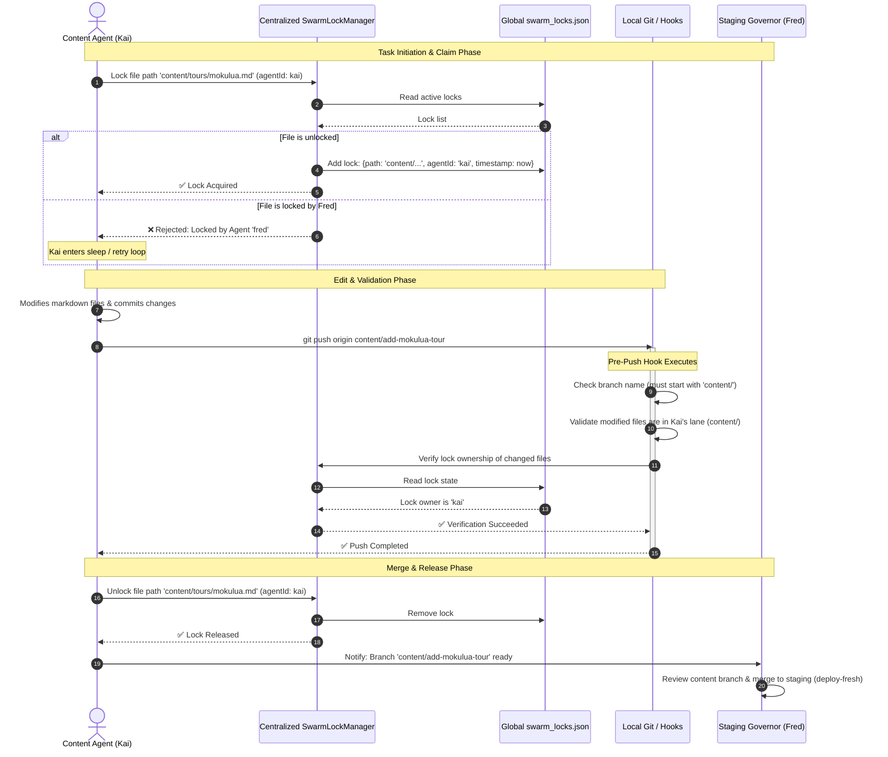

# Prismatic Engine — AGY Review & Implementation Plan

**Author:** AGY (Antigravity Senior Systems Architect)  
**Date:** 2026-06-08  
**Linear Issue:** [GRO-812](https://linear.app/growthwebdev/issue/GRO-812)  
**Status:** Complete — Pending Review  

---

## Executive Summary

The **Prismatic Engine** is a workspace coordination layer designed to prevent multi-agent resource conflicts, race conditions, and merge collisions in shared git repositories. This document provides a rigorous evaluation of the architectural specification proposed by Kai, outlines a phased implementation roadmap, addresses cross-runtime integration (adapting the VS Code-centric lock manager for headless Hermes environments), and proposes solutions for detected blind spots.

---

## 1. Approach Evaluation

### Kai's 6-Layer Architecture Overview
Kai's proposed architecture in [prismatic-engine-architecture-v1.md](file:///home/ubuntu/work/agentic-swarm-ops/prismatic-engine/specs/prismatic-engine-architecture-v1.md) consists of:
1. **Lane Assignment** (Static directory permissions)
2. **File Claim System** (Mutex locks)
3. **Staging Branch Governor** (Fred as sole branch merger)
4. **Agent Identity in Git** (Commit prefixes + config validation)
5. **Conflict Predictor** (Pre-push log/diff checks)
6. **Heartbeat & Grey Release** (Stale lock cleanup + staging validation)

### Soundness Analysis
The core approach is **highly sound** and practically optimized for multi-agent software engineering. Rather than attempting to solve real-time concurrent text editing at the character level (e.g., via Operational Transformation or CRDTs), it implements a **hybrid optimistic/pessimistic locking framework** built on top of git's branch-and-merge structure.

- **Pessimistic Prevention (Lanes & Claims):** Hard boundaries block agents from touching files they do not own or files that are actively checked out by peers.
- **Optimistic Reconciliation (Git + Conflict Predictor):** Uses git for version control but intercepts pushes *before* they touch the shared remote, detecting silent overwrites.

### Blind Spots & Critical Corrections

#### 1. Cross-Workspace Path Drift (Path Normalization)
> [!WARNING]
> **The Problem:** In [SwarmLockManager.ts](file:///home/ubuntu/mounts/synology-photo/Workshop/Antigravity%20Orchestration%20Hub/src/engine/SwarmLockManager.ts) and [swarm.js](file:///home/ubuntu/mounts/synology-photo/Workshop/Antigravity%20Orchestration%20Hub/.antigravity/swarm.js), locks are stored using absolute paths:
> `path.resolve(process.cwd(), fileArg)`.
> If Fred is working in `/home/ubuntu/work/active-oahu-tours` and Kai is working in `/home/ubuntu/work/active-oahu-tours-mirror`, they will use different absolute paths for the same file. The lock manager will fail to detect conflicts because the absolute keys (`/home/ubuntu/work/active-oahu-tours/src/Nav.tsx` vs `/home/ubuntu/work/active-oahu-tours-mirror/src/Nav.tsx`) do not match.
> 
> **The Resolution:** All lock keys in `swarm_locks.json` must be stored as **repository-relative paths** (e.g., `src/components/Nav.tsx`) resolved against the git root directory.

#### 2. Local vs. Distributed Lock File
> [!IMPORTANT]
> If agents work in separate repository directories on the same server, reading/writing a local `.antigravity/swarm_locks.json` file inside their own checkout folder isolates their lock registries. They will not see each other's locks.
> 
> **The Resolution:** Centralize the lock database file. The engine must support a global locks directory via an environment variable `SWARM_LOCKS_DIR` (defaulting to `/home/ubuntu/.antigravity/swarm_locks.json` or `/tmp/swarm_locks.json`).

#### 3. Semantic & Transitive Dependencies
If Agent A modifies `src/types/User.ts` (adding a mandatory field) and Agent B modifies `src/utils/auth.ts` (which imports `User`), no merge conflict occurs on the filesystem. However, compiling the project will fail.
- **The Resolution:** The pre-push hook must run a static verification step (e.g. compile/lint) if files inside core code lanes are updated.

---

## 2. Coordinated Git Workflow & Locking Lifecycle

The following Mermaid diagram visualizes the interaction between a Content Agent (Kai) and the Lock Manager/Git Hooks during a typical task execution cycle:



---

## 3. Hermes Adaptation Strategy

The existing [SwarmLockManager.ts](file:///home/ubuntu/mounts/synology-photo/Workshop/Antigravity%20Orchestration%20Hub/src/engine/SwarmLockManager.ts) is tightly coupled to VS Code APIs (using `vscode.workspace.workspaceFolders`, `vscode.FileSystemWatcher`, and showing VS Code alerts). For headless Hermes agents, we must decouple the logic.

### Comparison of Integration Options

| Dimension | Option A: Pure Python Port | Option B: Node CLI Wrapper (`swarm.js`) | Option C: SQLite Shared DB |
|---|---|---|---|
| **Development Cost** | Medium (Requires rewriting logic) | **Low** (Reuse existing JS code) | Medium (Write SQLite hooks) |
| **Portability** | High (Python standard library) | High (Node already on server) | High (Standard sqlite3 library) |
| **Concurrency Safety**| Poor (Requires file locking hacks) | Poor (File overwrite risk) | **Excellent** (Native ACID locks) |
| **Agent Integration** | Native for Fred, requires subprocess for Kai/Jules | Subprocess calls for all agents | Native Python/JS adapters |
| **Complexity** | Low | **Very Low** | Medium |

### Selected Architecture: The Hybrid Node CLI + Centralized State
We will maintain the Node-based CLI pattern by rewriting `swarm.js` to run headlessly. Agents will execute lock claims via CLI subprocess commands.

```bash
# Acquire Lock
node .antigravity/swarm.js lock content/tours/mokulua.md kai

# Heartbeat Ping
node .antigravity/swarm.js heartbeat kai

# Status Query
node .antigravity/swarm.js status
```

#### Headless Heartbeat Implementation
- **Heartbeat Daemon:** When an agent initializes, it spawns a background process:
  ```bash
  nohup node .antigravity/swarm.js heartbeat kai > /dev/null 2>&1 &
  ```
- **Loop:** The daemon updates `lastHeartbeat` in the central lockfile every 60s for all locks registered under `kai`.
- **On-Demand Pruning:** To avoid relying on external cron jobs for stale lock cleanup, `swarm.js` will execute a **lazy lock pruning** sequence during every `lock`, `unlock`, and `status` command:
  ```javascript
  const now = Date.now();
  const TTL = 300000; // 5 minutes
  locks = locks.filter(l => (now - (l.lastHeartbeat || l.timestamp)) < TTL);
  ```

---

## 4. Challenging Mainstream Assumptions

1. **"File-level locks are too slow for automated agents."**
   *Counter-Argument:* This is false for AI. Humans hold locks for hours because of biological constraints. AI agents edit, commit, and push files in seconds. The lock duration is measured in milliseconds, making pessimistic file locking a highly efficient safety net with near-zero latency overhead.
2. **"Git is the source of truth; local lockfiles violate git state."**
   *Counter-Argument:* Git is designed for *asynchronous* operations. When agents work at speeds 100x faster than humans, asynchronous systems lead to constant branch divergence and merge chaos. A synchronous local lockfile prevents this chaos *before* git commits are even made.
3. **"Isolation is superior to coordination."**
   *Counter-Argument:* Complete isolation forces agents to resolve conflicts downstream, which is computationally expensive and error-prone. Collaborative coordination reduces the state space of merge resolutions.
4. **"Use Git Hooks instead of Lock Files."**
   *Counter-Argument:* Git hooks without lock files only catch conflicts *after* the work is done and pushed. Checking lock files *before* editing saves massive agent tokens and execution cycles.

---

## 5. Phased Implementation Plan

```
┌────────────────────────────────────────────────────────┐
│ Phase 1: Declarative Rules & Lanes (Immediate)        │
└───────────────────────────┬────────────────────────────┘
                            ▼
┌────────────────────────────────────────────────────────┐
│ Phase 2: Centralized CLI Lock Engine (Short Term)      │
└───────────────────────────┬────────────────────────────┘
                            ▼
┌────────────────────────────────────────────────────────┐
│ Phase 3: Git Hook Validation (Medium Term)             │
└───────────────────────────┬────────────────────────────┘
                            ▼
┌────────────────────────────────────────────────────────┐
│ Phase 4: Conflict Predictor & Semantic Check (Long)    │
└────────────────────────────────────────────────────────┘
```

### Phase 1: Declarative Rules & Lanes (Immediate)
- Author `PRISMATIC_ENGINE.yaml` inside target repositories.
- Inject lane constraints directly into the system prompts (`SOUL.md` / `profile.yaml`) of Fred, Kai, and Jules.
- Enforce git commit message styling via convention: `[AgentName] comment`.

### Phase 2: Centralized CLI Lock Engine (Short Term)
- Refactor `.antigravity/swarm.js` to:
  - Read/Write to a centralized database (defaulting to `/home/ubuntu/.antigravity/swarm_locks.json`).
  - Prune path strings to repository-relative paths (e.g. parsing git root via `git rev-parse --show-toplevel`).
  - Implement the `heartbeat` command loop.
  - Implement lazy lock pruning.
- Embed subprocess calls to `swarm.js lock` and `swarm.js unlock` inside agent execution scripts.

### Phase 3: Git Hook Validation (Medium Term)
- Write a Python-based git `pre-push` hook script.
- The hook will:
  1. Detect the pushing agent via environment variable (`HERMES_AGENT_ID`).
  2. Parse the target branch name (assert correct prefix).
  3. Identify all files modified in the push using `git diff --name-only origin/deploy-fresh...HEAD`.
  4. Match modified files against `PRISMATIC_ENGINE.yaml` lanes.
  5. Check central `swarm_locks.json` to verify the active agent holds locks for those files.

### Phase 4: Conflict Predictor & Semantic Check (Long Term)
- Integrate a pre-push check that fetches remote staging branches and alerts the agent if any shared dependencies have changed.
- Implement AST parser validation to detect broken exports/imports across lanes before merge.

---

## 6. Minimal Viable Protocol (MVP)

To coordinate Fred and Kai immediately in the `active-oahu` workspace:

1. **Deploy configuration file:** Place `PRISMATIC_ENGINE.yaml` at repo root:
   ```yaml
   version: 1
   agents:
     fred:
       lanes: ["src/", "infra/", "deploy/"]
       branch_prefix: "feature/"
     kai:
       lanes: ["content/", "active-oahu/"]
       branch_prefix: "content/"
   staging:
     branch: "deploy-fresh"
     governor: "fred"
   ```
2. **Deploy central CLI lock manager:** Copy and modify `swarm.js` to `/home/ubuntu/.antigravity/swarm.js` pointing to `/home/ubuntu/.antigravity/swarm_locks.json`.
3. **Prompt injection:** Add the following strict prompt rule to Kai:
   > Before editing any file, run `node /home/ubuntu/.antigravity/swarm.js lock <filepath> kai`. Unlock it immediately after committing changes with `node /home/ubuntu/.antigravity/swarm.js unlock <filepath> kai`. You are prohibited from editing files outside of `content/` or `active-oahu/` folders.
4. **Git attribution:** Standardize commit hook checks.
