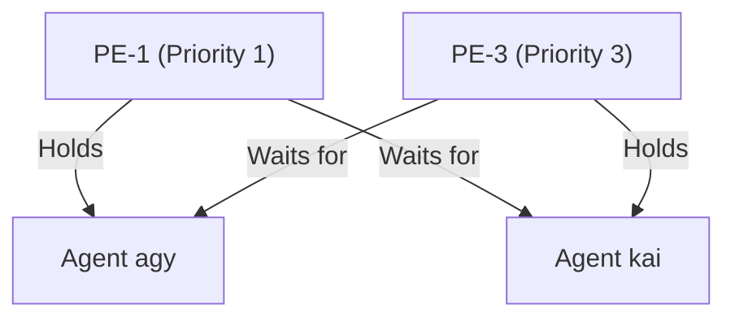
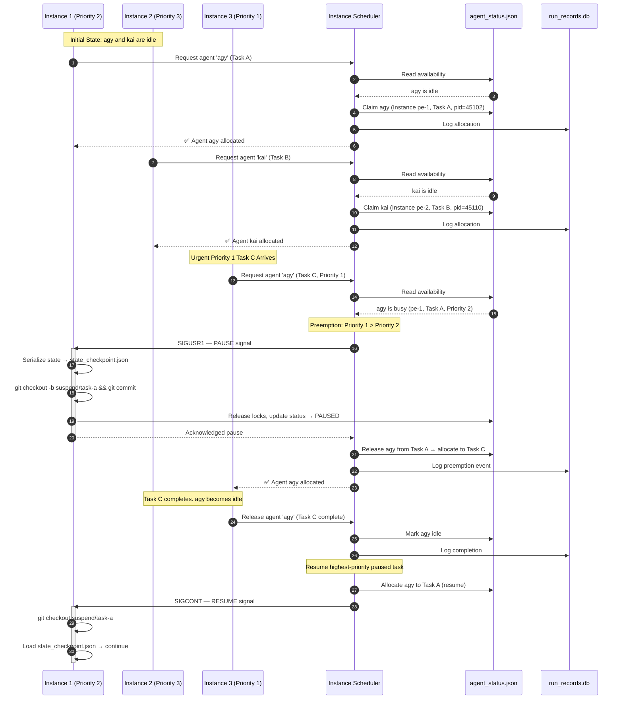

# Prismatic Engine — Instance Scheduler Design

**Linear Issue:** [GRO-820](https://linear.app/growthwebdev/issue/GRO-820)
**Author:** AGY (Antigravity Senior Systems Architect)
**Date:** June 8, 2026
**Status:** Complete — Ready for Review

---

## 1. Executive Summary

When multiple Prismatic Engine loops (instances) run concurrently on the same git repository, they compete for a finite pool of agents (`fred`, `kai`, `agy`, `jules`, `codex`). Without an orchestrating scheduler, conflicts arise: agents are double-booked, tasks wait indefinitely, and circular dependency deadlocks occur.

This document designs the **Prismatic Instance Scheduler**, a new core component (alongside the existing Dispatcher, Router, and Governance subsystems) that coordinates parallel execution loops, manages agent allocation state, detects deadlocks, enforces priority-based scheduling, and escalates stalled pipelines to humans.

### Source Documents Synthesized

| Source | Key Contributions |
|--------|-------------------|
| **Kai — `alchemy-mode-fractal-complexity.md` §4** | Parallel instances problem statement, instance config YAML schema, priority levels, agent availability with `max_concurrent`, deadlock scenario (PE-1 ↔ PE-3), capability/role model |
| **AGY — `agy-core-boundary-validation.md` §§2-4** | Claude Code loop mechanics (TASK.md scratchpad, self-correction, context curation), Git Worktrees for workspace isolation, STORM AST semantic scanning, hierarchical roles (SwarmPlanner/Specialist Workers/Verifiers), decoupled agent registry in `PRISMATIC_ENGINE.yaml` |
| **Fred — `prismatic/dispatcher.py`** | Existing lock/stall recovery architecture, `agent_stall_tracker` SQLite table, `cleanup_stale_agy()` process killer, `recover_stalled_agy()` escalation chain, `MAX_CYCLES_BEFORE_RECOVER` constant, `AGENT_CONFIG` hardcoded agent map, `dispatch_once()` main cycle |

---

## 2. Scheduling State & Instance Identity

### 2.1 Instance Identity

Each Prismatic Engine execution loop is a distinct **instance**. Identity must be established at three levels:

| Level | Mechanism | Example |
|-------|-----------|---------|
| **Process** | Environment variable `PRISMATIC_INSTANCE_ID` or CLI flag `--instance-id` | `PRISMATIC_INSTANCE_ID=pe-content-1` |
| **Linear** | Label `instance::<instance_id>` applied to every issue the instance processes | `instance::pe-content-1` |
| **Pipeline Config** | `instance_id` field in per-instance pipeline overrides (see §2.3) | `id: pe-content-1` |

This three-level identity allows:
- The scheduler to track which instance owns which task.
- Linear dashboard filtering by instance for observability.
- Per-instance pipeline configuration overrides (different agents, priorities).

### 2.2 Agent Scheduling: How the Scheduler Knows Who Is Busy

The scheduler must answer: *"Is agent X available for instance Y right now?"*

Two complementary mechanisms are used:

#### A. Central Status Registry (`agent_status.json`)

A centralized status file lives in the locks directory: `/home/ubuntu/.antigravity/agent_status.json`. This is the **source of truth** for cross-process agent availability.

```json
{
  "agents": {
    "agy": {
      "status": "busy",
      "spawnable": true,
      "limit": "hardware",
      "active_runs": [
        {
          "task_id": "GRO-901",
          "instance_id": "pe-content-1",
          "capability": "designer",
          "pid": 45102,
          "started_at": "2026-06-08T07:50:00Z"
        }
      ]
    },
    "kai": {
      "status": "idle",
      "max_concurrent": 1,
      "active_runs": []
    },
    "fred": {
      "status": "busy",
      "max_concurrent": 1,
      "active_runs": [
        {
          "task_id": "GRO-902",
          "instance_id": "pe-code-1",
          "capability": "implementer",
          "pid": 45110,
          "started_at": "2026-06-08T07:55:00Z"
        }
      ]
    }
  }
}
```

#### B. Swarm Locks File (`swarm_locks.json`)

The existing `/home/ubuntu/.antigravity/swarm_locks.json` tracks **file-level** locks. While not directly used for agent scheduling, it serves as a secondary signal: an agent holding file locks is certainly active. The scheduler cross-references lock holders against `agent_status.json` for consistency.

#### C. Heartbeat Validation

Agents update `agent_status.json` with a heartbeat timestamp every 60 seconds. The scheduler's `prune_stale_allocations()` method (see §6) marks agents as `stale` if no heartbeat is received within `heartbeat_ttl_ms` (default: 300,000 ms = 5 minutes), mirroring the TTL defined in `PRISMATIC_ENGINE.yaml`.

### 2.3 Per-Instance Configuration (YAML)

Inspired by Kai's instance config proposal in `alchemy-mode-fractal-complexity.md` §4, each instance can declare its pipeline, priority, and agent constraints:

```yaml
# PRISMATIC_ENGINE.yaml — instances section (new)
instances:
  - id: pe-1
    pipeline: content-pipeline
    priority: 1              # 1 = highest, 4 = lowest
    agents:
      agy: { role: reviewer,   max_concurrent: 2 }
      kai: { role: writer,     max_concurrent: 1 }
  - id: pe-2
    pipeline: code-pipeline
    priority: 2
    agents:
      fred: { role: developer,  max_concurrent: 1 }
      agy:  { role: designer,   max_concurrent: 2 }
  - id: pe-3
    pipeline: design-pipeline
    priority: 3
    agents:
      agy: { role: designer, max_concurrent: 2 }
```

---

## 3. Priority & Queuing

### 3.1 Priority Model

Tasks are scheduled based on **instance priority** and **issue priority** (1 = Highest/Critical, 4 = Lowest/Backlog). When resources are constrained, the scheduler applies the following rules:

| Priority | Label | Behavior |
|----------|-------|----------|
| 1 | Critical | Preempts any lower-priority work immediately; escalates stalled pipelines to humans |
| 2 | High | Queues behind Priority 1; can be preempted by Priority 1 |
| 3 | Normal | Queues behind Priority 2; cooperative suspend on preemption |
| 4 | Backlog | Only runs when no higher-priority work exists; never preempts |

### 3.2 Preemption Strategies

What happens to preempted work? Three strategies, selected by priority difference:

1. **Cooperative Suspend (Default — priority diff ≤ 2):**
   - Scheduler sends a pause signal (`SIGUSR1` or writes a `.pause` nudge file).
   - Agent serializes in-memory task state to `state_checkpoint.json`.
   - Agent commits current file modifications to a temporary Git branch `suspend/<task_id>`.
   - Agent releases all locks in `swarm_locks.json` and updates `agent_status.json` to `PAUSED`.
   - When resumed: agent checks out the suspend branch, loads checkpoint, continues.

2. **Let It Finish (Non-preemptive — priority diff = 1, small tasks):**
   - For minor priority differences where preemption cost exceeds benefit.
   - Scheduler allows the active pipeline step to complete.
   - Blocks the agent from starting the **next** pipeline step until higher-priority work is assigned.

3. **Hard Cancel & Rollback (Priority 1 emergency only):**
   - Scheduler terminates agent process (`SIGKILL`).
   - Rolls back the Git worktree to last committed state.
   - Releases all locks.
   - Places the task back in queue with `status: QUEUED` and an incrementing `retry_count`.

### 3.3 Queuing Algorithm

```
Queue = sorted(pending_tasks, key=lambda t: (t.priority, t.created_at))
```

Tasks are dequeued in order. If an agent is unavailable, the scheduler checks if any active allocation has lower priority than the pending task. If so, preemption fires. Otherwise, the task waits for the next scheduling cycle.

---

## 4. Deadlock Detection & Resolution

### 4.1 Deadlock Scenario

A deadlock occurs when instances enter circular wait states:

- **Instance PE-1** (Priority 1) holds Agent `agy` (as reviewer) and waits for Agent `kai` (as writer).
- **Instance PE-3** (Priority 3) holds Agent `kai` (as writer) and waits for Agent `agy` (as designer).



Neither can proceed. The scheduler must detect and break this cycle.

### 4.2 Detection Algorithm

The scheduler constructs a **Wait-For Graph (WFG)** by querying `agent_status.json` and `run_records.db`:

```
WFG Nodes = {all active tasks}
WFG Edges = {(T_a → T_b) | T_a holds an agent T_b is waiting for}
```

A cycle-detection check (depth-first search with coloring) runs every scheduling cycle (30 seconds). This is O(V+E) where V = active tasks and E = wait-for dependencies.

#### Pseudocode

```python
def detect_deadlocks(self) -> list[list[str]]:
    """Returns list of cycles found in Wait-For Graph."""
    graph = self._build_wait_for_graph()  # task_id -> set of waited-for task_ids
    cycles = []
    WHITE, GRAY, BLACK = 0, 1, 2
    color = {node: WHITE for node in graph}
    parent = {}

    def dfs(node, path):
        color[node] = GRAY
        for neighbor in graph.get(node, set()):
            if color[neighbor] == GRAY:
                # Cycle found
                cycle_start = path.index(neighbor)
                cycles.append(path[cycle_start:] + [neighbor])
            elif color[neighbor] == WHITE:
                parent[neighbor] = node
                dfs(neighbor, path + [neighbor])
        color[node] = BLACK

    for node in graph:
        if color[node] == WHITE:
            dfs(node, [node])

    return cycles
```

### 4.3 Resolution Strategy

Once a cycle is detected:

1. **Identify victim:** Find the task in the cycle with the **highest numerical priority value** (lowest actual priority).
2. **Preempt victim:** Suspend or cancel the victim task to release its agent allocation.
3. **Age-based tie-breaker:** If priorities are equal, preempt the **youngest** task (smallest `started_at` timestamp) — this minimizes wasted work.
4. **Re-queue victim:** The preempted task is returned to the queue. Its `retry_count` is incremented. If `retry_count >= MAX_RETRIES`, escalate to human.
5. **Log event:** Deadlock detection and resolution events are logged to `run_records.db` for post-mortem analysis.

---

## 5. Escalation: Pipeline Timeout → Human Notification

### 5.1 Timeout Detection

Not all stalls are deadlocks. A pipeline step may hang due to:
- Agent process crash (SIGSEGV, OOM kill)
- Infinite loop in generated code
- Linear API rate limiting
- Model provider outage

The scheduler detects these via the existing `MAX_CYCLES_BEFORE_RECOVER` mechanism (currently `6` cycles, configurable via `PRISMATIC_MAX_CYCLES_BEFORE_RECOVER` env var), enhanced for the multi-instance world.

### 5.2 Unified Stall Tracker (Evolution from `agy_stall_tracker`)

The existing `agy_stall_tracker` SQLite table in `dispatcher.py` (lines 849-858) is agent-specific. The Instance Scheduler generalizes this to an **`agent_stall_tracker`** table — exactly as recommended in `agy-core-boundary-validation.md` §2.3:

```sql
CREATE TABLE IF NOT EXISTS agent_stall_tracker (
    issue_id TEXT NOT NULL,
    instance_id TEXT NOT NULL,
    agent_id TEXT NOT NULL,
    cycle_count INTEGER DEFAULT 0,
    last_seen TEXT,
    escalated INTEGER DEFAULT 0,
    escalation_target TEXT,
    pipeline_timeout_seconds INTEGER,
    PRIMARY KEY (issue_id, agent_id)
);
```

This generalizes the existing `recover_stalled_agy()` function in `dispatcher.py` (lines 824-937) to a `recover_stalled_agent(agent_id)` that works for any agent.

### 5.3 Escalation Chain

```
Pipeline step stuck for MAX_CYCLES_BEFORE_RECOVER cycles
    │
    ▼
Retry: kill agent process, re-launch with same task
    │
    ▼ (still stuck after max_retries)
Escalate to fallback agent (configured per-agent in PRISMATIC_ENGINE.yaml)
    │  e.g., agy.stall_recovery.escalate_to = "fred"
    ▼
Post Linear comment: "⚠️ AGY stalled on GRO-901 after 6 cycles. Escalating to Fred."
    │
    ▼ (fallback agent also stuck)
Notify Human:
    - Post Linear comment @mentioning team lead
    - Optionally trigger Slack/email webhook (configured in PRISMATIC_ENGINE.yaml)
    - Tag issue with label "needs::human-intervention"
```

### 5.4 Configuration

```yaml
# Per-agent stall recovery in PRISMATIC_ENGINE.yaml
agents:
  agy:
    executable: "/home/ubuntu/.local/bin/agy"
    lanes: ["assets/", "designs/", "research/"]
    branch_prefix: "design/"
    stall_recovery:
      max_cycles: 6
      max_retries: 3
      escalate_to: "fred"
      human_notification:
        linear_mention: "@fred"
        webhook_url: ""  # optional Slack/Discord webhook
```

### 5.5 Pipeline-Level Timeouts

In addition to cycle-count-based stall detection, each pipeline step can have a wall-clock timeout:

```yaml
pipelines:
  content-pipeline:
    steps:
      - role: "researcher"
        agent: "agy"
        timeout_minutes: 30       # Hard timeout for this step
      - role: "writer"
        agent: "kai"
        timeout_minutes: 45
```

If a step exceeds its `timeout_minutes`, the scheduler treats it as stalled regardless of cycle count and immediately escalates.

---

## 6. Instance Isolation

### 6.1 Problem: Can Instance 1's Agents Lock Files Instance 2 Needs?

**Yes, and they will.** Without isolation, concurrent instances share the same working directory. If Instance 1's `agy` holds a write lock on `designs/brand-guide.md` while Instance 3's `agy` also needs to write to it, Instance 3 blocks — even if the instances have no semantic conflict.

### 6.2 Solution: Git Worktree Per-Instance Isolation

Following the Git Worktrees pattern researched in `agy-core-boundary-validation.md` §4.1, each instance operates in its own **isolated worktree**:

```bash
# Instance startup
git worktree add ../instances/pe-content-1 feature/content-batch-1
cd ../instances/pe-content-1
PRISMATIC_INSTANCE_ID=pe-content-1 prismatic-engine --once
```

```
Main Repo: /home/ubuntu/work/prismatic-engine/.git
    │
    ├── Worktree: /home/ubuntu/work/prismatic-engine/           (main clone, read-only for scheduler)
    ├── Worktree: /home/ubuntu/work/instances/pe-content-1/     (Instance 1)
    ├── Worktree: /home/ubuntu/work/instances/pe-code-1/        (Instance 2)
    └── Worktree: /home/ubuntu/work/instances/pe-design-1/      (Instance 3)
```

### 6.3 Isolation Guarantees

| Resource | Isolation Mechanism |
|----------|-------------------|
| **File writes** | Git worktrees — each instance has its own filesystem directory sharing the same `.git` history |
| **File locks** | `swarm_locks.json` uses **absolute paths**. Since worktrees have different base paths, locks don't collide. Lock keys include `instance_id` to disambiguate same-named files across instances. |
| **Git branches** | Each instance works on its own branch. Branch prefix includes instance ID: `pe-content-1/tour-pages` |
| **Database** | The scheduler's `run_records.db` and `agent_stall_tracker` are **shared** (in `/home/ubuntu/.antigravity/`) so the scheduler has global visibility. Instance-local state (checkpoints, temp files) lives in the worktree. |
| **Agent processes** | Each agent subprocess is launched within its instance's worktree (`cwd` set to worktree path). Process tracking uses PID + `instance_id`. |

### 6.4 Cross-Instance Semantic Conflicts (STORM-style Detection)

Isolation prevents filesystem collisions but not **semantic** conflicts. Following the STORM AST semantic scanning pattern from `agy-core-boundary-validation.md` §4.2:

If Instance 1 modifies `src/models/tour.py` (changing the `Tour` class signature) and Instance 2's worktree imports `Tour`, the scheduler:
1. Parses the AST of modified files on commit.
2. Checks if any other active instance's worktree imports the changed symbol.
3. If yes, flags the importing instance for a **rebuild** before merge.

This is a **future enhancement** (not required for v1) but the architecture supports it.

### 6.5 Shared vs Isolated — Decision Matrix

| Artifact | Shared? | Rationale |
|----------|---------|-----------|
| `agent_status.json` | ✅ Shared | Scheduler needs cross-instance view |
| `swarm_locks.json` | ✅ Shared | Central lock manager; lock keys include instance_id |
| `run_records.db` | ✅ Shared | Unified observability |
| `agent_stall_tracker` | ✅ Shared | Cross-instance stall detection |
| Working directory | ❌ Isolated | Git worktrees |
| Checkpoint files | ❌ Isolated | Per-worktree `state_checkpoint.json` |
| Agent subprocess cwd | ❌ Isolated | Set to worktree path |

---

## 7. Sequence Diagram: 3 Instances Competing for 2 Agents

Three instances (`pe-1`, `pe-2`, `pe-3`) compete for agents `agy` and `kai`. Instance 3 (Priority 1) preempts Instance 1 (Priority 2).



---

## 8. Proposed Dispatch Algorithm (Pseudocode)

```python
class InstanceScheduler:
    """
    Core scheduling loop that runs alongside the existing dispatcher.
    
    Integrates with dispatcher.py by:
    - Reading/writing the shared agent_status.json
    - Extending the agent_stall_tracker SQLite schema
    - Replacing agent-specific cleanup/recovery with generic versions
    - Adding preemption signaling (SIGUSR1/SIGCONT)
    """

    def __init__(self, config: dict, db_path: str, locks_dir: str):
        self.config = config
        self.db = SchedulerDB(db_path)
        self.locks_dir = Path(locks_dir)
        self.status_file = self.locks_dir / "agent_status.json"
        self.poll_interval = config.get("poll_interval", 30)
        self.max_cycles = config.get("max_cycles_before_recover", 6)

    # ── Main Scheduling Loop ──────────────────────────────

    def schedule_loop(self):
        """Run indefinitely, dispatching work to available agents."""
        while True:
            try:
                # 1. Prune stale allocations (agents that stopped heartbeating)
                self.prune_stale_allocations()

                # 2. Run cycle-detection on Wait-For Graph
                cycles = self.detect_deadlocks()
                if cycles:
                    self.resolve_deadlock(cycles[0])

                # 3. Recover stalled agents (generalized from dispatcher.py)
                self.recover_stalled_agents()

                # 4. Retrieve pending tasks ordered by priority, then age
                pending = self.db.query(
                    "SELECT * FROM tasks WHERE status = 'QUEUED' "
                    "ORDER BY priority ASC, created_at ASC"
                )

                for task in pending:
                    required_role = task.role
                    agent = self.resolve_agent_for_task(required_role, task.instance_id)

                    if agent and self.is_agent_available(agent):
                        # Idle agent — allocate immediately
                        self.allocate_agent(agent, task)

                    elif agent:
                        # Agent busy — check preemption
                        current = self.get_active_allocations(agent.name)
                        lowest = min(current, key=lambda a: a.priority)

                        if task.priority < lowest.priority:
                            # Higher priority — preempt
                            self.preempt_task(lowest.task_id)
                            self.allocate_agent(agent, task)
                        # else: wait for next cycle

                # 5. Check pipeline timeouts
                self.enforce_pipeline_timeouts()

            except Exception as exc:
                log_error(f"Scheduler cycle error: {exc}")

            time.sleep(self.poll_interval)

    # ── Agent Resolution ──────────────────────────────────

    def resolve_agent_for_task(self, role: str, instance_id: str) -> Agent | None:
        """
        Map a capability role to a specific agent for this instance.
        
        Uses the instance's config (from PRISMATIC_ENGINE.yaml instances section)
        to determine which agent fills the role and the max_concurrent limit.
        """
        instance_config = self.config["instances"].get(instance_id, {})
        agent_configs = instance_config.get("agents", {})

        for agent_name, agent_cfg in agent_configs.items():
            if agent_cfg.get("role") == role:
                max_concurrent = agent_cfg.get("max_concurrent", 1)
                return Agent(name=agent_name, max_concurrent=max_concurrent)

        # Fallback: global agent registry
        global_agents = self.config.get("agents", {})
        for name, cfg in global_agents.items():
            if cfg.get("role") == role:
                return Agent(name=name, max_concurrent=1)

        return None

    # ── Allocation & Preemption ────────────────────────────

    def allocate_agent(self, agent: Agent, task: Task) -> bool:
        """Claim an agent for a task. Updates agent_status.json and db."""
        status = self._read_status()
        agent_entry = status["agents"].setdefault(agent.name, {
            "status": "idle",
            "max_concurrent": agent.max_concurrent,
            "active_runs": [],
        })

        if len(agent_entry["active_runs"]) >= agent.max_concurrent:
            return False  # At capacity

        agent_entry["status"] = "busy"
        agent_entry["active_runs"].append({
            "task_id": task.id,
            "instance_id": task.instance_id,
            "capability": task.role,
            "pid": task.pid,
            "started_at": datetime.now(timezone.utc).isoformat(),
        })
        self._write_status(status)
        self.db.log_allocation(task.id, agent.name, task.instance_id)
        return True

    def preempt_task(self, task_id: str) -> bool:
        """
        Preempt a running task.
        
        Strategy depends on priority difference (see §3.2):
        - diff >= 2: Cooperative Suspend (SIGUSR1)
        - diff == 1: Let It Finish (block next step)
        - Priority 1 preempting anything: Hard Cancel (SIGKILL)
        """
        run_record = self.db.get_run_record(task_id)
        if not run_record:
            return False

        priority_diff = self._get_priority_diff(task_id)

        if priority_diff >= 3:
            # Hard cancel
            self._hard_cancel(run_record)
        else:
            # Cooperative suspend
            self._cooperative_suspend(run_record)

        return True

    def _cooperative_suspend(self, run_record):
        """Send SIGUSR1, wait for agent to checkpoint and release."""
        os.kill(run_record.pid, signal.SIGUSR1)
        # Agent is responsible for:
        #   1. Serializing state → state_checkpoint.json
        #   2. Committing to suspend/<task_id> branch
        #   3. Releasing swarm_locks.json locks
        #   4. Updating agent_status.json to PAUSED
        self.db.update_task_status(run_record.task_id, "PAUSED")

    def _hard_cancel(self, run_record):
        """SIGKILL, rollback worktree, release locks."""
        os.kill(run_record.pid, signal.SIGKILL)
        self._release_all_locks(run_record.task_id)
        self._update_agent_status(run_record.agent_id, remove_task=run_record.task_id)
        self.db.update_task_status(run_record.task_id, "QUEUED")
        self.db.increment_retry_count(run_record.task_id)

    # ── Deadlock Detection (§4) ────────────────────────────

    def detect_deadlocks(self) -> list[list[str]]:
        """DFS cycle detection on Wait-For Graph."""
        graph = self._build_wait_for_graph()
        cycles = []
        WHITE, GRAY, BLACK = 0, 1, 2
        color = {node: WHITE for node in graph}

        def dfs(node, path):
            color[node] = GRAY
            for neighbor in graph.get(node, set()):
                if color[neighbor] == GRAY:
                    cycle_start = path.index(neighbor)
                    cycles.append(path[cycle_start:] + [neighbor])
                elif color[neighbor] == WHITE:
                    dfs(neighbor, path + [neighbor])
            color[node] = BLACK

        for node in graph:
            if color[node] == WHITE:
                dfs(node, [node])

        return cycles

    def resolve_deadlock(self, cycle: list[str]) -> None:
        """
        Break deadlock by preempting lowest-priority task in cycle.
        Tie-break: youngest task (smallest started_at).
        """
        tasks = [self.db.get_task(tid) for tid in cycle if tid != cycle[-1]]
        if not tasks:
            return

        # Highest numerical priority = lowest actual priority
        victim = max(tasks, key=lambda t: (t.priority, -t.started_at.timestamp()))
        log_warning(f"Deadlock detected: cycle={cycle}, preempting={victim.id}")
        self.preempt_task(victim.id)

    # ── Stall Recovery (Generalized from dispatcher.py) ────

    def recover_stalled_agents(self):
        """
        Generalized version of dispatcher.py's recover_stalled_agy().
        
        Scans agent_stall_tracker for any agent that has been stuck
        on the same issue for >= max_cycles. Retries, then escalates.
        """
        for agent_name in self.config.get("agents", {}):
            self._recover_agent(agent_name)

    def _recover_agent(self, agent_name: str):
        """Check and recover a specific agent's stalled tasks."""
        agent_config = self.config["agents"].get(agent_name, {})
        stall_cfg = agent_config.get("stall_recovery", {})
        max_cycles = stall_cfg.get("max_cycles", self.max_cycles)
        max_retries = stall_cfg.get("max_retries", 3)
        escalate_to = stall_cfg.get("escalate_to", "fred")

        label = f"agent::{agent_name}"
        issues = get_issues_with_label(label)

        for issue in issues:
            issue_id = issue["id"]
            cycle_count = self.db.get_stall_cycle_count(issue_id, agent_name)
            cycle_count += 1
            self.db.update_stall_cycle(issue_id, agent_name, cycle_count)

            if cycle_count >= max_cycles:
                retry_count = self.db.get_stall_retry_count(issue_id, agent_name)

                if retry_count < max_retries:
                    # Retry: kill and re-launch
                    self._kill_agent_processes(agent_name, issue_id)
                    self.db.increment_stall_retry(issue_id, agent_name)
                    # Re-dispatch will happen on next cycle
                    log_info(f"Retrying {agent_name} on {issue['identifier']} "
                             f"(retry {retry_count + 1}/{max_retries})")
                else:
                    # Escalate
                    self._escalate_to_human(issue, agent_name, escalate_to, cycle_count)
                    self.db.mark_stall_escalated(issue_id, agent_name)

    def _escalate_to_human(self, issue, agent_name, escalate_to, cycle_count):
        """Notify humans that an agent pipeline is stuck."""
        # 1. Try fallback agent first
        transition_label(
            issue["id"],
            remove_label=f"agent::{agent_name}",
            add_label=f"agent::{escalate_to}",
        )

        # 2. Post Linear comment
        add_comment(
            issue["id"],
            f"⚠️ **{agent_name.upper()} stalled** after {cycle_count} cycles "
            f"with no progress.\n\n"
            f"Escalating to **{escalate_to}**.\n"
            f"Human review may be needed. cc @fred"
        )

        # 3. Tag with human-intervention label
        issue_labels = get_issue_labels(issue["id"])
        human_label_id = get_label_id("needs::human-intervention")
        if human_label_id:
            all_ids = [lab["id"] for lab in issue_labels] + [human_label_id]
            set_labels(issue["id"], all_ids)

        # 4. Optional webhook notification
        webhook_url = self.config.get("notifications", {}).get("webhook_url", "")
        if webhook_url:
            self._send_webhook(webhook_url, {
                "text": f"Prismatic: {agent_name} stalled on {issue.get('identifier', '')}"
            })

    # ── Pipeline Timeout Enforcement (§5.5) ────────────────

    def enforce_pipeline_timeouts(self):
        """Check all active pipeline steps against their timeout_minutes."""
        active_tasks = self.db.get_active_tasks()
        for task in active_tasks:
            pipeline_step = self._get_pipeline_step(task)
            if not pipeline_step:
                continue
            timeout_min = pipeline_step.get("timeout_minutes")
            if not timeout_min:
                continue

            elapsed = (datetime.now(timezone.utc) - task.started_at).total_seconds() / 60
            if elapsed > timeout_min:
                log_warning(f"Pipeline timeout: {task.id} exceeded {timeout_min}min")
                self._escalate_to_human(
                    {"id": task.id, "identifier": task.linear_identifier},
                    task.agent_id,
                    escalate_to="fred",
                    cycle_count=0,
                )

    # ── Cleanup (Generalized from dispatcher.py) ───────────

    def prune_stale_allocations(self):
        """
        Generalized version of dispatcher.py's cleanup_stale_agy().
        
        Marks agents as idle if they haven't heartbeat'd within TTL.
        Kills orphaned processes (PID exists but agent_status says idle).
        """
        status = self._read_status()
        now = datetime.now(timezone.utc)
        ttl = self.config.get("settings", {}).get("heartbeat_ttl_ms", 300000)
        ttl_delta = timedelta(milliseconds=ttl)

        for agent_name, agent_data in status.get("agents", {}).items():
            for run in list(agent_data.get("active_runs", [])):
                started = datetime.fromisoformat(run["started_at"])
                if now - started > ttl_delta:
                    # Agent hasn't heartbeat'd — consider it stale
                    agent_data["active_runs"].remove(run)
                    log_warning(f"Stale allocation pruned: {agent_name} / {run['task_id']}")

            if not agent_data.get("active_runs"):
                agent_data["status"] = "idle"

        self._write_status(status)

    # ── Helpers ────────────────────────────────────────────

    def _read_status(self) -> dict:
        if self.status_file.exists():
            return json.loads(self.status_file.read_text())
        return {"agents": {}}

    def _write_status(self, status: dict):
        self.status_file.parent.mkdir(parents=True, exist_ok=True)
        self.status_file.write_text(json.dumps(status, indent=2))

    def _build_wait_for_graph(self) -> dict[str, set[str]]:
        """Build Wait-For Graph from agent_status.json allocations."""
        status = self._read_status()
        graph = defaultdict(set)

        # For each agent, the task holding it blocks all tasks waiting for it
        held_by = {}  # agent_name -> task_id
        for agent_name, data in status.get("agents", {}).items():
            for run in data.get("active_runs", []):
                held_by[agent_name] = run["task_id"]

        # Query DB for tasks that are waiting for specific agents
        waiting_tasks = self.db.query(
            "SELECT task_id, waiting_for_agent FROM task_wait_queue"
        )
        for task_id, waiting_for in waiting_tasks:
            if waiting_for in held_by:
                graph[task_id].add(held_by[waiting_for])
                graph[held_by[waiting_for]]  # ensure node exists

        return dict(graph)
```

---

## 9. Integration Points with Existing `dispatcher.py`

The Instance Scheduler is a **new module** that runs alongside the existing dispatcher, not a replacement. Integration involves these specific touchpoints:

### 9.1 State Store Centralization

| Current (`dispatcher.py`) | Proposed |
|---------------------------|----------|
| `DEFAULT_DB_PATH = ./prismatic_state/event_router.db` | `/home/ubuntu/.antigravity/event_router.db` (centralized) |
| `agy_stall_tracker` table (line 851) | `agent_stall_tracker` table (generalized) |
| `cleanup_stale_agy()` scans `ps` for "agy" string (line 760) | `prune_stale_allocations()` uses `agent_status.json` PID tracking |
| `recover_stalled_agy()` hardcoded for AGY only (line 824) | `recover_stalled_agents()` iterates all configured agents |

### 9.2 Scheduler Thread Initialization

In `dispatcher.py`'s `main_loop()` (line 1217), add a background scheduler thread:

```python
def main_loop(interval=POLL_INTERVAL, once=False):
    # ... existing init ...

    # NEW: Start Instance Scheduler in background thread
    scheduler_config = load_instance_config()  # from PRISMATIC_ENGINE.yaml
    scheduler = InstanceScheduler(
        config=scheduler_config,
        db_path=DEFAULT_DB_PATH,
        locks_dir="/home/ubuntu/.antigravity",
    )
    scheduler_thread = threading.Thread(
        target=scheduler.schedule_loop,
        daemon=True,
        name="instance-scheduler",
    )
    scheduler_thread.start()

    # ... existing dispatch loop ...
```

### 9.3 Process Signaling Addition

Add process control to the dispatcher's agent launcher map. The existing `AGENT_LAUNCHERS` dict (line 585) and `AGENT_CONFIG` dict (line 383) gain new entries for preemption:

```python
# In dispatcher.py, near AGENT_CONFIG / AGENT_LAUNCHERS:

AGENT_SIGNALS = {
    "pause": signal.SIGUSR1,   # Agent must handle this
    "resume": signal.SIGCONT,
    "cancel": signal.SIGTERM,
}

def signal_agent(task_id: str, sig: str) -> bool:
    """Send a signal to an agent's running process."""
    run_record = db.get_run_record(task_id)
    if run_record and run_record.pid:
        os.kill(run_record.pid, AGENT_SIGNALS[sig])
        return True
    return False
```

### 9.4 Git Worktree Workspace Integration

Add to `prismatic/workspace.py`:

```python
def create_instance_worktree(instance_id: str, base_branch: str = "deploy-fresh") -> Path:
    """Create an isolated Git worktree for an instance."""
    worktree_path = Path(f"/home/ubuntu/work/instances/{instance_id}")
    worktree_path.parent.mkdir(parents=True, exist_ok=True)

    branch_name = f"{instance_id}/main"
    subprocess.run(
        ["git", "worktree", "add", str(worktree_path), "-b", branch_name, base_branch],
        check=True,
        cwd="/home/ubuntu/work/prismatic-engine",
    )
    return worktree_path

def cleanup_instance_worktree(instance_id: str):
    """Remove worktree after instance completes."""
    subprocess.run(
        ["git", "worktree", "remove", f"/home/ubuntu/work/instances/{instance_id}", "--force"],
        check=True,
        cwd="/home/ubuntu/work/prismatic-engine",
    )
```

### 9.5 Generalized Agent Launch

Replace the hardcoded `launch_agy`, `launch_jules`, `launch_codex` functions (lines 481-581) with a single generic function — as recommended in `agy-core-boundary-validation.md` §2.3:

```python
def launch_agent(agent_name: str, issue_id: str, task: str = "",
                 worktree_path: str = "") -> subprocess.Popen | None:
    """Generic agent launcher — resolves executable and args from config."""
    agent_config = load_agent_config(agent_name)  # from PRISMATIC_ENGINE.yaml
    if not agent_config:
        return None

    executable = agent_config.get("executable", "")
    if not os.path.exists(executable):
        print(f"[dispatcher] {agent_name} binary not found at {executable}")
        return None

    cmd = [executable, "--headless", "--issue", issue_id]
    if task:
        cmd.extend(["--task", task])

    cwd = worktree_path or os.getcwd()
    proc = subprocess.Popen(
        cmd,
        stdout=subprocess.DEVNULL,
        stderr=subprocess.DEVNULL,
        stdin=subprocess.DEVNULL,
        cwd=cwd,
    )
    print(f"[dispatcher] Launched {agent_name} (pid={proc.pid}) for {issue_id}")
    return proc
```

### 9.6 Phase-In Strategy

| Phase | Changes | Risk |
|-------|---------|------|
| **Phase 1** (now) | Add `agent_status.json` writer to dispatcher; scheduler reads it. Existing `agy_stall_tracker` remains. Scheduler runs as optional background thread. | Low |
| **Phase 2** | Generalize `cleanup_stale_agy` → `prune_stale_allocations`. Generalize `agy_stall_tracker` → `agent_stall_tracker`. Both old and new code paths coexist. | Medium |
| **Phase 3** | Add worktree isolation. Instance config from YAML. Remove hardcoded agent functions. | Higher |
| **Phase 4** | Deadlock detection, cooperative suspend, full preemption. | Higher |

---

## 10. Configuration Reference

### Complete `PRISMATIC_ENGINE.yaml` Additions

```yaml
# ── Instance Scheduler Configuration ────────────────────

instances:
  - id: pe-content-1
    pipeline: content-pipeline
    priority: 1
    agents:
      agy: { role: researcher, max_concurrent: 2 }
      kai: { role: writer,     max_concurrent: 1 }
    worktree_base: "/home/ubuntu/work/instances"

  - id: pe-code-1
    pipeline: code-pipeline
    priority: 2
    agents:
      fred: { role: implementer, max_concurrent: 1 }
      agy:  { role: designer,    max_concurrent: 2 }

  - id: pe-design-1
    pipeline: design-pipeline
    priority: 3
    agents:
      agy: { role: designer, max_concurrent: 2 }

# ── Per-Agent Stall Recovery ────────────────────────────

agents:
  fred:
    executable: "/home/ubuntu/.local/bin/fred"
    lanes: ["src/", "infra/", "deploy/", "agentic-swarm-ops/"]
    branch_prefix: "feature/"
    stall_recovery:
      max_cycles: 6
      max_retries: 3
      escalate_to: "human"   # Fred is the orchestrator; escalates to human directly

  agy:
    executable: "/home/ubuntu/.local/bin/agy"
    lanes: ["assets/", "designs/", "research/"]
    branch_prefix: "design/"
    stall_recovery:
      max_cycles: 6
      max_retries: 3
      escalate_to: "fred"

# ── Notifications ───────────────────────────────────────

notifications:
  linear_mention: "@fred"
  webhook_url: ""  # Slack/Discord webhook for critical escalations

# ── Pipeline Step Timeouts ──────────────────────────────

pipelines:
  content-pipeline:
    steps:
      - role: "researcher"
        agent: "agy"
        timeout_minutes: 30
      - role: "writer"
        agent: "kai"
        timeout_minutes: 45
      - role: "reviewer"
        agent: "jules"
        timeout_minutes: 15
```

---

## 11. Summary

| Design Question | Answer |
|-----------------|--------|
| **Instance Identity** | `PRISMATIC_INSTANCE_ID` env var + `instance::<id>` Linear label + `instances[].id` in YAML |
| **Agent Scheduling** | Central `agent_status.json` with heartbeat TTL; `swarm_locks.json` as secondary signal |
| **Priority & Preemption** | Cooperative suspend (SIGUSR1/checkpoint), let-it-finish for minor diffs, hard cancel for Priority 1 |
| **Deadlock Detection** | DFS cycle detection on Wait-For Graph built from `agent_status.json` + DB queries |
| **Deadlock Resolution** | Preempt lowest-priority task in cycle; age-based tie-breaker |
| **Escalation** | Cycle-count threshold → retry → fallback agent → Linear @mention + `needs::human-intervention` label + optional webhook |
| **Instance Isolation** | Git Worktrees per instance; shared DB/locks with `instance_id`-scoped keys; absolute paths prevent cross-worktree lock collisions |

### What Exists vs What's Built Here

| Component | Status Before | Status After |
|-----------|--------------|--------------|
| Dispatch (route work) | ✅ `dispatcher.py` | Extended with generic launch, signals |
| Governance (locks, lanes) | ✅ `swarm_locks.json` | Extended with `instance_id`-scoped locks |
| Stall Recovery | ✅ `cleanup_stale_agy`, `agy_stall_tracker` | Generalized to `agent_stall_tracker`, all agents |
| **Instance Scheduler** | ❌ Not designed | ✅ This document (GRO-820) |
| **Deadlock Detection** | ❌ Not designed | ✅ Wait-For Graph + DFS |
| **Preemption** | ❌ Not designed | ✅ Cooperative suspend + hard cancel |
| **Worktree Isolation** | ❌ Not designed | ✅ Per-instance Git Worktrees |
| **Pipeline Timeouts** | ❌ Not designed | ✅ Wall-clock + cycle-count |
| **Human Escalation** | Partial (Linear comments only) | ✅ Full chain with webhooks |
