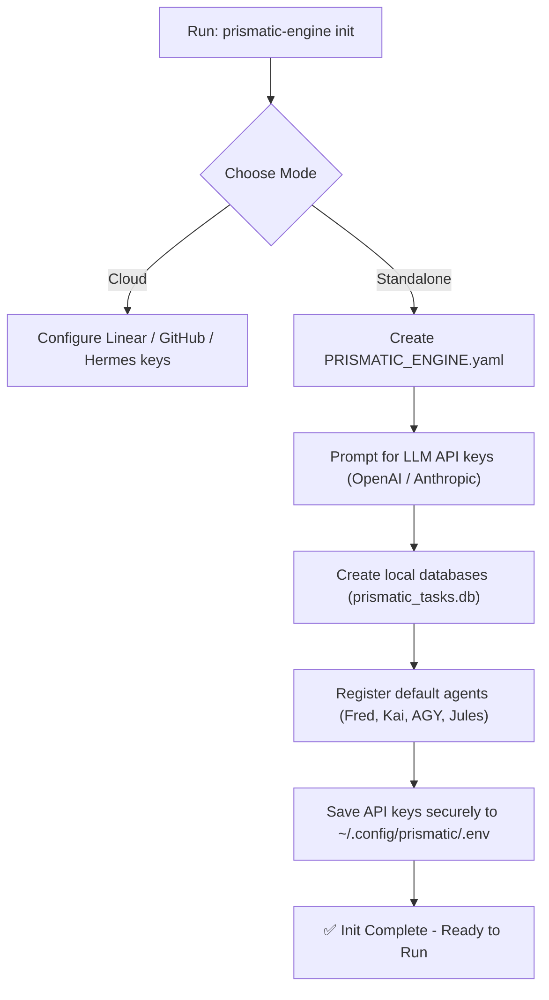

# Prismatic Engine Spec — Portability & Standalone Mode
**Linear Issue:** [GRO-821](https://linear.app/growthwebdev/issue/GRO-821)  
**Author:** Antigravity Senior Systems Architect  
**Date:** June 8, 2026  
**Status:** Complete — Ready for Review

---

## 1. Executive Summary

To enable deployment in offline, air-gapped, or resource-constrained environments, the Prismatic Engine must run in **Standalone Mode**. This mode decouples the engine from external cloud dependencies: **Linear** (for task intake), **Hermes** (for agent communication and orchestration), and **GitHub** (for remote git hosting). 

This spec designs the local SQLite-based task queue, the subprocess/Docker execution signaling framework, and the user-facing CLI initialization wizard.

---

## 2. Standalone Decoupling Architecture

| Dependency | Standard Mode Component | Standalone Mode Fallback |
|---|---|---|
| **Task Intake** | Linear GraphQL API (Polling/Webhooks) | Local SQLite Task Queue (`prismatic_tasks.db`) |
| **Agent Signaling** | Hermes messaging bus / gateway | Subprocess Execution or Docker Daemon API |
| **Workspace / Git** | GitHub remote repository host | Local Git repository (Local-only branch merges) |
| **API Credentials** | Vault / Hermes environment keys | Secure local `.env` and `~/.config/prismatic/` |

### 2.1 Default Local Task Provider
In Standalone Mode, the engine disables Linear polling and queries a local SQLite database (`prismatic_tasks.db`). 

```sql
CREATE TABLE tasks (
    id TEXT PRIMARY KEY,
    title TEXT NOT NULL,
    description TEXT,
    priority INTEGER DEFAULT 3, -- 1=Critical, 4=Backlog
    role TEXT NOT NULL,
    status TEXT DEFAULT 'QUEUED', -- QUEUED, RUNNING, COMPLETED, FAILED
    created_at TIMESTAMP DEFAULT CURRENT_TIMESTAMP,
    completed_at TIMESTAMP
);
```

Tasks can also be piped directly into the engine runtime using `stdin`:

```bash
echo '{"role": "researcher", "description": "Review spelling"}' | prismatic-engine run --oneshot
```

### 2.2 Default Local Signal Provider
To execute tasks without a Hermes messaging gateway, the scheduler spawns agents using one of two adapters:

1. **Subprocess Adapter (Default):** Runs the agent binary directly on the host operating system. The engine pipes instructions via standard environment variables and captures outputs from `stdout` and `stderr`.
2. **Docker Adapter:** Uses the local Docker socket (`/var/run/docker.sock`) to spin up ephemeral agent containers, mount local worktrees as volumes, and clean up resources upon completion.

---

## 3. Five-Step Quick Start (Standalone Mode)

Run the Prismatic Engine locally in five steps:

```bash
# 1. Install the engine CLI package
pip install prismatic-engine

# 2. Initialize the local configuration and databases
prismatic-engine init --standalone

# 3. Add a task to the local SQLite queue
prismatic-engine add --role "researcher" --desc "Compare competitor pricing models"

# 4. Start the scheduler to execute queued tasks
prismatic-engine run

# 5. Check status and output files
prismatic-engine status
```

---

## 4. `prismatic-engine init` Wizard Flow

The `init` command runs an interactive setup wizard in the shell:



During initialization, API credentials are saved to `~/.config/prismatic/.env` with `0600` (read-write for owner only) permissions to ensure security.

---

## 5. Loadable Custom Agents Config (`config/agents.yaml`)

Users can define custom agents or import third-party models by declaring them in a simple YAML format without writing Python wrapper code:

```yaml
version: 2
custom_agents:
  - name: "custom-coder"
    executable: "/usr/local/bin/custom-coder-cli"
    capabilities: ["code-writer", "bug-fixer"]
    max_concurrent: 1
    env:
      - name: "CODER_MODEL_TEMP"
        value: "0.2"

  - name: "local-llama-reviewer"
    docker_image: "prismatic/llama-reviewer:v1"
    capabilities: ["code-reviewer"]
    max_concurrent: 4
    gpu_enabled: true
    volumes:
      - host_path: "/var/cache/models"
        container_path: "/root/.cache"
```

The engine automatically loads this file at startup and incorporates the custom agents into the scheduling pool.

---

## 6. Standalone vs. Cloud Feature Matrix

| Feature | Standalone Mode | Cloud Mode |
|---|---|---|
| **Local Subprocess Spawning** | Yes (Default) | Yes |
| **Docker Spawning** | Yes | Yes |
| **Local SQLite Task Queue** | Yes (Default) | No |
| **Linear Issue Synchronization** | No | Yes (Default) |
| **Hermes Gateway Routing** | No | Yes (Default) |
| **Multi-Server Agent Pooling** | No | Yes |
| **Local Git Merging** | Yes | Yes |
| **Automated GitHub PR Creation** | No | Yes (Default) |
