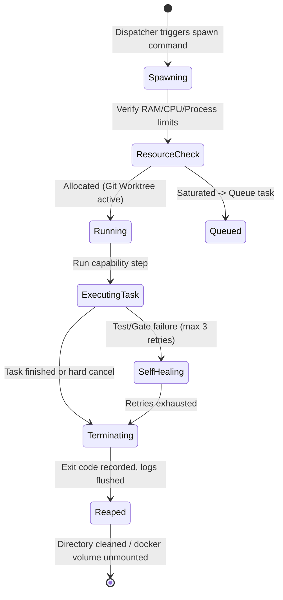
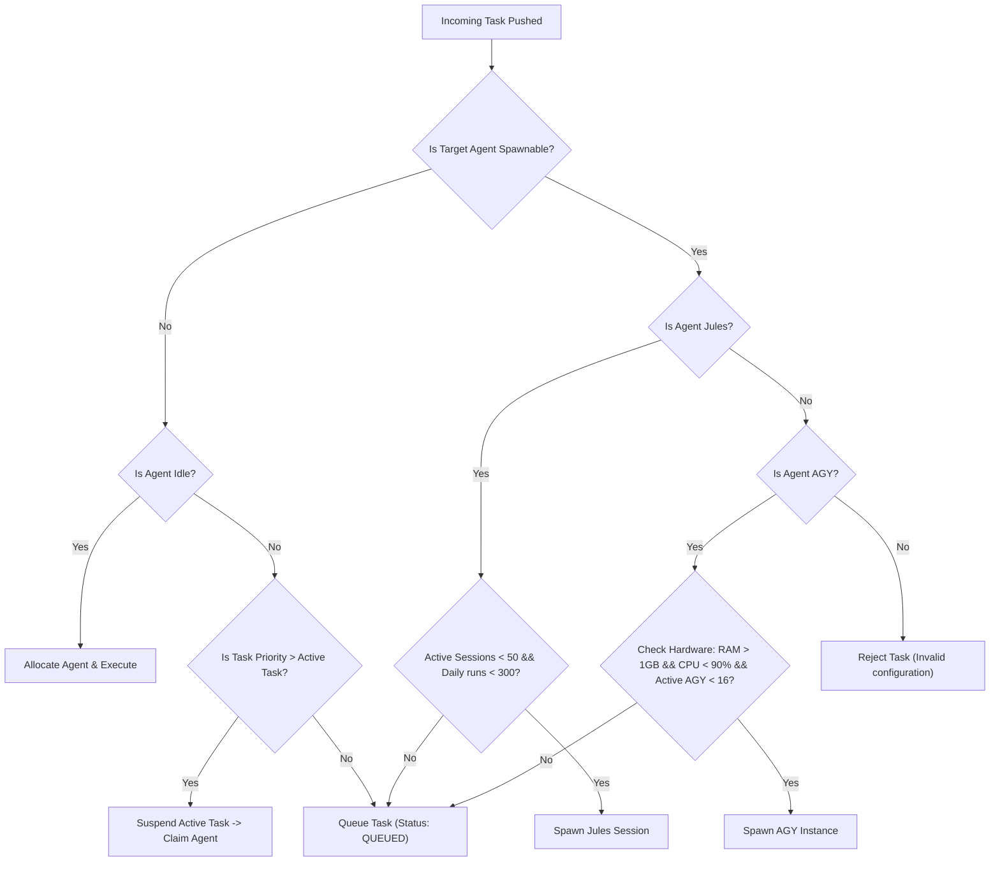

# Prismatic Engine Spec — Revised Agent Spawning & Scheduling Model
**Linear Issue:** [GRO-821](https://linear.app/growthwebdev/issue/GRO-821)  
**Author:** Antigravity Senior Systems Architect  
**Date:** June 8, 2026  
**Status:** Complete — Ready for Review

---

## 1. Executive Summary

Based on updated constraints, our previous assumption of fixed agent concurrency was incorrect. **AGY** is not a single agent with a concurrency cap of 4; it is a multi-agent platform capable of spawning arbitrary instances limited only by host bare-metal resources. **Jules** is a multi-session CLI capable of running up to 50 parallel sessions (and 300 per day). Other agents—**Fred** (Orchestrator), **Kai** (Writer), and **Autobot**—remain strictly single-instance. 

This document defines the revised spawning and scheduling model designed to handle this dynamic allocation architecture without resource exhaustion or database contention.

---

## 2. Spawning API & Lifecycle

### 2.1 The Spawning API
The Dispatcher initiates a new AGY instance using a standardized CLI command, injecting task details and configuration limits.

```bash
agy spawn \
  --task-id "GRO-821" \
  --role "researcher" \
  --worktree "/home/ubuntu/work/instances/gro-821" \
  --brief "/home/ubuntu/work/instances/gro-821/brief.json" \
  --cpu-shares 1024 \
  --memory-limit "2g"
```

For containerized environments, the Dispatcher invokes the Docker daemon or a local container runtime:

```bash
docker run -d \
  --name "agy-gro-821" \
  --cpu-shares 1024 \
  --memory "2g" \
  -e HERMES_TASK_ID="GRO-821" \
  -e AGY_ROLE="researcher" \
  -v "/home/ubuntu/work/instances/gro-821:/workspace" \
  prismatic/agy-platform:latest
```

### 2.2 Instance Lifecycle
AGY instances are designed to be ephemeral, following a strict lifecycle:



* **Spawning Trigger:** Triggered immediately when a task requiring an AGY capability is polled and no hardware bottleneck exists.
* **Idle Reaping:** If an AGY instance is waiting for human feedback or downstream signaling and goes idle for more than **300 seconds (5 minutes)**, the scheduler reaps it. The instance serializes its execution stack to a state checkpoint and terminates to free memory.

---

## 3. Hardware Limit Detection

To prevent AGY instances from exhausting the host server's resources (and crashing other agents), the scheduler performs a pre-flight resource check before spawning any new instance:

1. **Memory Availability:** Queries `/proc/meminfo` to check free RAM. Spawning is blocked if available memory drops below **1.0 GB** or is less than **10%** of total RAM.
2. **CPU Load:** Checks `/proc/loadavg`. Spawning is blocked if the 5-minute load average exceeds **90%** of the host's total logical cores (e.g., load average > 7.2 on an 8-core machine).
3. **Process Count:** Queries active AGY process counts. A safety ceiling of **16 concurrent instances** is enforced to avoid thread thrashing, regardless of raw RAM/CPU availability.

---

## 4. Jules Batch & Single-Instance Scheduling

### 4.1 Jules Batch Scheduling
Jules has a licensing/concurrency limit of **50 parallel sessions** and **300 daily runs**. 
* **On-Demand Allocation:** The scheduler does not pre-allocate or hold idle Jules sessions. When $N$ tasks in the queue require reviews (where $N \le 50$), the scheduler spawns exactly $N$ sessions in parallel.
* **Throttling:** If the queue contains 60 review tasks, the scheduler spawns 50 immediately and queues the remaining 10.
* **Daily Quota Management:** The scheduler maintains a rolling 24-hour execution count in SQLite. If the daily run count approaches 280, the scheduler alerts Fred and throttles Jules to critical priority tasks only to avoid hitting the 300-session wall.

### 4.2 Single-Instance Agent Constraints (Fred, Kai, Autobot)
Because Fred, Kai, and Autobot are single-instance resources, the scheduler uses a strict lock-and-queue model:
* **No Alternative Routing:** These agents possess unique permissions, specialized prompt overlays, or API access keys. If a task requires Kai (Writer) and Kai is currently running a task, the incoming task is marked as `QUEUED` in the database. No backup or fallback agent is chosen.
* **Preemption:** If an incoming task has Priority 1 (Critical) and the target single-instance agent is executing a Priority 3 task, the scheduler suspends the active task, commits its progress, and redirects the agent to the Priority 1 task.

---

## 5. YAML & JSON Schemas

### 5.1 `agent_types.yaml`
Declares the capabilities, spawnability, limits, and hardware metrics for each agent:

```yaml
version: 2
agents:
  fred:
    spawnable: false
    max_instances: 1
    exclusive: true
    capabilities: ["orchestrator", "staging-governor"]
    
  kai:
    spawnable: false
    max_instances: 1
    exclusive: true
    capabilities: ["content-writer"]
    
  autobot:
    spawnable: false
    max_instances: 1
    exclusive: true
    capabilities: ["cleaner", "infrastructure"]

  jules:
    spawnable: true
    max_instances: 50
    daily_limit: 300
    capabilities: ["code-reviewer", "test-runner"]

  agy:
    spawnable: true
    max_instances: "hardware"
    hardware_limits:
      min_free_ram_mb: 1024
      max_cpu_load_pct: 90
      max_instances_safety_ceiling: 16
    capabilities: ["designer", "researcher", "reviewer"]
```

### 5.2 Revised `agent_status.json`
Since AGY and Jules can run multiple instances, `agent_status.json` must track active runs in a list (array) format instead of single-value properties:

```json
{
  "last_updated": "2026-06-08T08:00:00Z",
  "agents": {
    "fred": {
      "status": "idle",
      "active_runs": []
    },
    "kai": {
      "status": "busy",
      "active_runs": [
        {
          "task_id": "GRO-815",
          "pid": 45120,
          "started_at": "2026-06-08T07:55:00Z"
        }
      ]
    },
    "autobot": {
      "status": "idle",
      "active_runs": []
    },
    "jules": {
      "status": "busy",
      "active_runs": [
        {
          "task_id": "GRO-816",
          "session_id": "js-901b",
          "started_at": "2026-06-08T07:58:00Z"
        },
        {
          "task_id": "GRO-817",
          "session_id": "js-901c",
          "started_at": "2026-06-08T07:59:00Z"
        }
      ]
    },
    "agy": {
      "status": "busy",
      "active_runs": [
        {
          "task_id": "GRO-818",
          "pid": 45188,
          "capability": "researcher",
          "started_at": "2026-06-08T07:50:00Z"
        },
        {
          "task_id": "GRO-819",
          "pid": 45192,
          "capability": "designer",
          "started_at": "2026-06-08T07:52:00Z"
        }
      ]
    }
  }
}
```

---

## 6. Decision Tree: Spawn, Queue, or Reject

The Scheduler evaluates incoming tasks against the following decision logic:



---

## 7. Worked Example: Mixed Constraints Trace

Let's walk through an execution scenario involving three active pipelines:
* **Pipeline A (Priority 2):** Requires 3 AGY instances + 1 Jules (Review)
* **Pipeline B (Priority 1 - Critical):** Requires 1 AGY instance + 1 Kai (Write)
* **Pipeline C (Priority 3 - Low):** Requires 5 Jules (Reviews)

### System Starting State:
* Host CPU load: 10%, Free RAM: 8GB
* Kai: Idle, Jules: 0 sessions, AGY: 0 instances

### Step-by-Step Scheduling Execution:

```
t=0s: Pipeline B (Priority 1) arrives first.
      - Scheduler allocates 1 AGY instance for research. (AGY count: 1, CPU: 15%, RAM: 7.8GB)
      - Scheduler allocates Kai for drafting. Kai is idle -> starts immediately. (Kai: Busy)

t=5s: Pipeline A (Priority 2) and Pipeline C (Priority 3) arrive.
      - Pipeline A requests 3 AGY instances. 
        - Safety checks: RAM (7.8GB > 1GB), CPU (15% < 90%), AGY count (1 < 16).
        - Scheduler spawns all 3 AGY instances concurrently. (AGY count: 4, CPU: 40%, RAM: 7.2GB)
      - Pipeline A requests 1 Jules session. Spawns immediately. (Jules count: 1)
      - Pipeline C requests 5 Jules sessions. Spawns all 5 concurrently. (Jules count: 6)

t=10s: Pipeline B's second step needs 1 Kai instance (still writing) and 1 AGY instance.
      - B's AGY request: RAM (7.2GB > 1GB), CPU (40% < 90%), AGY count (4 < 16). Spawns immediately. (AGY count: 5)
      - B's Kai request: Kai is already busy with Pipeline B's first step. 
        Since Pipeline B is Priority 1, it has the same or higher priority than itself. 
        It does not preempt itself; the second step queues behind the first step.

t=15s: A heavy system load spike occurs from an external build process. CPU load climbs to 92%.
      - An ad-hoc Pipeline D arrives, requesting 1 AGY instance.
      - Hardware check: CPU load (92% > 90%). Saturated limit reached!
      - Scheduler rejects spawning and places Pipeline D's task into the SQLite queue.

t=30s: Pipeline C's 5 Jules sessions complete. CPU load drops back to 30%.
      - Scheduler re-evaluates the queue.
      - Pipeline D is pulled from the queue and spawned now that CPU load is 30% (< 90%).
```
