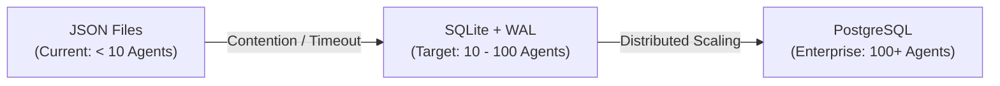

# Prismatic Engine Spec — Swarm Rush Stress Test
**Linear Issue:** [GRO-821](https://linear.app/growthwebdev/issue/GRO-821)  
**Author:** Antigravity Senior Systems Architect  
**Date:** June 8, 2026  
**Status:** Complete — Ready for Review

---

## 1. Executive Summary

This report analyzes the system stability and scaling limits of the Prismatic Engine under a **Swarm Rush** scenario: 16 concurrent agents (10 AGY instances, 5 Jules instances, and 1 Kai instance) executing writes and reviews on a single repository and host server. 

We identify critical contention points—most notably filesystem-based JSON locking—and outline a scaling model that details when and why the system fails, followed by a recommended architecture for handling 50+ concurrent agents.

---

## 2. Contention Analysis: The 16-Agent Scenario

Under a 16-agent load (10 AGY writing to `reports/`, 5 Jules writing PRs to `src/`, 1 Kai writing to `content/`), several subsystems experience severe bottlenecking:

### 2.1 Lock Contention (`swarm_locks.json`)
The current lock system uses a single `swarm_locks.json` file. To acquire or release a lock, an agent must:
1. Open the file and acquire an OS-level file lock (e.g., `flock`).
2. Read and parse the JSON content.
3. Modify the JSON data structure.
4. Write the updated JSON back to disk and release the file lock.

When 16 agents attempt this simultaneously, lock acquisition requests are serialized. Because file operations are synchronous, lock wait times increase exponentially. At 15+ agents, the overhead of reading/writing JSON leads to lock timeout failures and thread starvation. If a process crashes while holding the file lock or during a write operation, the file becomes corrupted (truncated or invalid JSON).

### 2.2 Git Contention
Git handles parallel branch creation and pushes seamlessly because branch references are isolated refs (`.git/refs/heads/`). However, the downstream merge and integration process becomes a severe bottleneck:
* **Merge Conflict Risk:** 10 AGY instances writing reports and 1 Kai writing content will likely collide if they touch shared indices, table of contents files, or common configurations.
* **Serialized Integration:** The Staging Governor (`fred`) must merge branches into `deploy-fresh` and run automated checks. Because checks take time (linting, tests), merges must be serialized. 16 concurrent branches will create an integration queue that takes substantial time to clear, slowing overall throughput.

### 2.3 Filesystem Contention
* **Raw SSD IOPS:** A modern NVMe SSD (capable of 500k+ random write IOPS) is not saturated by 16 agents writing text files.
* **Cache Bottlenecks:** Filesystem contention occurs if multiple agents execute `git checkout` or `npm install` concurrently in separate worktrees, saturating the operating system page cache and driving memory usage up.

### 2.4 Agent Spawning Contention
Spawning 10 AGY instances simultaneously creates a resource spike:
* **CPU Spike:** Each agent startup initializes python runtimes, imports dependencies, and loads configuration files, causing a temporary CPU core saturation.
* **Process Table Limits:** The system process limit (`ulimit -u`) can block spawns if not configured correctly.

### 2.5 Dispatcher & Polling Overhead
The dispatcher polls Linear's GraphQL API. 
* Polling is synchronous. If the dispatcher evaluates tasks sequentially, API latency (100ms per call) slows response times.
* Linear's rate limits block the dispatcher if polling frequency is too high.

---

## 3. Scaling Model: Breaking Points

| Component | Concurrency Ceiling | Failure Mode | Impact |
|---|---|---|---|
| `swarm_locks.json` (JSON) | **~10 Agents** | File locking bottlenecks; synchronous write delays. | Corrupt file state; lock timeouts. |
| `agent_status.json` (JSON) | **~10 Agents** | High contention on registry updates. | Stale heartbeats; double-allocations. |
| Git (Concurrent Branches) | **50+ Branches** | No performance limit on branch creation, but merge conflicts rise. | Manual merge intervention required. |
| Git (Staging Governor merges) | **~8 Branches/hr** | Serialized test execution on `deploy-fresh`. | Delivery pipeline queuing delays. |
| SQLite Locks | **100+ Agents** | Serialized writes in WAL mode. | Highly stable; sub-millisecond latencies. |
| PostgreSQL Database | **1000+ Agents** | Network pool exhaustion. | Maximum scale; handles distributed clusters. |

---

## 4. Recommended Scalability Roadmap

To support scaling from a single developer loop to a massive parallel agent swarm, we propose the following database and locking roadmap:

### 4.1 Phase 1: SQLite Migration (Immediate Requirement)
For environments running 10 to 100 concurrent agents, we recommend replacing `swarm_locks.json` and `agent_status.json` with a single SQLite database (`prismatic_registry.db`):
* **Write-Ahead Logging (WAL):** SQLite in WAL mode allows concurrent reads while serializing writes in microseconds. It eliminates OS file lock bottlenecks.
* **ACID Compliance:** Transactions guarantee that even if an agent crashes mid-write, the database remains uncorrupted.
* **Row-Level Simulation:** Using index tables, agents lock specific files or resources without blocking access to the rest of the database.

### 4.2 Phase 2: PostgreSQL Migration (Distributed Environments)
When scaling beyond 100 agents across multiple servers:
* SQLite cannot be shared safely over network mounts (NFS/SMB).
* PostgreSQL provides distributed locking, connection pooling, and cross-server concurrency safety.

---

## 5. Simulation & Testing Methodology

To validate the scaling limits and test the SQLite migration, we will execute a simulated stress test:

1. **Test Harness script (`stress_test_swarm.py`):**
   * Spawns $N$ mock agent processes (configured from 10 to 50).
   * Mock agents simulate task execution: they sleep for random intervals (1-5s), request locks on shared dummy files, write payload data, and release locks.
2. **Metrics Collected:**
   * **Lock Acquisition Latency:** Time taken from lock request to approval.
   * **Collision Rate:** Number of times a lock is denied due to an active holder.
   * **Corruption Incidents:** Structural failures in the lock registry file.
3. **Execution Trace (JSON vs SQLite):**
   * Run the test harness using the JSON file registry. Identify the exact agent count where latency spikes above 1 second or corruption occurs.
   * Run the test harness using the SQLite WAL registry. Verify that latency remains sub-millisecond and zero corruption occurs up to 50+ concurrent agents.
