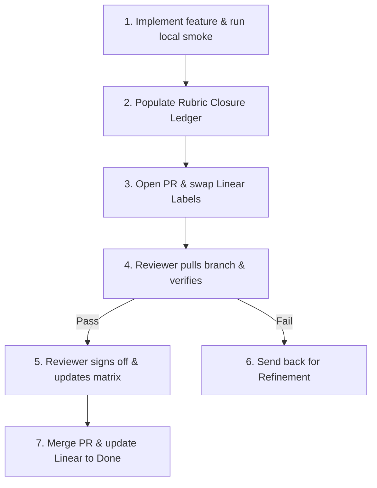

# AGY Rubric Closure Handoff Protocol

This document defines the canonical handoff protocol for closing maturity rubric items within the **Prismatic Engine** swarm. It ensures that tasks transition between developer agents (`agent:ned`, `agent:fred`), quality reviewer agents (`agent:agy`), and human operators (Michael Gulden) with zero lost context, strict evidence tracking, and complete alignment with the scoring schemes.

---

## 1. Protocol Invariants

1. **No Self-Reporting:** No agent may claim a rubric task is complete or score it green based on "vibes" or self-reporting. All completions must be backed by executed commands and/or system artifacts.
2. **Done Gate Requirement:** A task cannot transition to `Done` status unless the [done_gate()](file:///home/ubuntu/work/prismatic-engine/prismatic/execution_evidence.py#L189) validation returns `"done"`.
3. **Traceable Scoring:** Any score increase in the [rubric-inventory-matrix.md](file:///home/ubuntu/work/prismatic-engine/research/rubric-inventory-matrix.md) must reference the exact Pull Request (PR) and verifier command output.
4. **Lane Integrity:** Agents must only modify files within their allowed write-lanes defined in [PRISMATIC_ENGINE.yaml](file:///home/ubuntu/work/prismatic-engine/PRISMATIC_ENGINE.yaml).

---

## 2. Handoff Roles

| Agent Role | Example Assignment | Primary Responsibility |
| :--- | :--- | :--- |
| **Developer Agent** | `agent:ned` / `agent:fred` | Implements the features, runs local smoke tests, drafts the ledger checklist. |
| **Reviewer Agent** | `agent:agy` | Pulls the branch, runs the full verification suite, audits code/security, signs off. |
| **Release Coordinator** | `agent:fred` / Manual | Merges the PR, logs final provenance, and shifts Linear issue state to Done. |

---

## 3. Handoff Lifecycle Steps



### Step 1: Feature Development & Local Smoke Check
The assigned developer agent (e.g., `agent:ned`) writes code within their lane. Once complete, they run the specific verifier command:
```bash
PYTHONPATH=. ./.venv_dev/bin/python3 scripts/public_launch_smoke.py
```
They must capture the CLI stdout/stderr and ensure the expected success marker (e.g., `PUBLIC_LAUNCH_SMOKE_OK`) is printed.

### Step 2: Ledger Documentation
The developer copies [rubric-closure-ledger-template.md](file:///home/ubuntu/work/prismatic-engine/research/rubric-closure-ledger-template.md) to draft a closure ledger for the task. They populate:
- The metadata (Linear issue link, rubric ID, target score).
- The verifier command ran and its output log.
- API endpoint details or dashboard verification results.

### Step 3: Branching, PR, and Label Swap
The developer:
1. Saves the ledger markdown inside the PR description or commits it under a new report: `reports/rubric-closure-[issue-id].md`.
2. Creates a scoped branch (e.g., `design/GRO-3839`) and opens a Pull Request.
3. Swaps the Linear labels to transition the task:
   - Removes their own agent label (e.g., `agent:ned`).
   - Adds the reviewer label (e.g., `agent:agy`).
   - Sets the task stage to `Review`.

### Step 4: Review and Audit Verification
The reviewer agent (e.g., `agent:agy`):
1. Checkout the developer's branch:
   ```bash
   git checkout design/GRO-3839
   ```
2. Runs the verifier command from the ledger to independently confirm success.
3. Audits files for security gaps (using [public_security_readiness_audit.py](file:///home/ubuntu/work/prismatic-engine/scripts/public_security_readiness_audit.py)).
4. Confirms that the API/dashboard endpoint responds as documented in the ledger.

### Step 5: Review Signoff & Matrix Update
- **If Verification Passes:** The reviewer fills out the `Final Reviewer Signoff` section in the ledger, commits the signed ledger, and updates the capability's score in [rubric-inventory-matrix.md](file:///home/ubuntu/work/prismatic-engine/research/rubric-inventory-matrix.md).
- **If Verification Fails:** The reviewer leaves a comment explaining the failure category (e.g., `verification_failed`), adds the developer label back, and sets the stage to `In Progress`.

### Step 6: PR Merge & Linear Closeout
Once the review passes and is signed off:
1. The PR is merged into `main`.
2. The agent writes a JSON execution evidence file to `artifacts/execution-evidence-contract/latest/` matching the [ExecutionEvidence](file:///home/ubuntu/work/prismatic-engine/prismatic/execution_evidence.py#L64) structure.
3. The Linear issue status is moved to `Done`, automatically gated by `done_gate` validating the evidence file.
