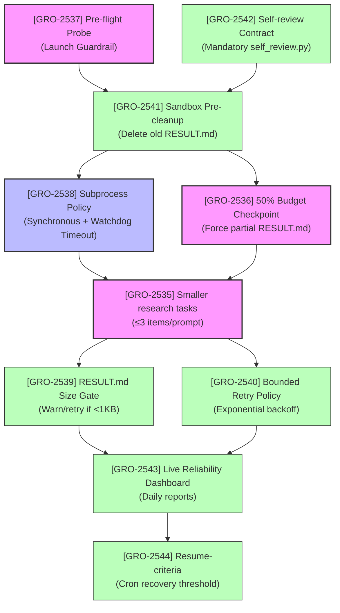

# AGY Research Reliability Plan Analysis & Recommendations

**Author:** Antigravity (AI Coding Assistant)  
**Date:** 2026-07-13  
**LINEAR Task:** GRO-2537  
**Parent Epic:** [GRO-2492](file:///home/ubuntu/recovery/agy-research-reliability-plan.md) (PWP Implementation Epic)  
**Lane:** infra  
**Priority:** P1  

---

## 1. Verdict & Executive Summary

### Operational Verdict: **APPROVED WITH CONDITIONS (CRITICAL PAUSE SUSTAINED)**

Based on an empirical analysis of 331 task logs and a deep-dive review of the PWP research child tasks (GRO-2508..GRO-2523), the AGY fleet is experiencing a **96.1% failure rate** (only 13 out of 331 runs completed successfully with a `DONE` state).

The AGY supervisor cron must remain paused. Resuming operations without implementing the pre-flight probes, subprocess guardrails, and budget checkpoints detailed below will result in high operational noise, resource waste, and data/state divergence.

---

## 2. Failure Taxonomy Verification

We programmatically analyzed the empirical log sweep in [`01_failure_taxonomy.csv`](file:///home/ubuntu/recovery/agy-reliability-evidence/01_failure_taxonomy.csv) (331 total runs) and verified the following failure metrics:

### Fleet-Wide Metrics (331 runs)
* **Total Task Runs**: 331 (100%)
* **Zero-Byte Logs (Startup Failures)**: **273 runs (82.48%)** — Failed at startup (0 bytes written to log) due to sandbox container spin-up timeouts, volume-mount delays (e.g. NAS latency), or initialization failures.
* **Gemini API Transport Timeouts**: **31 runs (9.37%)** — Failed due to upstream network/API timeouts, ending in `Error: timed out waiting for response`.
* **Background-Subprocess Hangs**: **14 runs (4.23%)** — Stalled indefinitely waiting for async tasks (`pytest`, `git clone`, `find`, `Lighthouse`).
* **Success Rate**: Only **13 runs (3.93%)** successfully reached a `DONE` state.

### Deep-Dive: PWP AI Research Children (GRO-2508..GRO-2523)
Out of 13 children tasks within this range:
- **7 tasks (53.8%)** ended in Gemini API transport timeouts (GRO-2512, GRO-2513, GRO-2514, GRO-2515, GRO-2516, GRO-2519, GRO-2521).
- **1 task (7.7%)** stalled waiting on a background process (GRO-2523).
- **5 tasks (38.5%)** completed successfully (GRO-2510, GRO-2517, GRO-2518, GRO-2520, GRO-2522).

> [!IMPORTANT]
> The empirical taxonomy is verified. Startup failures account for over **82%** of fleet failures, meaning the supervisor is running blind without container-readiness checks. Meanwhile, child tasks in the PWP research wave see their transport timeout rate spike to **53.8%**, indicating prompt decomposition is critical.

---

## 3. Point-by-Point Recommendations & Amendments

### Recommendation 1: Prompt Decomposition & Smaller Tasks (GRO-2535)
* **Verdict**: **APPROVED WITH CONDITIONS**
* **Plan Proposal**: Break research tasks into smaller prompts with $\le$ 3 target deliverables.
* **Condition / Amendment**: 
  * **Structured Session Handoff (Context Sharing)**: Since tasks will be smaller, downstream tasks must not waste tool budget re-discovering repository state. Implement a mandatory handoff file (`session_state.json`) committed by the supervisor. This file should contain:
    1. Key files modified or created.
    2. Latest verified findings.
    3. Next logical steps for the succeeding subtask.

### Recommendation 2: 50% Budget Checkpoint for Partial RESULT.md (GRO-2536)
* **Verdict**: **APPROVED WITH CONDITIONS**
* **Plan Proposal**: Inject a system-level alert at 50% tool-call budget to force the agent to write a partial `result.md`.
* **Condition / Amendment**:
  * **Dual-Trigger Watchdog**: Trigger the checkpoint at **50% tool calls** OR **50% of the maximum elapsed execution time** (whichever comes first).
  * **Automated Failsafe Synthesis**: The agent should write findings to a draft file `.result.md.draft`. If the container crashes or times out after the 50% mark, the supervisor must automatically capture `.result.md.draft`, rename it to `result.md`, and commit it. This guarantees we always get partial results even during sudden upstream API timeouts.

### Recommendation 3: Banning Background Subprocess waiting (GRO-2538)
* **Verdict**: **APPROVED WITH AMENDMENT**
* **Plan Proposal**: Kill sandbox background-subprocess waiting and force all commands to run synchronously.
* **Condition / Amendment**:
  * Completely banning background execution is too restrictive for tasks that require starting local services (e.g. dev servers, testing databases).
  * **Amendment**: Implement **Synchronous Execution by Default** and enforce a **Supervisor-Level Process Watchdog**. If a command is launched, the supervisor must enforce strict, non-configurable timeouts (e.g., 60s for git operations, 180s for test suites). If the timeout is exceeded, the supervisor must terminate the subprocess group (`SIGKILL`), and return the stdout/stderr with a `TimeoutExpired` error back to the agent so it can handle the failure gracefully.

### Recommendation 4: Launch Guardrail / Pre-Flight Probe (GRO-2537)
* **Verdict**: **APPROVED**
* **Plan Proposal**: Run a 30s sentinel probe (`agy-bin --print "ping"`) before launching full task containers.
* **Condition / Amendment**:
  * The probe should be **two-staged** to isolate failure surfaces:
    * **Stage 1 (Control Plane)**: A quick non-sandboxed API call to verify Gemini API health and token validity.
    * **Stage 2 (Data Plane)**: A minimal container run to verify that container volume mounts (NAS) are readable and writeable.
  * If Stage 1 fails, hold tasks and warn. If Stage 2 fails, flag the worker node as degraded and route tasks to other healthy nodes.

---

## 4. Ticket Dependency and Implementation Plan

The implementation sequence proposed in the plan is correct. Phase 1 (Pre-flight) and Phase 2 (Runtime Hardening) should be prioritized immediately.

