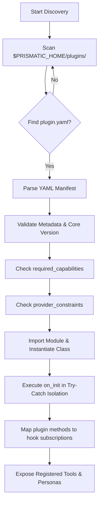

# Implementation Plan: GRO-1497 — Plugin Interface (Manifest Format + Hook System)

This document provides a detailed implementation plan for fleshing out the plugin interface of the Prismatic Engine Core, focusing on extending the manifest schema, implementing new lifecycle hooks, enhancing the plugin loader with capability/provider validation, and establishing provider-agnostic abstractions.

---

## 1. plugin.yaml Manifest Schema Specification

Every plugin in the Prismatic Engine must provide a [plugin.yaml](file:///home/ubuntu/work/prismatic-engine/plugins/example_plugin/plugin.yaml) manifest at its root directory. This manifest is parsed on startup to discover metadata, capabilities, dependencies, custom personas, and hook subscriptions.

### 1.1 Complete YAML Schema Structure

Below is the exhaustive schema specification, detailing every supported field, data types, and requirement flags.

| Field | Type | Required | Description |
| :--- | :--- | :--- | :--- |
| `schema_version` | `string` | **Yes** | Version of the manifest schema being used (e.g., `"1.0.0"`). |
| `name` | `string` | **Yes** | Unique plugin identifier. Must be lowercase, alphanumeric, and may include dashes or underscores. |
| `version` | `string` | **Yes** | Semantic version of the plugin (e.g., `"1.2.3"`). |
| `description` | `string` | No | A short description summarizing the capabilities and purpose of the plugin. |
| `author` | `string` | No | Name or agent moniker representing the creator of the plugin. |
| `entry_point` | `string` | **Yes** | Fully qualified path to the Python class (e.g., `"vram_observability.plugin:VRAMObservabilityPlugin"`). |
| `core_version_constraint` | `string` | **Yes** | SemVer range expression defining supported core engine versions (e.g., `">=1.0.0, <2.0.0"`). |
| `dependencies` | `dict` | No | System or library dependencies needed by the plugin. |
| `dependencies.pip` | `list[string]` | No | List of Python packages to validate or install before loading (e.g., `["GPUtil>=1.4.0"]`). |
| `personas` | `list[dict]` | No | Persona extensions registered by this plugin. |
| `personas[].id` | `string` | **Yes** | Unique persona identifier (e.g., `"GPU-COMPUTE-OBSERVER"`). |
| `personas[].displayName` | `string` | **Yes** | Display name used in agent UIs or output logs. |
| `personas[].systemPrompt` | `string` | **Yes** | The core instruction prompt injected into the LLM context. |
| `personas[].defaultAllowedDirs`| `list[string]` | No | List of directory paths the persona is permitted to write to. |
| `personas[].defaultReadOnlyDirs`| `list[string]` | No | List of directory paths the persona is permitted to read from. |
| `personas[].preferredHead` | `string` | No | UI head mode preferred by this persona (e.g., `"Headless API"`). |
| `personas[].maxActions` | `integer` | No | Maximum execution steps allowed per agent run. |
| `hooks` | `list[string]` | **Yes** | Lifecycle hooks the plugin subscribes to. Must contain valid canonical hook names. |
| `required_capabilities` | `list[string]` | No | System features/capabilities required by the plugin (e.g., `["gpu", "git", "network"]`). |
| `provider_constraints` | `dict[str, str]` | No | Restrictions on agent LLM providers. Maps provider keys (`google-antigravity`, `claude-code`, `github-copilot`, `local-llm`) to constraint strings (`"blocked"`, `"supported"`, SemVer range, or `"*"`). |

### 1.2 Concrete Manifest Example

```yaml
schema_version: "1.0.0"
name: "gpu-observability-plugin"
version: "1.1.0"
description: "Monitors GPU vRAM utilization and interfaces with the CreditPolicyEngine to enforce hardware budget rules."
author: "Fred (agent:fred)"
entry_point: "gpu_observability.plugin:GPUObservabilityPlugin"
core_version_constraint: ">=1.0.0, <2.0.0"

dependencies:
  pip:
    - "GPUtil>=1.4.0"
    - "prometheus-client>=0.17.0"

required_capabilities:
  - "gpu"
  - "network"

provider_constraints:
  google-antigravity: ">=1.0.0"
  claude-code: "supported"
  github-copilot: "blocked"
  local-llm: "*"

personas:
  - id: "GPU-COMPUTE-OBSERVER"
    displayName: "GPU Compute Observability Specialist"
    systemPrompt: |
      You are the GPU Compute Observability Specialist. You analyze GPU usage,
      detect memory leaks, and advise on optimal batch configurations.
    defaultAllowedDirectories:
      - "reports/gpu/"
    defaultReadOnlyDirectories:
      - "src/"
    preferredHead: "Headless API"
    maxActions: 15

hooks:
  - "on_init"
  - "on_issue_dispatch"
  - "on_review_complete"
  - "on_credit_threshold"
```

---

## 2. Hook Registration API (Python Interface)

The hook system operates dynamically. Plugins declare the hooks they subscribe to in `plugin.yaml`, and the [PluginLoader](file:///home/ubuntu/work/prismatic-engine/prismatic/core/registry.py) maps the plugin to those hook points. 

### 2.1 Hook Interface Extension ([prismatic/interface/hooks.py](file:///home/ubuntu/work/prismatic-engine/prismatic/interface/hooks.py))

Add constants and documentation stubs for the 4 new lifecycle hooks:

```python
# ── New hook-name constants ────────────────────────────────────────────

HOOK_ON_ISSUE_DISPATCH      = "on_issue_dispatch"
HOOK_ON_REVIEW_COMPLETE     = "on_review_complete"
HOOK_ON_PIPELINE_STAGE      = "on_pipeline_stage"
HOOK_ON_CREDIT_THRESHOLD    = "on_credit_threshold"

# Add to the list of HOOK_NAMES validation whitelist
HOOK_NAMES.extend([
    HOOK_ON_ISSUE_DISPATCH,
    HOOK_ON_REVIEW_COMPLETE,
    HOOK_ON_PIPELINE_STAGE,
    HOOK_ON_CREDIT_THRESHOLD,
])

# ── Hook Function Signatures & Stubs ───────────────────────────────────

def on_issue_dispatch(issue_id: str, agent_name: str, payload: dict) -> None:
    """
    Executed when an issue is picked up and dispatched to an LLM provider / agent runner.
    
    Args:
        issue_id: The unique identifier of the issue (e.g. Linear UUID).
        agent_name: Name of the agent receiving the task (e.g., 'agy', 'jules').
        payload: Metadata dictionary containing details of the dispatch run.
    """

def on_review_complete(issue_id: str, origin_agent: str, reviewer_agent: str, results: dict) -> None:
    """
    Triggered when a peer review cycle finishes and results are routed back to the original requestor.
    
    Args:
        issue_id: The unique identifier of the issue.
        origin_agent: Moniker of the agent that requested review (e.g., 'kai').
        reviewer_agent: Moniker of the agent that executed the review (e.g., 'agy').
        results: Dictionary containing files changed, review comments, or execution outputs.
    """

def on_pipeline_stage(issue_id: str, stage_name: str, status: str, metadata: dict) -> None:
    """
    Fired when a pipeline stage transitions (e.g., setup, execution, validation).
    
    Args:
        issue_id: The unique identifier of the issue.
        stage_name: Name of the active pipeline stage.
        status: The outcome or state of the stage ('started', 'succeeded', 'failed').
        metadata: Relevant run logs, execution records, or transition state info.
    """

def on_credit_threshold(thread_id: str, provider: str, current_spend: int, limit: int, op: str) -> None:
    """
    Fired when credit consumption exceeds a safety threshold or is blocked by policy rules.
    
    Args:
        thread_id: The session or issue identifier.
        provider: Active LLM provider (e.g., 'google-antigravity', 'claude-code').
        current_spend: Total credits consumed in the current session/month.
        limit: The threshold budget limit defined by the policy.
        op: Operation type that triggered the threshold warning (e.g. 'code_generation').
    """
```

### 2.2 Abstract Base Class Modification ([prismatic/interface/plugin.py](file:///home/ubuntu/work/prismatic-engine/prismatic/interface/plugin.py))

Add optional method signatures to `PrismaticPlugin` so that plugins can subclass them directly:

```python
class PrismaticPlugin(ABC):
    # ... Existing hooks (on_init, register_tools, before_task_execution, after_task_execution, on_state_transition)

    def on_issue_dispatch(
        self, issue_id: str, agent_name: str, payload: Dict[str, Any]
    ) -> None:
        """Called immediately after an issue is dispatched to a provider."""
        return

    def on_review_complete(
        self,
        issue_id: str,
        origin_agent: str,
        reviewer_agent: str,
        results: Dict[str, Any],
    ) -> None:
        """Called when a reviewer agent completes and signals the origin agent."""
        return

    def on_pipeline_stage(
        self,
        issue_id: str,
        stage_name: str,
        status: str,
        metadata: Dict[str, Any],
    ) -> None:
        """Called when a pipeline stage starts, fails, or completes."""
        return

    def on_credit_threshold(
        self,
        thread_id: str,
        provider: str,
        current_spend: int,
        limit: int,
        op: str,
    ) -> None:
        """Called when credit policy checks trigger warnings or denials."""
        return
```

---

## 3. Plugin Loader Implementation Approach

The [PluginLoader](file:///home/ubuntu/work/prismatic-engine/prismatic/core/registry.py) will be extended to handle discovery, validation, and registration of the new hooks and manifest fields.



### 3.1 Step-by-Step Loader Flow

1. **Discovery & Multi-format Support**:
   * Scan directories under `plugins_dir` (resolving relative paths using `PRISMATIC_HOME`).
   * Support both `plugin.yaml` (new standard) and `plugin-manifest.yaml` (legacy support).

2. **Validation Layer**:
   * Check mandatory keys (`name`, `version`, `entry_point`, `core_version_constraint`).
   * Validate core engine version compatibility against the manifest `core_version_constraint`.
   * **Required Capabilities Validation**:
     * Iterate over `required_capabilities`.
     * Check `"gpu"`: Verify python packages like `GPUtil` are importable and `nvidia-smi` is available if needed.
     * Check `"git"`: Execute `git --version` to verify system-level availability.
     * Check `"network"`: Run a quick DNS/socket check to ensure network channels are open.
     * If any capability fails, raise `PluginValidationError` and skip loading.
   * **Provider Constraints Validation**:
     * Fetch the active LLM provider name from the running engine config.
     * Match against `provider_constraints`. If the active provider is marked as `"blocked"`, or if a SemVer version check fails (e.g., active AGY version doesn't fit constraint), block plugin initialization.

3. **Hook Registration Map**:
   * During instantiation, map methods of the plugin instance to specific hook points.
   * Store them in a dictionary mapping hook names to a list of subscriber plugins:
     `self._hook_subscribers: Dict[str, List[PrismaticPlugin]] = {hook: [] for hook in HOOK_NAMES}`
   * Only trigger hooks that the plugin has explicitly declared in its `hooks` list.

4. **Hook Dispatcher with Crash Isolation**:
   * Update `execute_hook(self, hook_name: str, *args, **kwargs)`:
     ```python
     def execute_hook(self, hook_name: str, *args: Any, **kwargs: Any) -> None:
         subscribers = self._hook_subscribers.get(hook_name, [])
         for plugin in subscribers:
             if hasattr(plugin, hook_name):
                 try:
                     getattr(plugin, hook_name)(*args, **kwargs)
                 except Exception as exc:
                     logger.error(
                         "Plugin '%s' crashed during hook '%s': %s",
                         plugin.__class__.__name__, hook_name, exc, exc_info=True
                     )
     ```

---

## 4. Provider Abstraction Architecture

To ensure plugins can work seamlessly across `google-antigravity` (AGY), `claude-code` (Jules), `github-copilot` (Codex), and `local-llm` (Ned/Fred/Kai), we implement a **Provider Abstraction Layer**.

### 4.1 Concept

Plugins define custom tools using the standard OpenAI JSON Schema format. Different LLM providers expect tools in different, native JSON shapes. Rather than forcing plugin developers to handle provider variations, the core engine intercepts and translates schemas on-the-fly.

```
+-------------------------------------------------------------+
|                     Prismatic Plugin                        |
|   (Defines tool in standard OpenAI JSON Schema format)      |
+-------------------------------------------------------------+
                               |
                               v
+-------------------------------------------------------------+
|                 Provider Abstraction Layer                  |
|    - Schema Translation (to Gemini, Anthropic, Copilot)     |
|    - Interception & Execution Routing                       |
+-------------------------------------------------------------+
          /                    |                     \
         v                     v                      v
+-----------------+   +-----------------+   +------------------+
|      AGY        |   |     Claude      |   |    Local LLM     |
| (Gemini Schema) |   | (Anthropic Tool)|   | (OpenAI Schema)  |
+-----------------+   +-----------------+   +------------------+
```

### 4.2 Schema Translators ([prismatic/providers/translator.py](file:///home/ubuntu/work/prismatic-engine/prismatic/providers/translator.py))

A translator module maps tool dictionary structures dynamically:

1. **Gemini / Vertex AI Translator (`to_gemini_tool`)**:
   * Converts the JSON Schema properties into Gemini's `FunctionDeclaration` structures.
   * Maps field data types (e.g., standard type mappings) and removes unsupported attributes like `additionalProperties`.

2. **Anthropic Translator (`to_anthropic_tool`)**:
   * Takes the parameters dictionary and wraps it as `input_schema` inside Anthropic's tool call parameters payload.

3. **OpenAI / Copilot Translator (`to_openai_tool`)**:
   * Passes the schema directly since OpenAI-compliant local models and GitHub Copilot natively accept standard OpenAI JSON Schema definitions.

### 4.3 Runtime Interception & Execution Router

* **Registration**: When an agent worker launches, the agent runner queries the `PluginLoader` for active tools and runs the translator to format schemas.
* **Interception**: When the agent's LLM decides to call a plugin tool:
  1. The agent's native provider runtime receives the tool invocation (e.g., Gemini's `function_call` or Anthropic's `tool_use`).
  2. The agent wrapper intercepts the call, maps the native payload to standard parameters, and retrieves the corresponding plugin instance.
  3. The wrapper executes the plugin tool in a subprocess or sandboxed thread.
  4. The result is serialized and returned to the LLM in the native format expected by that specific provider.

---

## 5. Implementation Tasks (Sub-Tasks)

```mermaid
gantt
    title GRO-1497 Implementation Sub-tasks
    dateFormat  YYYY-MM-DD
    section Tasks
    Task 1: Hook Stubs & Types        :active, t1, 2026-06-13, 2d
    Task 2: Loader & Capability Check : t2, after t1, 3d
    Task 3: Dispatcher Integration     : t3, after t2, 2d
    Task 4: Credit Hook Integration   : t4, after t2, 2d
    Task 5: Schema Translator Layer    : t5, after t3, 3d
    Task 6: Agent Harness Interceptor  : t6, after t5, 3d
    Task 7: End-to-end Integration Test: t7, after t6, 2d
```

### Task 1: Hook Stubs & Interface Types
* **Description**: Define new hook constants, add stubs to `PrismaticPlugin` ABC class, and update hook lists in the engine.
* **Assignee**: Ned (Local development prep)
* **Deliverables**:
  * Modified [hooks.py](file:///home/ubuntu/work/prismatic-engine/prismatic/interface/hooks.py) with new constants and type documentation.
  * Modified [plugin.py](file:///home/ubuntu/work/prismatic-engine/prismatic/interface/plugin.py) with the updated `PrismaticPlugin` abstract class containing optional stubs for new hooks.

### Task 2: Loader Discovery & Capability Validation
* **Description**: Upgrade `PluginLoader` to support `plugin.yaml`, validate manifest constraints, and verify system capabilities (GPU, Git, Network).
* **Assignee**: Ned
* **Deliverables**:
  * Improved `scan_and_load_plugins` and helper methods in [registry.py](file:///home/ubuntu/work/prismatic-engine/prismatic/core/registry.py).
  * Validation rules checking active providers, core engine versions, and local hardware/CLI dependencies.

### Task 3: Hook Integration in Dispatcher
* **Description**: Inject hook triggers (`on_issue_dispatch`, `on_review_complete`, and `on_pipeline_stage`) at key lifecycle points in the core dispatcher.
* **Assignee**: AGY (Dispatcher workflow execution)
* **Deliverables**:
  * Wired execution calls (`execute_hook`) in [dispatcher.py](file:///home/ubuntu/work/prismatic-engine/prismatic/dispatcher.py):
    * Trigger `on_issue_dispatch` inside `dispatch_once` after spawning processes.
    * Trigger `on_review_complete` in `detect_origin_completions` after signaling origin agents.
    * Trigger `on_pipeline_stage` inside pipeline setups and transition handlers.

### Task 4: Credit Policy Engine Integration
* **Description**: Trigger `on_credit_threshold` inside policy evaluations.
* **Assignee**: AGY
* **Deliverables**:
  * Integrate the `on_credit_threshold` hook trigger inside [credit_policy_engine.py](file:///home/ubuntu/work/prismatic-engine/prismatic/credit_policy_engine.py#L244) during evaluation whenever warnings are printed or limit-based denies are returned.

### Task 5: Tool Schema Translator Layer
* **Description**: Write the translator module to format OpenAI tool JSON Schemas into Anthropic and Gemini native formats.
* **Assignee**: Ned
* **Deliverables**:
  * Create `prismatic/providers/translator.py` containing conversion routines.
  * Unit tests validating mapping consistency.

### Task 6: Agent Harness Interceptor
* **Description**: Modify agent execution adapters to register plugin tools and route execution calls back to plugin instances during LLM loop iterations.
* **Assignee**: AGY / Ned
* **Deliverables**:
  * Integrations in [hermes.py](file:///home/ubuntu/work/prismatic-engine/prismatic/agents/hermes.py) and other agent runners to dynamically include translated tools in context and execute them securely.

### Task 7: Dynamic Integration & Isolation Testing
* **Description**: Author end-to-end integration tests to verify plugin loading, capability check failures, hook isolation behavior, and tool routing.
* **Assignee**: Ned
* **Deliverables**:
  * Integration tests under `tests/` utilizing a mock plugin and mock dispatcher events to verify that plugin failures do not compromise engine core stability.