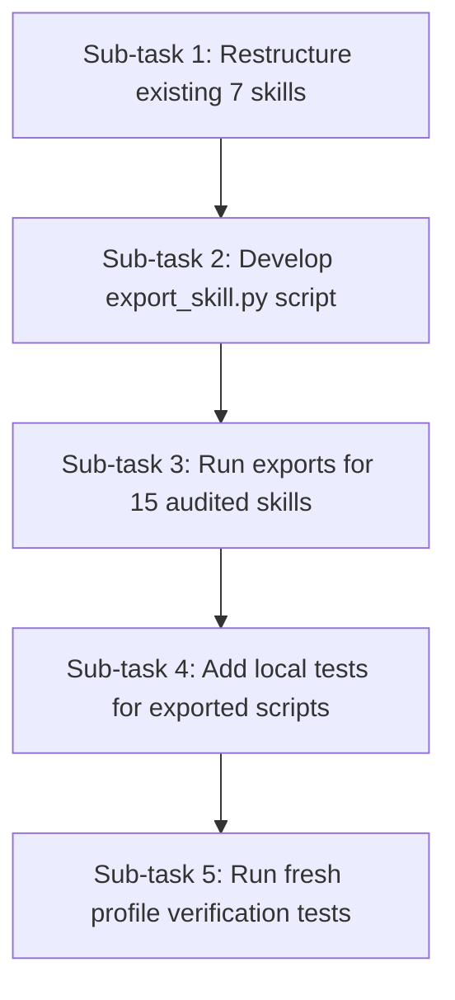

# Implementation Plan: GRO-1499 Portable Skill Export

This document outlines the step-by-step implementation plan for exporting 15 high-priority skills from the orchestrator profile into the standardized, standalone, and shareable `portable-skills/` bundle. 

---

## 1. Audit & Priority List: 15 Skills to Export

To transition from the current flat layout (containing the 7 existing legacy-exported skills) to the category-based format defined in [portable-skill-export-design.md](file:///home/ubuntu/work/prismatic-engine/specs/portable-skill-export-design.md), we audited the active orchestrator profile skills. 

The following 15 skills have been selected as the highest priority. They represent core agent functionalities, video/media production capabilities, and DevOps tools containing hardcoded system-specific paths that will benefit immediately from templated packaging.

### Category 1: Agent-Orchestration
These skills manage multi-agent swarms, sandbox environments, session lifecycle, and communication.

1.  **`antigravity-cli-orchestration`**
    *   **Source Subpath**: `agent-orchestration/antigravity-cli-orchestration`
    *   **Target Subpath**: `agent-orchestration/antigravity-cli-orchestration`
    *   **Description**: Guides the coordination of multiple subagents, sandbox isolation, and LLM model routing.
    *   **Key Path Templating**: Templating of `~/.gemini/antigravity-cli` -> `$APP_DATA_DIR`, `/home/ubuntu/work` -> `$WORKSPACE_DIR`.
    *   **Required Tools**: `agy` (>=1.0.5)

2.  **`antigravity-cli-session-recovery`**
    *   **Source Subpath**: `agent-orchestration/antigravity-cli-session-recovery`
    *   **Target Subpath**: `agent-orchestration/antigravity-cli-session-recovery`
    *   **Description**: Playbook to resume suspended terminal session histories, clear lockfiles, and bypass locks.
    *   **Key Path Templating**: Templating of `/home/ubuntu/.hermes/profiles/orchestrator/logs` -> `$LOGS_DIR`.
    *   **Required Tools**: `agy`, `tmux` | `screen`

3.  **`agy-delegate-goals-not-tasks`**
    *   **Source Subpath**: `agent-orchestration/agy-delegate-goals-not-tasks`
    *   **Target Subpath**: `agent-orchestration/agy-delegate-goals-not-tasks`
    *   **Description**: Strategic principles for delegating high-level goals instead of step-by-step terminal tasks.
    *   **Key Path Templating**: General sanitization of home directory paths.
    *   **Required Tools**: None

4.  **`agy-subagent-communication`**
    *   **Source Subpath**: `agent-orchestration/agy-subagent-communication`
    *   **Target Subpath**: `agent-orchestration/agy-subagent-communication`
    *   **Description**: Protocols for formatting parent-child notification patterns and context updates.
    *   **Key Path Templating**: None (pure markdown documentation)
    *   **Required Tools**: None

5.  **`prismatic-agent-factory`**
    *   **Source Subpath**: `agent-orchestration/prismatic-agent-factory`
    *   **Target Subpath**: `agent-orchestration/prismatic-agent-factory`
    *   **Description**: Script-based workflow to dynamically generate customized task-specific subagent profiles.
    *   **Key Path Templating**: Templates local paths to subagent configuration JSON templates.
    *   **Required Tools**: `python3` (>=3.10)

---

### Category 2: Creative & Content Production
These skills orchestrate external pipelines to parse documents, design vector graphics, compose audio assets, and render math videos.

6.  **`baoyu-article-illustrator`**
    *   **Source Subpath**: `creative/baoyu-article-illustrator`
    *   **Target Subpath**: `creative/baoyu-article-illustrator`
    *   **Description**: Parses text outputs to generate clean vector infographics and styled document schemas.
    *   **Key Path Templating**: Resolves template output locations and `/tmp` paths to `$TMP_DIR`.
    *   **Required Tools**: `pandoc`, `librsvg`, `python3`

7.  **`pixel-art`**
    *   **Source Subpath**: `creative/pixel-art`
    *   **Target Subpath**: `creative/pixel-art`
    *   **Description**: Renders and slices 16-bit sprite sheets using localized model inputs and ImageMagick pipelines.
    *   **Key Path Templating**: Replaces hardcoded asset library locations with `$WORKSPACE_DIR` lookups.
    *   **Required Tools**: `imagemagick`, `python3`

8.  **`manim-video`**
    *   **Source Subpath**: `creative/manim-video`
    *   **Target Subpath**: `creative/manim-video`
    *   **Description**: Coordinates rendering scripts for mathematical animations using 3Blue1Brown's Manim library.
    *   **Key Path Templating**: Templates paths for media cache files, scenes, and output logs.
    *   **Required Tools**: `manim`, `ffmpeg`

9.  **`songwriting-and-ai-music`**
    *   **Source Subpath**: `creative/songwriting-and-ai-music`
    *   **Target Subpath**: `creative/songwriting-and-ai-music`
    *   **Description**: Formulates meta-prompts for lyric composition and handles audio splicing pipelines.
    *   **Key Path Templating**: Replaces output workspace directories.
    *   **Required Tools**: `ffmpeg`

10. **`expert-interview-content-production`**
    *   **Source Subpath**: `content-strategy/expert-interview-content-production`
    *   **Target Subpath**: `content-strategy/expert-interview-content-production`
    *   **Description**: Pipeline for compiling raw interview transcripts into high-quality technical blog articles.
    *   **Key Path Templating**: Resolves paths to transcript inputs and publication templates.
    *   **Required Tools**: `python3`

---

### Category 3: DevOps & Infrastructure
These skills automate server deployments, monitor local homelab states, track webhooks, and compile container orchestrations.

11. **`cloudflare-deployment`**
    *   **Source Subpath**: `infrastructure/cloudflare-deployment`
    *   **Target Subpath**: `infrastructure/cloudflare-deployment`
    *   **Description**: Guides building and publishing serverless static/dynamic workers to Cloudflare infrastructure.
    *   **Key Path Templating**: Sanitizes wrangler token files and workspace production builds.
    *   **Required Tools**: `wrangler` (>=3.0.0), `node` (>=18)

12. **`kubernetes-gpu-llm-serving`**
    *   **Source Subpath**: `infrastructure/kubernetes-gpu-llm-serving`
    *   **Target Subpath**: `infrastructure/kubernetes-gpu-llm-serving`
    *   **Description**: Standardized Helm charts and configuration steps to serve LLM models on GPU node clusters.
    *   **Key Path Templating**: Replaces driver mounting volumes and cluster-specific credentials.
    *   **Required Tools**: `kubectl`, `helm`

13. **`homelab-inventory-management`**
    *   **Source Subpath**: `infrastructure/homelab-inventory-management`
    *   **Target Subpath**: `infrastructure/homelab-inventory-management`
    *   **Description**: Audits local subnet systems, active IP endpoints, and inventory databases.
    *   **Key Path Templating**: Templates absolute locations of IP ranges and catalog SQLite files.
    *   **Required Tools**: `nmap`, `ssh`

14. **`webhook-subscriptions`**
    *   **Source Subpath**: `devops/webhook-subscriptions`
    *   **Target Subpath**: `devops/webhook-subscriptions`
    *   **Description**: Manages secure continuous integration signals and webhook subscriber handshakes.
    *   **Key Path Templating**: Templates SSL certificates and local server hooks.
    *   **Required Tools**: `openssl`, `curl`

15. **`kanban-orchestrator`**
    *   **Source Subpath**: `devops/kanban-orchestrator`
    *   **Target Subpath**: `devops/kanban-orchestrator`
    *   **Description**: Automatically aggregates project issue lanes across developer workspaces.
    *   **Key Path Templating**: Sanitizes target Git workspace directory paths.
    *   **Required Tools**: `git`

---

## 2. Export Script Approach

The export process will be executed via a revised `export_skill.py` command line script (leveraging the design in [portable-skill-export-design.md](file:///home/ubuntu/work/prismatic-engine/specs/portable-skill-export-design.md)) to transition skills into clean, environment-agnostic formats.

```
+-------------------------------------------------------------+
|               Orchestrator Profile Skill                    |
|  (contains /home/ubuntu/, hardcoded paths, local metadata)  |
+------------------------------+------------------------------+
                               |
                               v
                     [ export_skill.py ]
                               |
       +-----------------------+-----------------------+
       |                                               |
       v                                               v
[ Regex Path Substitution ]                  [ Frontmatter Parsing ]
Replaces absolute paths with:                Extracts YAML frontmatter.
$SKILLS_DIR, $WORKSPACE_DIR,                 Generates standardized
$APP_DATA_DIR, $PRISMATIC_HOME,              manifest.yaml mapping
$TMP_DIR, $LOGS_DIR                          triggers, versions & tools.
       |                                               |
       +-----------------------+-----------------------+
                               |
                               v
                     [ Leakage Scan ]
               Checks files for residual paths 
              (warns on /home/ubuntu, etc.)
                               |
                               v
+------------------------------+------------------------------+
|                Portable Skill Bundle Output                 |
|    (Category subfolder, manifest.yaml, templated files)     |
+-------------------------------------------------------------+
```

### Key Logic Implementations:
1.  **Strict Variable Mappings**: Regex patterns will match system-specific absolute paths (ordered from most specific to least specific) and substitute them with target variables:
    *   `/home/ubuntu/.hermes/profiles/orchestrator/skills` -> `$SKILLS_DIR`
    *   `/home/ubuntu/work` -> `$WORKSPACE_DIR`
    *   `/home/ubuntu/.gemini/antigravity-cli` -> `$APP_DATA_DIR`
    *   `/home/ubuntu/.hermes/profiles/orchestrator/logs` -> `$LOGS_DIR`
    *   `/home/ubuntu` -> `$PRISMATIC_HOME`
    *   `/tmp` -> `$TMP_DIR`
2.  **Manifest Automation**: Parse the top of the skill's source `SKILL.md` for YAML frontmatter. If present, extract dependencies, required tools, and triggers, generating `manifest.yaml` in the target folder.
3.  **Category Subfolders**: The export script will write directly into `portable-skills/<category>/<skill-name>` rather than the current flat directory layout.

---

## 3. Verification & Testing Procedure

To guarantee that each exported skill works standalone and can be safely loaded into any external environment:

### Step 1: Automated Leakage Scan
As part of the export validation pipeline, a post-processing script will check every `.md`, `.sh`, `.py`, `.json`, and `.yaml` file for hardcoded user paths. It must fail the build/warning checks if `/home/` (except allowed variables), `/Users/`, or `/root` is detected outside of a templated environment variable.

### Step 2: Standalone Test Execution
For skills containing custom executable code or test suites (such as python scripts or bash deployment commands in `scripts/`), tests will be executed inside a local isolated test environment:
*   Mock out orchestrator dependencies.
*   Validate that scripts run successfully using only arguments or variables defined inside their local folder.

### Step 3: Fresh Profile Load Test
We will verify that a fresh, empty Hermes profile can discover and register the exported skills without errors:
1.  Initialize a temporary sandbox directory: `/tmp/hermes-sandbox-test`.
2.  Set the temporary environment: `HOME=/tmp/hermes-sandbox-test`.
3.  Recreate the category folders inside the sandbox: `~/.hermes/skills/<category>/`.
4.  Copy the exported skills into the test structure.
5.  Execute a validation script to read all generated `manifest.yaml` files, ensuring YAML syntax is correct and required properties are present.
6.  Ensure no imports or commands reference files outside the package boundaries.

---

## 4. Concrete Sub-tasks

To successfully execute this implementation plan, the following sub-tasks will be tracked:



### Sub-task 1: Restructure Existing Skills into Category Folders
*   **Description**: Move the 7 legacy-exported skills currently residing in the flat `portable-skills/` directory into category-specific subfolders (e.g. `agent-orchestration/`, `engineering/`, `software-development/`, `github/`, `email/`) as defined in the target architecture.
*   **Deliverables**: Restructured directory layout under `portable-skills/`, updated [INSTALL.md](file:///home/ubuntu/work/prismatic-engine/portable-skills/INSTALL.md) commands matching the new category structure.

### Sub-task 2: Develop and Test the `export_skill.py` Pipeline Script
*   **Description**: Write the automated `export_skill.py` utility based on the design specification. It must support `--src`, `--dest`, and `--category` arguments, handle regex replacements, extract YAML frontmatter, write `manifest.yaml`, and perform the path leakage check.
*   **Deliverables**: Verified `export_skill.py` script located in the `portable-skills/` root.

### Sub-task 3: Execute Export for the 15 Priority Skills
*   **Description**: Iterate through the audited list of 15 skills in the orchestrator profile skills folder. Add necessary metadata frontmatter to their source `SKILL.md` files, and run the `export_skill.py` script to bundle them into their respective categories under `portable-skills/`.
*   **Deliverables**: 15 new categorized skill directories under `portable-skills/`, each containing templated files and a valid `manifest.yaml`.

### Sub-task 4: Implement Standalone Verification Tests
*   **Description**: For any skill bundling an executable script in its `scripts/` directory (e.g., `baoyu-article-illustrator`, `prismatic-agent-factory`, `pixel-art`), write minimal mock tests to confirm they execute standalone and do not import orchestrator files or reference user paths.
*   **Deliverables**: Simple verification test scripts inside the respective skills' `scripts/` folder.

### Sub-task 5: Execute Fresh Profile Validation Suite
*   **Description**: Write a validation shell script (`verify_exports.sh`) that sets up a clean temp profile directory, imports all 22 portable skills (the 7 existing + 15 newly exported), parses their manifests, and asserts that no relative or absolute links are broken.
*   **Deliverables**: `verify_exports.sh` script in `portable-skills/` and a green build output.
